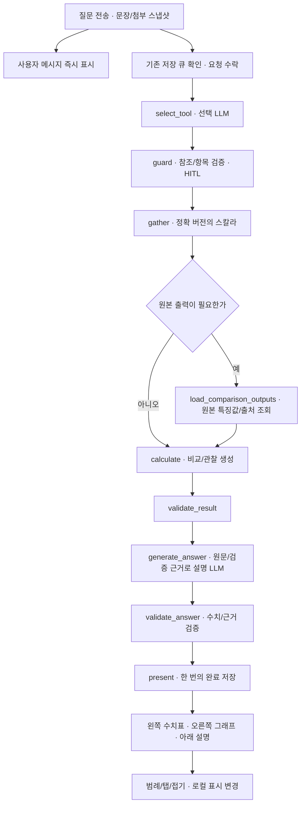

# 실험 비교 그래프와 채팅 메시지 개선

## Goal Capsule

질문을 보내면 사용자 메시지와 당시 첨부한 실험 태그를 먼저 표시한다. Agent의 진행 상태와 답변은 별도 영역에 표시한다. `compare_runs` 답변은 왼쪽의 촘촘한 수치표, 오른쪽의 질문에 맞는 그래프, 아래의 비교 설명으로 구성한다.

스칼라는 막대그래프로 표시한다. 저장된 파형·분포는 실제 샘플로 그리며, 파형의 피크·첨두간 값 등도 코드로 계산해 비교와 설명에 사용한다. 처음에는 비교 실험 전체를 표시하고 같은 색상의 범례로 개별 표시를 켜고 끈다.

기존 네 Tool Calling 도구, Python LangGraph v1, 모델 `gpt-5.6-luna`/추론 `none`, 기존 PostgreSQL 요청·답변 저장, fallback 비활성을 유지한다. 단일 Run 후속 질문의 라우팅 문제는 후속 범위다. 이 문서는 구현 계획이며 제품 코드 변경·테스트 실행 결과를 보고하지 않는다.

## Product Contract

### Problem Frame

현재 `frontend/src/features/agent/RunComparisonCard.tsx`는 스칼라 표를 세로로 나열한다. 행마다 버전·상세 버튼이 들어가 비교 실험이 많으면 화면을 크게 차지한다. 질문별 그래프, 파형 특징값 계산, 표시할 실험의 선택 기능은 연결되어 있지 않다.

진행 중에는 `frontend/src/features/agent/PendingRequest.tsx`가 질문과 진행 상태를 하나의 패널에 표시하고, 완료 후에야 `ConversationTurn`이 사용자 질문과 답변을 표시한다. 완료 메시지의 태그도 전송 당시 첨부 목록 대신 답변의 참조와 단일 `context`에서 복원하므로 질문의 첨부 실험과 일치한다고 보장할 수 없다.

`KPlasmaGraphParser`는 상세 표시를 위해 IED·IAD·RF 파형·2D 격자·잔차를 추린다. 이 표시용 데이터에서 원본 피크를 계산하면 누락될 수 있다. 특히 원본 전류 헤더는 `statampere/cm^2`, 거리 헤더는 `cm`인데 기존 차트의 일부 라벨은 `A/m²`, `m`다. 새로운 비교의 값·단위·축은 이 라벨을 그대로 신뢰해서는 안 된다.

### Requirements

| ID | 요구사항 |
| --- | --- |
| R1 | 전송 즉시 사용자 질문을 독립 메시지로 표시하고 진행·완료·실패·취소 상태는 Agent 응답 영역에서 표시한다. |
| R2 | 전송 당시의 Run ID·정확한 버전·태그 순서를 고정한다. 입력창 수정, HITL 선택, 완료 답변의 사용 실험이 원래 메시지의 태그를 덮어쓰지 않는다. |
| R3 | 비교 답변을 좌측 수치표·우측 그래프·하단 설명으로 구성하고 좁은 화면에서는 순서대로 쌓는다. |
| R4 | 요청한 스칼라와 파형 특징값은 막대그래프를 사용한다. 서로 다른 단위의 지표를 한 축에 혼합하지 않는다. |
| R5 | 상세 그래프 7종인 IED, IAD, IEAD, RF 전류 밀도, 전극 전위, 쉬스 이온 밀도, 수렴 잔차를 비교에서 지원한다. |
| R6 | 선택 LLM이 질문에서 요청한 항목을 구조화하고 코드가 허용 목록·계산 가능 여부·초기 그래프 탭을 검증한다. |
| R7 | 비교에 확정된 모든 실험을 처음부터 그래프에 포함한다. 기존 화면의 최대 3개 제한을 적용하지 않는다. |
| R8 | 실험별 범례와 전체 표시/숨김, 그래프 접기/펼치기, 지표 탭을 제공한다. 그래프 표시 선택은 비교 대상과 설명을 변경하지 않는다. |
| R9 | 태그·표·막대·선·범례에서 기존 Run 색상 매핑을 공유한다. 같은 Run의 서로 다른 명시 버전은 같은 색에 선 모양·버전 라벨을 추가해 구분한다. |
| R10 | 파형·분포 특징값은 전체 원본 샘플에서 코드로 계산한다. 계산 정의·단위·원본 개수·출처·비가용 이유를 보존한다. |
| R11 | 답변 LLM은 원문 질문과 검증된 관찰·계산 결과만으로 비교와 가능한 해석을 작성한다. 원본 배열이나 임의로 계산한 숫자를 만들지 않는다. |
| R12 | 0·누락·삭제·단위 불일치·원본 비가용을 구분하며 표시 데이터가 부족해도 이미 검증한 스칼라 답변을 보존한다. |
| R13 | 브라우저 새로고침·요청 재시도·중복 클릭·늦은 응답·새 대화에서 메시지 중복, 참조 변경, 과거 답변 덮어쓰기를 방지한다. 이번 기능을 위한 서버 장애 복구는 추가하지 않는다. |
| R14 | 원본 그래프 배열은 대화·답변·체크포인트·LLM 입력에 넣지 않는다. 범위가 제한된 일괄 조회, 캐시, 지연 표시와 계측으로 데이터 비용을 관리한다. |

### Key Flows

- F1. 실험 6개 첨부 → “이온 플럭스를 비교해줘” → 질문과 6개 태그가 먼저 표시 → 좌측 6행과 우측 플럭스 막대 6개 → 설명 표시.
- F2. “평균 이온 에너지와 IED 분포를 비교해줘” → 에너지 막대와 IED 곡선 탭 → 선택 실험의 곡선을 동일 축에서 비교.
- F3. “RF 전류의 피크와 진폭 차이를 설명해줘” → 전체 원본에서 정의된 특징값 계산 → 특징값 막대와 RF 파형 탭 → 계산 근거가 있는 비교 설명.
- F4. 그래프에서 실험 하나 숨김 → 해당 선·막대만 즉시 숨김 → 표·계산·설명·첨부 태그는 유지 → 다시 켜면 동일 색·버전으로 복구.
- F5. 전송 중 브라우저 새로고침 또는 재시도 → 서버 수락 여부를 같은 요청 키로 확인 → 원래 질문·첨부·완료 답변을 각각 한 번만 표시.

### Acceptance Examples

- AE1. 여러 실험을 첨부해도 분석 중 질문이 큰 진행 패널에 묶이지 않는다. 사용자 말풍선에서 원래 첨부한 실험을 볼 수 있다.
- AE2. 플럭스·평균 에너지 비교에서는 두 막대그래프 탭을 제공한다. 탭 전환과 범례 클릭은 LLM 호출을 추가하지 않는다.
- AE3. 표시용 샘플 사이에 원본 피크가 있는 인공 파형에서도 원본 피크 수치·위치를 보존하고 그래프에서 해당 원본 점을 표시한다.
- AE4. Bias-off 등으로 파형이 없는 실험을 0으로 그리지 않는다. 실험별 비가용 이유와 가용 개수를 표시한다.
- AE5. 피크가 동일한 여러 점에 나타나면 단일 피크인 것처럼 설명하지 않는다. 공동 최대 개수와 선택한 표시 위치의 의미를 밝힌다.
- AE6. 전송 응답이 유실된 후 같은 요청을 재확인해도 사용자 메시지와 완료 답변이 각각 한 번만 나타난다.
- AE7. 그래프 응답의 버전·원본 식별자·축 단위가 저장 답변과 다르면 해당 그래프만 불일치를 안내한다. 과거 수치와 설명을 새 응답 값으로 덮어쓰지 않는다.
- AE8. 참조 저장 큐가 대기 중일 때 버튼 연속 클릭이나 Enter 연속 입력을 해도 사용자 메시지와 전송 요청은 하나만 생성한다. 실패 후 재시도도 같은 메시지에 연결한다.

### Scope Boundaries

포함: 다중 Run 비교의 요청별 시각화, 7종 상세 출력, 아래에 정의한 파형·분포 특징값, 질문·첨부 스냅샷의 독립 표시, compact 비교 UI와 가시성 조작.

기존 스칼라 카탈로그는 이온 플럭스·평균 이온 에너지·IED 폭, 공정 조건은 압력·소스 전력·바이어스 전력이다. 이 값들과 이번에 등록하는 특징값을 막대그래프로 처리한다. 임의의 새 물리량이나 정의되지 않은 특징값은 자동으로 계산하지 않고 지원 범위를 안내한다.

후속: 단일 Run 후속 질문 라우팅, RAG, 임의 회귀·상관·인과 분석, 주파수/고조파/상호상관, 사용자 정의 수식, 원본을 보간한 교차점·위상차 추정. 기존 순·역방향 검색 화면과 일반 답변의 제품 동작은 유지한다. 공통 채팅 표시 개선은 모든 질문에 적용한다.

제외: 이번 기능을 위한 batch별 체크포인트, 중단 지점부터의 서버 재개, 추가 worker 재시작 복구 설계·검증. 기존 저장·체크포인트 코드는 유지하고 새로운 복구 체계를 추가하지 않는다. 일괄 조회의 batch 분할은 조회량·메모리를 제한하기 위한 용도로 유지한다.

## Planning Contract

### Key Technical Decisions

- KTD1. 스칼라는 막대, 원본 파형은 선, 2D 분포는 실험별 패널을 사용한다. (session-settled: user-directed — 점그래프 대신 막대그래프를 선택했다.)
- KTD2. 원본 표시와 함께 피크·진폭 등 수치 계산·설명까지 포함한다. (session-settled: user-directed — 표시만 먼저 구현하는 안 대신 이번 범위에 수치 분석도 포함하기로 했다.)
- KTD3. 기존 네 도구와 비교 참조 HITL을 유지한다. `compare_runs` 인자에 비교 항목·원본 출력 선택을 추가하며 새로운 그래프 선택 LLM이나 다섯 번째 도구를 만들지 않는다.
- KTD4. 원본 특징값 추출은 검증된 파일 파서를 사용하는 backend, 실험 간 비교·관찰 생성은 Python 코드, 해석은 기존 답변 LLM이 담당한다. 표시용 `full_run` 배열을 원본 전체로 취급하지 않는다.
- KTD5. 그래프 표시/숨김은 로컬 UI 상태로 즉시 반영하고 분석 대상은 그대로 둔다. 이 상태는 turn 단위로 브라우저에 저장한다. 서버의 매 클릭 저장과 LLM 재실행을 추가하지 않는다.
- KTD6. 사용자 메시지의 원본은 이미 저장된 `agent_request.question/submission/created_at`이다. transient context가 지워져도 원래 첨부 목록을 이 저장값에서 복원한다. 메시지용 새 테이블은 만들지 않는다.
- KTD7. 확장 비교는 `schemaVersion: 3`으로 명시하고 schema 1/2는 읽기 호환한다. 기존 답변을 새 스키마로 재계산하거나 채우지 않는다. 일반·검색 답변은 기존 스키마를 유지할 수 있다.
- KTD8. 그래프는 정확 버전과 허용 출력 ID로 일괄 조회한다. 프론트에서 실험마다 상세 GET을 연속 호출하는 방식은 채택하지 않는다.
- KTD9. 새 서버 장애 복구와 batch별 진행 상태 저장은 이번 범위에서 제외한다. 표·그래프의 데이터 일치와 즉시 전송 시 중복 방지는 반영한다. (session-settled: user-directed — 계획 검토 후 사용자가 1번 보완은 제외하고 2·3번은 포함하기로 했다.)

### Feature Definitions

모든 특징값은 원본에 저장된 관측 구간/격자의 값이다. 연속 함수의 이론적 극댓값이나 완전한 주기라고 주장하지 않는다. 계산 전 유한값·축 순서·단위·원본 식별자를 검증하고, 비교 전에도 단위 일치 여부를 검사한다.

| 출력 | 이번에 제공할 특징값 | 계산·표시 정책 |
| --- | --- | --- |
| RF 전류 밀도 / 전극 전위 | 최댓값, 최솟값, 첨두간 값, 반첨두간 진폭, 최대/최소 RF 위상 | `peakToPeak = max − min`, `halfPeakToPeak = (max − min)/2`. “진폭” 요청에는 **반첨두간 진폭** 정의를 표시한다. 최댓값·절댓값 최대·진폭을 혼용하지 않는다. |
| IED | 최대 강도와 그 에너지, 저장된 평균 에너지·IED 폭 | IED 폭은 기존 **P90−P10** 정책을 재사용한다. FWHM으로 이름을 바꾸거나 다시 정의하지 않는다. |
| IAD | 최대 강도와 그 입사각 | 원본 각도 격자에서 계산한다. 평균 입사각이나 폭을 임의 정의하지 않는다. |
| IEAD | 최대 강도와 그 에너지·입사각 | 원본 2D 격자에서 계산하며 원본 축 방향과 flatten 순서를 검증한다. |
| 쉬스 이온 밀도 | 최대값과 그 RF 위상·거리 | 원본 열별 거리 좌표를 보존한다. 서로 다른 쉬스 길이를 같은 거리 격자로 보간하지 않는다. |
| 수렴 잔차 | 마지막 값·최댓값과 반복 번호, 기존 수렴 상태 | 기존 파서의 열별 절댓값 최대 정책을 재사용한다. 실행 성공과 strict convergence를 동일시하지 않는다. |

파형의 첨두간 값은 서로 다른 축 좌표가 최소 2개인 유효 구간에서 계산한다. 단일 점은 진폭 0으로 대체하지 않고 자료 부족으로 표시한다. 공동 극값은 개수와 첫 원본 위치를 함께 보존해 payload를 제한하고 “첫 최대 위치”로 표시한다. 명시적 정의 없는 “피크”는 최대 y값, “진폭”은 반첨두간 값으로 정규화하고 계산 정의를 화면과 설명에 포함한다. 음의 전위가 큰 경우의 최솟값과 피크를 혼용하지 않는다. 절댓값 피크·RMS·위상차처럼 이번 카탈로그에 없는 별도 정의가 요청되면 지원 범위를 확인한다. 위상·각도의 차이는 필요할 때 원본 좌표의 절대 차이로만 표시하며 순환 경계의 위상차를 새로 추정하지 않는다. 좌표·위상·각도에는 일반 변화율을 자동 적용하지 않는다.

전류의 원본 단위 `statampere/cm²`, 거리 `cm`, 전위 `V`, IED/IAD 강도 `a.u.` 등은 출력 메타데이터로 명시한다. 밀도·IEAD 등도 검증된 원본 헤더/파서 계약에 근거해 단위를 선언한다. 단위가 불명확하면 물리 단위를 만들어 붙이지 않는다. 기존 SI 라벨을 그대로 복사하지 않으며, 단위 변환을 제공한다면 코드의 검증된 변환과 원값·원단위를 함께 보존해야 한다.

### Selection and Graph Rules

`compare_runs`는 기존 참조·기준·경향 인자를 유지하면서 허용 카탈로그의 `comparison_fields`와 `plot_ids`를 nullable 인자로 받는다. 기존 `metrics`는 호환 경로로만 유지하고 신규 질문의 비교 필드는 하나의 확정 계획으로 정규화한다. 카탈로그는 기존 스칼라/조건과 `current.peakToPeak`, `potential.halfPeakToPeak`, `ied.peakEnergy` 같은 등록 특징값을 구분한다. ID 문자열만 모델이 선택하며 코드·SQL·그래프 좌표·단위 변환식은 받지 않는다.

| 질문 | 기본 숫자/초기 그래프 | 추가 그래프 탭 |
| --- | --- | --- |
| “플럭스를 비교해줘” | 플럭스 원값 / 플럭스 막대 | 없음 |
| “플럭스와 평균 에너지를 비교해줘” | 두 지표 / 첫 요청 지표의 막대 | 평균 에너지 막대 |
| “IED 분포를 비교해줘” | IED 최대 강도·에너지·기존 폭 / IED 원본 곡선 | 관련 특징값 막대 |
| “전류의 피크와 진폭 차이를 설명해줘” | 전류 최대·반첨두간 진폭 / RF 전류 곡선 | 피크·진폭 막대 |
| “RF 파형을 비교해줘” | 전류·전위의 기본 특징값 / 전류 곡선 | 전위 곡선·관련 특징값 막대 |
| “전체 상세 그래프를 비교해줘” | 각 출력의 기본 특징값 / IED | 가용 7종과 관련 특징값 막대 |
| 지표 없는 “이 실험들을 비교해줘” | 기존 3개 결과 지표 / 첫 지표 막대 | 나머지 결과 지표 막대 |

스칼라 비교만 요청한 경우에는 파형 원본을 읽거나 특징값을 추출하지 않는다. 명시적 출력 요청의 데이터가 없으면 다른 그래프로 조용히 바꾸지 않고 그 탭에 비가용 이유를 표시한다. 단위가 다른 특징값은 각각 별도 막대 탭을 만든다. 그래프를 사용자가 수동으로 전환해도 저장된 숫자·분석 설명은 바뀌지 않는다. 특징값 막대의 추가 탭은 같은 요청에서 이미 계산·검증한 값에 한정하며, 탭 클릭이 새로운 특징값 계산이나 추가 LLM 호출을 시작하지 않는다.

답변 LLM 입력은 질문의 요청 필드와 관련 근거를 우선하고 제한된 context budget을 적용한다. 모든 실험의 표·수치 snapshot은 유지하되 많은 실험의 개괄 설명에는 코드가 만든 전체 집합의 범위·극값·가용 개수와 필요한 실험 근거를 사용한다. 명시적으로 모든 실험의 개별 설명을 요구해 budget에 들어가지 않으면 범위를 HITL로 확인하고 임의의 몇 실험만 답하지 않는다. 숨김/표시 조작에 따라 이 설명용 집합을 바꾸지 않는다.

### High-Level Technical Design

기존 일반 답변·검색 분기는 유지한다. 새 `load_comparison_outputs` 노드는 비교에서 필요한 경우에만 연결한다. 원본 배열을 노드 출력에 넣지 않고 특징값·출처·카탈로그 버전·출력 메타데이터만 체크포인트에 보존한다. 설명의 숫자와 근거 ID 검증 및 제한된 repair 정책은 유지한다.

### Data and API Contracts

1. **메시지 조회:** `AgentRequestView`에 원래 첨부한 `submittedRunRefs`를 추가한다. `WorkspaceView`에 현 workspace/conversation epoch의 compact 요청 메시지 목록 `agentMessages`를 추가한다. 항목은 request ID, clientMessageId, 원문, 생성 시각, 원래 첨부 목록, 상태, 연결 turn ID만 포함한다. clientMessageId는 해당 epoch의 기존 AGENT idempotency key를 사용하고 기존 idempotency 기록과 일괄 연결해 조회한다. 키가 없는 과거 항목은 request ID로 표시한다. 완료 답변 배열을 중복 반환하지 않는다. 목록은 단일 일괄 projection으로 조회하며 각 항목에 `view()/events()`를 호출해 N+1을 만들지 않는다.
2. **HITL의 참조:** 원래 `submittedRunRefs`는 유지하고 HITL에서 확정한 목록은 `usedRunRefs`와 별도 추가 입력 이벤트로 표시한다. 사용자가 전송하지 않은 태그를 원래 메시지에 소급 추가하지 않는다.
3. **원본 출력 조회:** `POST /api/run-versions/outputs`로 정확한 RunRef 배열과 허용 `plotIds`를 받는다. 반환은 실험/출력별 상태·축/단위·원본 개수·표시 샘플·검증된 특징값·출처 식별자다. 각 출력에 정확 RunRef, outputId, sourceIntegrity, 축/값 단위와 featurePolicyVersion을 포함해 저장 답변과 대조할 수 있게 한다. 원본 서버 파일 경로는 신규 응답에 노출하지 않는다. 누락 실험 하나 때문에 전체 성공 결과를 버리지 않는다.
4. **worker 조회:** `/internal/agent/requests/{id}/comparison-outputs`는 기존 worker 인증·lease/generation/revision/epoch 검사와 확정 참조 목록을 적용하고 특징값/출처만 반환한다. 공개 출력 projection과 같은 backend 추출 서비스를 재사용한다.
5. **schema 3 비교 답변:** 허용 비교 필드별 `ScalarDatum`, 원값·차이·요약·관찰, 표시할 `plotIds`, 정확 RunRef, 특징값 계산 정책 버전, 원본 개수/범위/출처를 저장한다. 그래프별 RunRef·outputId·sourceIntegrity·축/값 단위도 함께 고정한다. 원본 배열·경로·HTML·차트 라이브러리 설정은 저장하지 않는다. 모델의 자유 형식 차트 명세를 실행하지 않는다.
6. **호환성:** Python Pydantic, TypeScript 계약, Java 검증기, OpenAPI/schema 문서, 소량의 인공 공통 fixture를 함께 갱신한다. schema 3은 비교에서만 허용하고 알 수 없는 버전을 schema 1로 간주하지 않는다. 과거 schema 1/2 비교는 기존 수치의 막대 표시만 안전하게 제공하고 새로운 파형 수치를 소급 생성하지 않는다.

표·막대·설명의 수치는 항상 완료 답변 snapshot을 사용한다. 파형·분포의 그래프 응답은 snapshot의 RunRef·outputId·sourceIntegrity·축/값 단위와 대조한 뒤 표시한다. 하나라도 다르면 해당 그래프만 “답변에 사용한 데이터와 일치하지 않습니다”로 안내하고 기존 표·설명을 보존한다. featurePolicyVersion이 바뀌어도 과거 특징값을 새로 계산한 값으로 교체하지 않는다. 원본과 단위가 일치하는 파형 자체는 표시할 수 있지만, 현재 정책의 특징값을 과거 답변의 특징값으로 섞어 쓰지 않는다.

공개 출력 API는 기존 Run 조회의 접근 경계를 유지하며 Run ID와 정확 버전의 대응·허용 출력·batch 상한을 서버에서 검증한다. 클라이언트가 서버 파일 경로나 파서 식을 전달할 수 없게 하고 원본 읽기는 기존 SourceStore의 검증된 보관 경로 안에서만 수행한다. worker 조회는 확정 참조 목록의 부분집합만 허용한다. raw 배열과 사용자 대화가 포함된 로그/스크린샷은 GitHub에 게시하지 않는다.

메시지는 기존 `agent_request.submission`에서 읽고 답변/출처 정보는 기존 JSON 저장 영역에 두므로 현재 설계상 테이블 변경은 필요하지 않다. 새 인덱스가 실제 쿼리 계획상 필요해지면 버전 있는 migration으로 추가하며 직접 DB 수정은 하지 않는다. graph build/prompt/feature 정책 버전을 올리고 이전 미완료 checkpoint는 기존 버전 불일치 정책으로 안내한다.

### Message Lifecycle

전송 클릭 시 첫 await 이전에 동기 전송 잠금을 확보한다. 잠금을 확보한 호출만 clientMessageId 겸 idempotency key를 발급하고 UI에 보이는 원문·첨부 버전을 고정해 provisional 사용자 메시지 한 건을 만든다. 버튼과 Enter 입력은 같은 잠금과 전송 함수를 사용한다. 기존 참조 저장 큐를 기다리는 동안에도 메시지가 보이며 아직 수락 전이라는 상태를 구분한다. 큐 실패나 참조 불일치 시 다른 실험으로 보내지 않고 그 메시지에 실패를 표시한다.

요청 수락 후 clientMessageId를 기준으로 서버 request ID와 provisional 메시지를 연결하고, 새 메시지를 추가하지 않고 기존 메시지를 갱신한다. 완료 turn의 ID가 request ID와 같다는 기존 규칙을 활용해 같은 자리에 응답을 붙이고 질문을 다시 추가하지 않는다. 불확실한 POST 결과는 같은 idempotency key/body로 확인하며 자동 중복 질문을 생성하지 않는다. 명백한 전송 전 실패와 수락 후 취소를 구분한다. 요청 body를 확정해 POST한 뒤에는 같은 키에 다른 body를 보내지 않는다. 네트워크 재시도는 같은 키/body와 같은 메시지를 사용한다. 수락 여부가 불확실한 동안 새 전송을 허용하지 않는다. 전송 성공 또는 확인된 실패·취소 시 잠금을 해제한다.

수락 전 reload 대응은 브라우저 outbox 한 건에 clientMessageId·원문·첨부·키·정확 요청 body·epoch만 보관한다. 서버 수락을 확인하면 제거한다. 아직 body가 확정되지 않은 저장 큐 대기 단계는 자동 전송하지 않고 재시도 가능한 미전송 메시지로 복원한다. 수락 여부를 모르는 확정 body만 같은 키로 조회/재시도한다. 새 대화·전체 초기화는 기존 epoch 범위에 맞춰 outbox와 표시 설정을 정리한다.

### Layout and Rendering

1008px 이상에서는 약 40:60의 두 열, 390/800px에서는 수치표→그래프→설명 순으로 배치한다. 표는 Run당 한 행을 기본으로 하고 이름·색상·조건·요청값만 먼저 보여준다. 버전·상태·계산 근거는 펼침 영역, 상세 열기는 작은 접근 가능한 버튼으로 둔다. 단위는 열 제목에 모으되 원단위 불일치/비가용 이유는 셀에서 볼 수 있게 한다.

막대는 실험 순서를 유지하고 0 기준축을 표시한다. 음수도 실제 부호로 표시하며 누락은 빈 막대로 표현하지 않는다. 실험이 많으면 범주 축에 스크롤을 제공하고 임의 top-N으로 줄이지 않는다. 파형은 공통 축 범위에서 원본 점을 직선으로 연결하며 보간·평활화 곡선을 만들지 않는다. 전체 숨김 상태에는 선택 안내를 표시한다.

IEAD·밀도는 실험별 작은 패널로 표시하고 같은 출력·단위·표시 모드에서 공통 색상 범위를 사용한다. 색상 점은 실험 식별, heatmap 색은 물리량 크기를 뜻한다. 밀도의 열별 거리 좌표를 그대로 사용한다. 잔차 로그축의 0은 양수로 바꾸지 않고 값과 표시 불가 이유를 별도 표현한다.

### Data Cost and Measurement

정확한 version/source identity는 요청 배열을 batch 단위로 일괄 조회한다. 표시/추출 batch 기본 크기는 25 Run, API 상한은 50 Run·7 출력으로 두고 설정으로 관리한다. 비교 대상 자체의 개수 제한은 아니며 150 Run도 여러 batch로 모두 처리한다. 한 batch 안에서 실험별 SQL을 반복하지 않고 필요한 출력만 JSON projection으로 읽는다. 전체 SQL 수는 batch 수에 따라 늘 수 있으므로 150 Run에서도 무조건 두 쿼리라고 주장하지 않는다. 원본 파일 읽기 수는 실험·출력 수에 비례할 수 있으며 이를 DB N+1과 구분해 기록한다.

원본 특징값은 `(runVersionId, outputId, sourceIntegrity, featurePolicyVersion)` 키의 제한된 backend 캐시에 보관하고 동시 요청의 중복 파싱을 합친다. 파일/Run 삭제·버전 교체·정책 변경 때 무효화하며 삭제 상태를 캐시 hit 전에 확인한다. 표시 projection은 프론트에서 정확 버전/출력/원본 식별자/단위를 기준으로 제한 캐시하고 이전 epoch의 늦은 응답을 버린다. 캐시 응답도 저장 답변의 출처와 대조한다. 숨긴 실험을 켜거나 이미 연 탭으로 돌아갈 때 같은 payload를 다시 요청하지 않는다.

원본 추출은 stream/sink와 제한된 동시성으로 수행한다. 전체 raw 배열 여러 개를 메모리에 복사하거나 worker에 전송하지 않는다. 큰 요청은 조회량·메모리를 제한하는 batch로 처리한다. batch별 체크포인트와 서버 중단 지점 재개는 추가하지 않는다. 기존 요청 처리·heartbeat·lease 경계를 따른다. HTTP timeout을 빈 데이터 성공으로 간주하지 않는다.

처음에는 태그한 실험 모두를 포함하지만 화면에 보이는 답변/활성 탭의 출력만 로드한다. 많은 실험은 범위를 명시한 batch로 나눠 모두 로드하며 누락·실패를 개수로 알린다. 오래된 답변의 그래프는 화면 진입/펼침 때 로드한다. 표시점 축약이 필요하면 원본 점 선택만 사용하고 원본 최대/최소 위치를 포함한다. 계산은 항상 축약 전 원본에서 수행한다.

Phoenix에서 출력 로드·특징값 계산·비교·설명·검증 span의 시간, cache hit, 선택 Run/출력/원본 샘플 개수와 모델 사용량을 구분한다. 브라우저에서는 클릭→메시지 DOM, 탭/범례 클릭→DOM, 출력 로드 완료→그래프 표시를 계측한다. SQL 수·원본 읽기 수·payload 크기·cold/warm 시간을 별도로 기록한다. 계획 단계에서 개선율을 주장하지 않는다.

## Implementation Units

### U1. Versioned Comparison and Message Contracts

**Goal / Requirements:** R2, R4–R6, R10–R14의 공통 계약을 확정한다. **Dependencies:** 없음.

**Files:** `agent/src/contracts/answers.ts`, `agent/src/contracts/index.ts`, `agent/python/src/kplasma_agent/tools.py`, `agent/python/src/kplasma_agent/answer_contracts.py`, `backend/src/main/java/com/kplasma/analysisagent/contract/WorkspaceDto.java`, 신규 출력 DTO·schema 3 검증기, `docs/contracts/agent-v1.openapi.yaml`, 신규 `docs/contracts/agent-answer-v3.schemas.yaml`, `docs/contracts/agent-answer-v2.schemas.yaml`의 호환 안내. 테스트는 `agent/python/tests/test_tool_selection.py`, 신규 `agent/python/tests/test_answer_v3_contract.py`, 신규 `backend/src/test/java/com/kplasma/analysisagent/agent/AnswerV3ValidatorTest.java`, `backend/src/test/java/com/kplasma/analysisagent/contract/ContractSerializationTest.java`, 신규 인공 schema 3 공통 fixture.

**Approach / Pattern:** 기존 strict Tool Calling/Pydantic과 schema 2 검증 패턴을 유지한다. 비교 필드·출력 ID·원본 단위·특징값 정의·가용성 카탈로그를 명시하고 새 생산자/소비자를 동시에 변경한다. nullable 신규 인자와 과거 선택 인자의 충돌 규칙을 정의한다.

**Test scenarios:** 스칼라/파형/혼합 요청 추출, 잘못된 필드·출력·단위·알 수 없는 schema 거절, source metadata와 숫자의 일치, 표·그래프의 버전/원본/단위 불일치 거절, 계산 정책 변경 후 저장 수치 보존, raw 배열 주입 차단, schema 1/2 읽기 호환, original submitted refs와 used refs의 분리. **Verification:** 동일 인공 fixture를 Python/Java/TS가 해석하며 숫자·단위·원본 배열 금지 계약이 일치한다.

### U2. Full Source Feature Extraction and Batch Output API

**Goal / Requirements:** R5, R7, R10, R12, R14. **Dependencies:** U1.

**Files:** `backend/src/main/java/com/kplasma/analysisagent/parser/KPlasmaGraphParser.java`, `backend/src/main/java/com/kplasma/analysisagent/parser/IedWidthCalculator.java`의 재사용 경계, 신규 `backend/src/main/java/com/kplasma/analysisagent/parser/ComparisonFeatureExtractor.java`, 신규 `backend/src/main/java/com/kplasma/analysisagent/run/RunOutputService.java`, `backend/src/main/java/com/kplasma/analysisagent/run/RunController.java`, `backend/src/main/java/com/kplasma/analysisagent/run/RunRepository.java`, `backend/src/main/java/com/kplasma/analysisagent/agent/AgentWorkerController.java`, `backend/src/main/java/com/kplasma/analysisagent/agent/AgentRequestService.java`; 신규 `backend/src/test/java/com/kplasma/analysisagent/parser/ComparisonFeatureExtractorTest.java`, 신규 `backend/src/test/java/com/kplasma/analysisagent/run/RunOutputsTest.java`, `backend/src/test/java/com/kplasma/analysisagent/ingestion/RunDeletionTest.java`.

**Approach / Pattern:** 원본 parser의 검증·축 순서·읽기 경계를 재사용한다. 표시용 sampling과 전체 원본 특징값 추출을 분리한다. version→source는 일괄 검증하고 동일 서비스에서 내부 특징값 응답과 외부 표시 projection을 만든다. 중복 파싱 캐시는 제한 크기와 삭제 무효화를 갖는다. 기존 parser의 실패를 숨기는 예외 fallback을 만들지 않는다.

**Test scenarios:** AE3–AE5/AE7; 표시점 사이 최대값, 음수/양수 전위, 0/단일 점/빈 데이터, 공동 최대, 비정상 NaN/overflow, 원본 단위 보존, P90−P10 폭 유지, 2D 축/가변 거리, source 파일 삭제/읽기 실패, mixed batch의 일부 성공, worker lease/참조 위반, 2/5/150 Run에서 batch 내 실험별 SQL 반복이 없는지 확인, 캐시 hit·동시 요청·삭제 후 miss. **Verification:** 원본 특징값과 그래프의 강조 점이 일치하고 출력별 로딩 실패가 다른 검증 결과를 지우지 않는다.

### U3. Comparison Planning, Computation and Grounded Explanation

**Goal / Requirements:** R4–R6, R10–R14. **Dependencies:** U1, U2.

**Files:** `agent/python/src/kplasma_agent/tools.py`, `agent/python/src/kplasma_agent/backend_client.py`, `agent/python/src/kplasma_agent/graphs/v1.py`, `agent/python/src/kplasma_agent/domain/compare.py`, `agent/python/src/kplasma_agent/domain/comparison_evidence.py`, `agent/python/src/kplasma_agent/domain/grounding.py`, `agent/python/src/kplasma_agent/metric_registry.py`; 신규 `agent/python/src/kplasma_agent/domain/comparison_features.py`, `agent/python/tests/test_multi_run_compare.py`, 신규 `agent/python/tests/test_comparison_outputs_graph.py`, `agent/python/tests/test_tool_selection.py`, 신규 `agent/python/evals/test_comparison_visualization.py`.

**Approach / Pattern:** 출력/필드 카탈로그로 정규화한 비교 계획에서 필요한 원본 출력만 요청한다. 원본 특징값은 기존 ScalarDatum·차이·요약·근거 ID 흐름으로 비교한다. 스칼라만 요청하면 새 조회 노드를 건너뛴다. 기준 미지정·0 기준·다른 조건 통제·설명 실패 부분 결과 정책을 유지하고 새 필드에 맞게 확장한다. LLM에는 원문·검증 관찰·정의·가용성만 전달하며 큰 집합의 근거는 위 context budget 정책을 따른다.

**Test scenarios:** F2/F3, 스칼라에서 원본 조회 0회, 파형 요청에서 같은 정확 버전만 조회, 참조 없는 요청 HITL, 그래프 ID 오타/지원 밖 특징값, 모든 Run 보존, 단위 불일치·0 기준·좌표 변화율 금지, 유효하지 않은 숫자 재서술/근거 ID repair, 출력 조회 실패 시 검증된 수치 보존과 오류 안내. 서버 강제 종료·batch 재개 검증은 이번 범위에서 제외한다. **Verification:** 파형 계산은 코드가 수행하고 모델의 의미 오류가 raw 숫자 생성 경로로 이어지지 않는다.

### U4. Durable User Message Projection and Immediate Chat Display

**Goal / Requirements:** R1, R2, R9, R13, R14. **Dependencies:** U1. U2/U3와 독립적으로 진행 가능하나 단독 실행 원칙을 유지한다.

**Files:** `backend/src/main/java/com/kplasma/analysisagent/agent/AgentRequestRepository.java`, `backend/src/main/java/com/kplasma/analysisagent/agent/AgentRequestService.java`, `backend/src/main/java/com/kplasma/analysisagent/workspace/WorkspaceRepository.java`, `backend/src/main/java/com/kplasma/analysisagent/workspace/WorkspaceService.java`, `frontend/src/features/agent/useConversation.ts`, `frontend/src/features/agent/AgentPage.tsx`, `frontend/src/features/agent/PendingRequest.tsx`, 신규 `frontend/src/features/agent/ChatUserMessage.tsx`, `frontend/src/components/ReferenceTray.tsx`, `frontend/src/components/RunColors.tsx`; `backend/src/test/java/com/kplasma/analysisagent/workspace/AgentRequestPersistenceTest.java`, `frontend/src/features/agent/chat-references.test.tsx`, `frontend/src/features/agent/server-conversation.test.tsx`, 신규 `frontend/src/features/agent/chat-message-lifecycle.test.tsx`.

**Approach / Pattern:** 기존 submission JSON에서 compact 메시지 목록을 projection한다. 전송 직후 provisional 메시지→server request→완료 turn을 같은 논리 메시지로 연결한다. PendingRequest는 질문 복사본 대신 진행/HITL/실패 응답을 표시한다. 첫 await 이전의 동기 잠금·clientMessageId 발급·메시지 생성을 하나의 진입 절차로 처리하고, outbox와 참조 저장 큐 경계에서 원문·태그·키를 동결한다. 응답·polling·목록 조회·재시도는 같은 논리 메시지를 갱신한다. legacy turn은 확인 가능한 기존 참조만 표시하며 없던 첨부를 추정하지 않는다.

**Test scenarios:** AE1/AE6/AE8, 저장 큐 대기 중 즉시 메시지, 태그/질문 편집 후 원래 메시지 불변, 부분 참조 저장 실패, 수락 전후 reload, 유실 POST의 동일 키 재시도, 중복 클릭, 완료 polling과 workspace reload 경합, HITL 선택과 원래 첨부의 분리, FAILED/CANCELLED 목록 복원, 새 대화/초기화의 늦은 응답 차단, 메시지 목록의 DB N+1 방지. **Verification:** 질문과 첨부가 전송 시점 그대로 한 번 표시되고 어떤 상태에서도 가짜 수락/성공을 표시하지 않는다.

### U5. Compact Comparison UI and Interactive Charts

**Goal / Requirements:** R3–R9, R12, R14. **Dependencies:** U1, U2, U3, U4.

**Files:** `frontend/src/features/agent/RunComparisonCard.tsx`, `frontend/src/features/agent/V1AnswerView.tsx`, `frontend/src/features/agent/agent-contract.ts`, 신규 `frontend/src/features/agent/ComparisonCharts.tsx`, 신규 `frontend/src/features/agent/comparison-chart-model.ts`, 신규 `frontend/src/features/agent/useComparisonOutputs.ts`, `frontend/src/api/runs.ts`, `frontend/src/prototype/charts.tsx`, `frontend/src/prototype/styles.css`, `frontend/src/components/RunColors.tsx`; 신규 `frontend/src/features/agent/comparison-charts.test.tsx`, 신규 `frontend/src/features/agent/comparison-output-loading.test.tsx`, `frontend/src/features/agent/answer-v2-wire.test.tsx`, `frontend/src/prototype/charts.test.tsx`, 신규 `frontend/src/features/agent/comparison-visualization.pw.ts`, `frontend/src/features/agent/chat-references.pw.ts`.

**Approach / Pattern:** 표시용 view model과 실제 데이터 조회를 분리한다. 기존 SVG/heatmap을 가능한 범위에서 재사용하되 단일 Run의 개별 축을 그대로 겹치지 않는다. 막대·공통축 선·실험별 2D 패널에 shared Run 색을 적용한다. 켜기/끄기·접기·탭은 turn 단위 로컬 상태이고 신규 LLM/서버 UI 저장 요청을 만들지 않는다. 실제 출력 조회는 활성 탭에서 batch/cache로 수행하며 abort·epoch·version 식별자로 stale 응답을 차단한다. 저장 답변의 출처와 그래프 메타데이터를 대조한 뒤 렌더링하고, 불일치 시 그래프 영역만 안내 상태로 둔다. 표·막대의 값과 설명은 저장 snapshot을 사용한다.

**Test scenarios:** AE2/AE4/AE7, 초기 모든 Run 표시, 6개 이상과 150개 실험의 보존, 음수·0 막대/누락 구분, 단위별 탭과 요청 순서, 범례 개별/전체 hide/show, 탭·숨김·reload 후 색 유지, 같은 Run의 다른 버전 구분, partial batch/retry/삭제, common 2D scale, residual 0과 log, keyboard/aria/focus, 네 폭의 넘침·표 행 밀도·모달. **Verification:** 숫자와 그래프가 같은 버전을 사용하고 표시 조작이 분석 대상이나 저장 답변을 바꾸지 않는다.

### U6. End-to-End Evidence, Observability and Documentation

**Goal / Requirements:** R1–R14. **Dependencies:** U2–U5.

**Files:** `frontend/src/features/agent/workspace.integration.pw.ts`, `frontend/src/features/agent/workspace.integration.ts`, `frontend/src/features/agent/agent-v1.playwright.config.ts`, `agent/python/src/kplasma_agent/tracing.py`, 신규 `docs/verification/실험-비교-그래프와-메시지-검증.md`, 관련 API/실행 문서.

**Approach / Pattern:** 인공 원본으로 전체 HTTP·DB·worker·브라우저 흐름을 검증한다. 기존 요청 인증·fence 검사를 유지하고 표·그래프 일치와 중복 전송 방지를 검증한다. 새 서버 장애 복구나 재시작 검증 시나리오는 추가하지 않는다. 실제 모델 평가와 mock 평가를 구분해 호출량·정확도·시간을 기록한다. 실데이터나 trace/키는 공개하지 않는다.

**Test scenarios:** 스칼라/파형/혼합/7종 전체/데이터 부족/정의 질문 구별, 시작 전/후 메시지 reload, HITL·취소·Run 삭제, schema 1/2/3 공존, 정확 버전 변경·원본/단위 불일치·계산 정책 변경, cold/warm cache와 2/5/150 Run의 SQL·읽기·크기 계측. **Verification:** 아래 Verification Contract의 결과와 미실행 항목을 문서에 남기며 독립 팀원 리뷰를 대체했다고 주장하지 않는다.

## Verification Contract

구현 시 수행할 검증이며 계획 작성 단계에서는 실행하지 않는다.

| 범위 | 필수 검증 |
| --- | --- |
| 계약·Python | 공통 인공 schema fixture, pytest tests/evals, Ruff, Mypy. 선택/답변 모델은 고정 응답 검사와 실제 모델 평가를 분리한다. |
| Backend | Gradle tests: 원본 특징값·batch SQL·권한/fence·메시지 projection·단위·삭제·호환성. 원본 극값을 보존하는 인공 파일을 사용한다. |
| Frontend | `npm test`, `npm run typecheck`, `npm run lint`, `npm run build`. 메시지 생명주기·차트 model·loading/cache·과거 답변 호환을 포함한다. |
| Browser | `npx playwright test --config frontend/src/features/agent/agent-v1.playwright.config.ts` 및 HTTP 통합 suite. 390/800/1008/1440px에서 compact 표·탭·범례·공동축·태그·실패·reload·모달·넘침을 확인한다. |
| 메시지·데이터 일치 | 저장 큐 대기 중 중복 클릭/Enter·동일 메시지 재시도·브라우저 새로고침을 검증한다. 그래프 버전/원본/단위 불일치와 계산 정책 변경 시 저장 수치 보존을 확인한다. 새 서버 장애 복구 테스트는 추가하지 않는다. |
| Public safety | `npm run verify:public-files`, `git diff --check`. 실데이터·원본 파일·Phoenix trace·비밀값·로컬 `docs/folio`를 커밋하지 않는다. |
| Measurement | 인공 응답 지연의 UI 동작 검증과 실제 HTTP/DB 계측을 구분한다. 메시지·탭·범례 반응, cold/warm 지연, LLM 호출/토큰, SQL 수, 원본 읽기 수, payload 크기를 기록한다. 측정 전 성능 개선율을 약속하지 않는다. |

그래프/계산 정의의 성공 기준은 원본의 알려진 극값을 정확하게 찾고 표시·표·관찰이 같은 값/단위를 사용하는 것이다. 모델의 실제 최초 선택 성공률과 repair/HITL 후 성공률은 따로 집계한다. 모든 Run을 보존했는지와 raw 배열이 snapshot/LLM에 들어가지 않는지도 자동 검사한다.

## Definition of Done

- R1–R14와 F1–F5/AE1–AE8을 구현·검증한다. 파형의 수치 계산과 설명을 “후속”으로 남기지 않는다.
- 지원하지 않는 특징값·단위·불충분한 데이터는 명시적으로 안내하고 가짜 값·곡선·성공을 만들지 않는다.
- 기존 순·역방향 조건/단위/정렬, 일반 답변, schema 1/2 저장 답변, 참조 저장·새 대화·삭제·브라우저 새로고침·중복 전송 회귀 검증이 통과한다.
- 변경 생산자·소비자·API/schema·인공 fixture·검증 문서를 함께 갱신하고 실제 실행한 결과와 미실행 항목을 구분한다.
- 기존 기능 브랜치/PR 맥락을 재사용하며 사용자 변경 `.gitignore`와 로컬 `docs/folio`는 이 작업에 포함하지 않는다. 팀원 승인 전 병합하지 않는다.

## Rollout and Error Handling

계약·backend 검증/조회·schema 3을 읽는 frontend를 먼저 준비한 뒤 새 worker의 schema 3 생성을 활성화한다. 이전 worker와 새 worker를 같은 미완료 checkpoint에서 섞지 않는다. 배포 후 스칼라·파형·혼합 요청과 과거 답변을 확인하고 Phoenix의 출력 조회/계산 오류, 메시지 중복, 삭제된 source의 cache 반환을 점검한다.

문제가 생기면 새 파형 비교 생성을 먼저 중지하고 기존 완료 schema 3을 읽는 consumer는 유지한다. 저장된 답변을 삭제하거나 schema 2로 재작성하지 않는다. 파형 출력 조회 장애에서는 기존 스칼라와 검증된 특징값 표를 보존하고 그래프의 실패를 별도 표시한다. 메시지 복구는 서버가 수락한 request ID와 기존 epoch/idempotency 규칙을 기준으로 한다.

## Open Questions and Risks

현재 추가 제품 결정이 필요한 blocker는 없다. 사용자가 파형 수치 계산·설명을 포함하도록 선택했고, 기본 특징값과 진폭 정의는 위 정책으로 제안한다. 검토 후 합의에 따라 신규 서버 장애 복구는 제외하고, 표·그래프 데이터 일치와 중복 전송 방지를 구체화했다. 다른 정의가 필요하면 해당 질문을 HITL로 확인하며 임의의 수식으로 실행하지 않는다.

- 원본이 보관되지 않은 과거 Run은 파형 특징값을 추출할 수 없다. 기존 저장 스칼라와 가용 그래프는 유지하고 원본 기반 분석만 비가용으로 표시한다.
- 여러 실험의 곡선은 가독성이 낮아질 수 있다. 임의 실험 제거 대신 전체 표시 기본값·범례 hide/show·강조·2D 패널 내 스크롤로 대응한다.
- 새 원본 파일 I/O와 설명 근거가 비용을 늘릴 수 있다. 요청한 출력만 추출하고 정책별 cache 및 compact 근거로 제한한다. 성능 수치는 구현 후 계측한다.
- 서브 에이전트는 사용하지 않는다. 계획 정합성은 단독 검토하며 독립 전문가·팀원 승인을 대신하지 않는다.

## Sources

- 사용자 대화의 비교 화면·즉시 메시지·첨부 태그·스칼라 막대·원본 그래프 요구와 “파형의 피크·진폭 등 수치 계산과 설명도 이번에 포함” 응답.
- `AGENTS.md`, `CONTRIBUTING.md`.
- `docs/superpowers/plans/2026-10-07-agent-v1-tool-calling-and-answer-design.md`: 네 도구·명시 참조·코드 계산/LLM 설명·복구 기준. 본 후속 계획은 이 문서의 과거 “곡선 비교 제외” 범위를 확장한다.
- `docs/verification/agent-chat-references-and-answer-ui.md`: 다중 참조·태그 UI·기존 Run 색상 배정과 보존.
- `agent/python/src/kplasma_agent/graphs/v1.py`, `agent/python/src/kplasma_agent/tools.py`, `agent/python/src/kplasma_agent/domain/comparison_evidence.py`: 기존 선택/검증/계산/답변 노드와 근거 생성.
- `backend/src/main/java/com/kplasma/analysisagent/parser/KPlasmaGraphParser.java`, `backend/src/main/java/com/kplasma/analysisagent/parser/IedWidthCalculator.java`: 원본 헤더·표시용 sampling·P90−P10 폭.
- `backend/src/main/java/com/kplasma/analysisagent/agent/AgentRequestService.java`, `backend/src/main/java/com/kplasma/analysisagent/agent/AgentRequestRepository.java`: submission 저장·요청/완료 turn ID·transient 정리.
- `frontend/src/features/agent/AgentPage.tsx`, `frontend/src/features/agent/PendingRequest.tsx`, `frontend/src/features/agent/RunComparisonCard.tsx`, `frontend/src/features/analysis/RunDetail.tsx`, `agent/src/fallback/view-models.js`: 현재 표시와 7종 상세 그래프.
