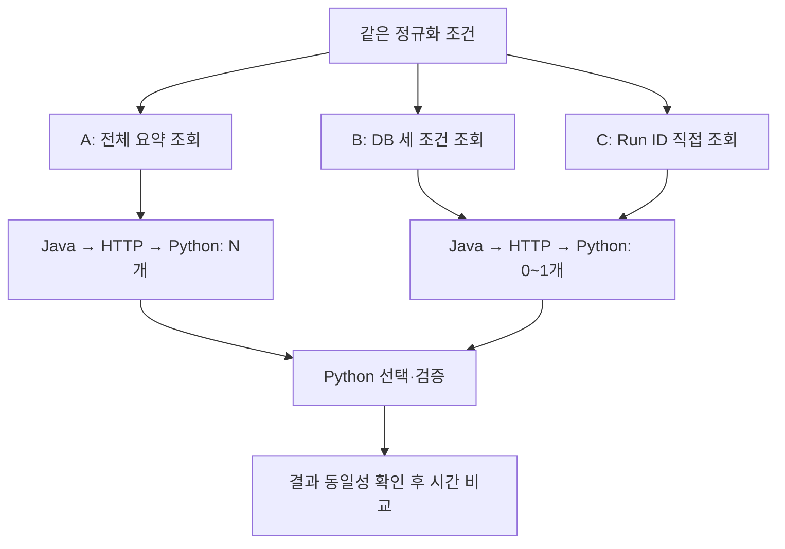

# 순방향 조회 성능 테스트 설계서 - Plan

## Goal Capsule

**전체 Run을 가져와 Python에서 찾는 방식, DB에서 세 조건으로 찾는 방식, 기존 Run ID 인덱스로 찾는 방식을 같은 인공 데이터에서 비교한다.** 데이터는 150 → 10,000 → 100,000 → 1,000,000 Run으로 늘린다. 반환량 감소와 DB 탐색 비용 감소가 각각 시간·메모리에 미치는 영향을 측정한다.

이번 문서는 테스트 설계이며 측정 결과가 아니다. 실행 순서는 **DB 벤치마킹 → 제품 코드 변경 전 k6 기준 측정 → 제품 조회 개선 → 같은 k6 시나리오로 재측정**이다. 먼저 U1–U4의 격리된 벤치마크를 완료하고, 결과 보고 때 다음 k6 기준 측정을 사용자에게 제안한다. 제품의 순방향 조회 교체는 그 뒤 별도 작업으로 판단하며 목표 개선율을 미리 만들어 넣지 않는다.

- 기준 코드: `feat/agent-comparison-charts`, 커밋 `de4ddcc25814b03ae208e58931143509637eecab`.
- 기준 환경: `compose.yaml`의 PostgreSQL 18.6, 현재 Java 서버와 Python Agent. 실행 시 실제 이미지 digest와 런타임 버전을 기록한다.
- 문서는 `main`에서 분리한 문서 브랜치에 작성한다. 실행 코드는 위 기준 기능이 포함된 `main`에서 별도 테스트 브랜치를 만들거나, 해당 기능의 병합을 선행 조건으로 삼는다.
- 중단 조건: 결과 불일치, 대상 DB 식별 실패, 메모리·디스크 한도 초과. 실패한 측정은 성공 표본으로 바꾸거나 제외해 숨기지 않는다.
- 실제 Run·기록·현재 서비스 DB는 수정하지 않는다. 사용자가 변경한 `.gitignore`도 이번 작업에 섞지 않는다.

---

## Product Contract

### Problem and scope

현재 순방향 조회는 전체 현재 버전 목록을 고정하고 요약 데이터를 Java → Python으로 전달한 뒤 조건을 비교한다. 따라서 정확한 결과가 한 개여도 전송·JSON 처리·Python 검사가 전체 Run 수에 비례할 수 있다. 이것은 Run마다 SQL을 실행하는 N+1 문제와 구별되는 **과다 조회와 애플리케이션 필터링** 문제다.

DB에 조건을 전달하면 반환량을 줄일 수 있다. 그러나 조건 컬럼에 맞는 인덱스가 없으면 DB 내부의 전체 검사는 남을 수 있다. 기존 `run.run_id` 기본 키 인덱스를 활용하는 세 번째 방식으로 탐색 경로까지 바꿨을 때의 차이를 확인한다.

범위는 세 조건이 모두 주어진 순방향의 정확 일치 조회다. 역방향, 업로드 병렬화, 새 캐시, UI, LLM 프롬프트, 새 조건 인덱스 추가는 제외한다. 가까운 Run 탐색과 기존 대화·버전 계약은 회귀 확인 대상으로 남기며 이번 벤치마크를 근거로 임의 변경하지 않는다.

### Requirements

**비교와 데이터**

- R1. A/B/C 세 방식은 같은 스키마·데이터·조회 목록·반환 필드·실행 자원을 사용한다.
- R2. 네 규모는 각각 서로 다른 조건 조합의 현재 Run 수이며, 동일 조건 복제나 과거 버전 수로 대체하지 않는다.
- R3. 150건은 현행 조건 격자를 재현한 인공 데이터이고, 1만 건 이상은 조건 범위를 확장한 가정 실험으로 표시한다.
- R4. 모든 방식에서 정확 일치한 Run ID·현재 버전·조건·결과 수치가 같아야 시간 비교를 인정한다.

**측정과 보고**

- R5. DB 실행 시간, 조회 구간 응답 시간, 반환 행·바이트, SQL 수, Python 처리 시간, Java/Python 메모리를 구분해서 기록한다.
- R6. DB 실행 계획으로 실제 인덱스 사용 여부와 필터링·버퍼 접근을 확인한다.
- R7. 전체 ID 목록 저장과 재검증을 포함한 현재 Agent 경로도 별도로 측정하여 조회 구간 개선율을 전체 응답 개선율로 쓰지 않는다.
- R8. 측정 원자료·환경·표본 수·실패·집계 방법을 남기고, 포트폴리오 결과는 문제·분석·해결·결과의 근거가 있는 문장으로 작성한다.
- R9. 제품 조회 코드를 변경하기 전에 k6로 현재 API 경로의 기준 성능을 보관하고, 변경 후 동일한 조건으로 다시 측정한다.
- R10. DB 벤치마킹 완료 보고에는 다음 k6 기준 측정 제안을 반드시 포함한다. 테스트 작업과 제품 최적화는 별도 PR로 관리한다.

### Existing behavior

| 근거 코드 | 확인한 동작 | 설계에 반영할 사항 |
|---|---|---|
| `backend/src/main/java/com/kplasma/analysisagent/run/RunRegistrationService.java` | 세 조건을 `RUN-P%02d-S%03d-B%04d`로 조합 | 정규화 후 정확히 표현 가능한 조건만 ID로 변환 |
| `backend/src/main/java/com/kplasma/analysisagent/run/RunRepository.java` | 동일 ID의 현재 버전을 갱신하고 과거 버전은 보존 | 현재 Run 수와 버전 수를 별도 기록 |
| `backend/src/main/resources/db/migration/V2__runs_and_graphs.sql` | `run_id`, 버전 `id`에 기본 키 | 새 인덱스 추가 없이 기존 인덱스를 활용 |
| `backend/src/main/java/com/kplasma/analysisagent/agent/AgentRequestService.java` | 전체 `catalogRunRefs` 고정, `scalarVersions` 조회, manifest 저장 | 이 비용을 순수 SQL 측정 밖으로 누락하지 않음 |
| `agent/python/src/kplasma_agent/domain/forward.py` | 전체 데이터 적격성 검사, 정확 일치, 없으면 근접 탐색 | 최종 수치·비가용 이유·근접 동작의 기준 |
| `agent/python/src/kplasma_agent/domain/validation.py` | 같은 원본으로 순방향 결과 재계산·검증 | 실제 경로에 중복 계산 비용이 존재함 |
| `backend/src/main/java/com/kplasma/analysisagent/parser/KPlasmaScalarParser.java` | 압력 5 × 소스 5 × 바이어스 6 조합 허용 | 현재 등록 가능한 서로 다른 조건은 150개 |

---

## Planning Contract

### Comparison methods

| 방식 | 검색 방법 | 정확 일치 시 반환 요약 수 | 비교 목적 |
|---|---|---:|---|
| A. 전체 조회 후 선택 | 현재 Run의 요약 전체 조회 → Python 조건 검사 | N개 | 현재 과다 조회 구조의 비용 |
| B. DB 조건 조회 | JSON의 압력·소스·바이어스를 정규화하여 `WHERE` 동등 비교 | 1개 | DB 조건 처리와 반환량 감소 효과 |
| C. Run ID 직접 조회 | 정규화 조건 → ID → `run_id = ?` → 현재 버전 조회 | 1개 | 기존 기본 키 인덱스 활용 효과 |

KTD1. C는 새 복합 인덱스 생성 대신 **기존 Run ID 인덱스를 활용하는 조회 경로**로 삼는다. 이미 조건 조합으로 고유 ID를 만들기 때문이다. A→B는 필터 처리 위치와 반환량 변경, B→C는 검색 키와 접근 경로 변경이다. B→C 결과를 “같은 SQL에 인덱스만 추가한 효과”라고 표현하지 않는다. (session-settled: user-approved — chosen over 새 압력·소스·바이어스 복합 인덱스: 기존 고유 Run ID를 활용하는 방향을 논의한 뒤 설계 작성을 요청함)

KTD2. 모든 방식에서 기존 기본 키와 외래 키를 유지한다. B의 “조건 인덱스 없음”은 DB의 모든 인덱스를 제거한다는 뜻이 아니다. 테이블 구조나 저장 필드를 B/C에서 추가로 바꾸지 않는다.

KTD3. ID 생성은 LLM이 수행하지 않는다. 코드가 단위를 정규화한 후 정수·범위·형식을 확인한다. 예를 들어 `0.008 Torr / 300 W / 600 W`는 `8 mTorr / 300 W / 600 W`로 맞춘 뒤 ID를 만든다. `8.5`를 `8`로 잘라 다른 Run을 선택하면 실패다.

KTD4. C는 `run`에서 찾은 `current_version_id`로 현재 버전을 가져온다. 과거 버전 전체에서 조건 일치 행을 찾거나 `LIMIT 1`로 버전을 임의 선택하지 않는다. 고정된 과거 참조의 재사용은 별도 버전 ID를 따르는 기존 계약이다.

기본 키 생성 시 PostgreSQL이 고유 B-tree 인덱스를 만든다는 점은 [공식 문서](https://www.postgresql.org/docs/18/indexes-unique.html)를 따른다. 실제 사용 여부는 실행 계획으로 판단하며 `enable_seqscan=off`로 강제한 수치를 본 결과에 넣지 않는다.

### Synthetic data

| 현재 Run 수 | 조건 생성 방식 | 의미 |
|---:|---|---|
| 150 | 압력 `{2,4,6,8,10}`, 소스 `{100,200,300,400,500}`, 바이어스 `{0,200,400,600,800,1000}`의 전체 조합 | 현재 규모와 형식 재현, 수치는 인공 |
| 10,000 | 확장 격자에서 고정 seed로 선택한 고유 조합, 기존 150개 포함 | 가정 규모 |
| 100,000 | 같은 선택 순서의 다음 조합까지 확장 | 가정 규모 |
| 1,000,000 | 확장 격자 전체 | 가정 규모 |

확장 격자는 압력 `1..50`의 50개, 소스 `5..500`을 5 간격으로 100개, 바이어스 `0..9950`을 50 간격으로 200개로 구성한다. `50 × 100 × 200 = 1,000,000`이며 ID 자릿수와 고유성을 유지한다. 이는 물리적으로 유효한 공정 범위라는 주장이 아니다. 선택 seed는 `20261010`으로 고정하고, 작은 데이터셋이 큰 데이터셋에 포함되게 만든다.

대량 데이터는 격리 DB의 테스트 생성기로 넣는다. 제품 업로드 파서의 150개 조합 제한을 풀거나 실제 등록 API를 100만 번 호출하지 않는다. 삽입 순서는 별도 seed로 섞어 물리 저장 순서가 조회 키 순서와 우연히 일치하는 효과를 통제한다.

- 실제 마이그레이션의 `run`, `run_version`, `source_set` 관계와 JSON 타입·단위·상태 필드를 유지한다. ID·버전 UUID·요약·Full의 참조가 서로 일치해야 한다.
- 기본 측정에서는 모든 현재 Run이 적격이고 각 Run에 현재 버전 한 개만 있다. 별도 작은 회귀 데이터에서 과거 버전과 비가용 데이터를 검증한다.
- 수치는 seed에 따른 인공 값이며 실제 실험 수치·원본을 복제하지 않는다. `sourceFiles`와 scalar 필드 구성은 기존 인공 계약 fixture를 따른다.
- 그래프 원본 파일과 대용량 파형은 생성하지 않는다. 이로 인해 실제 `full_run`의 TOAST·압축 해제 비용까지 재현하지 못한다는 제한을 보고서에 남긴다.
- 동일 JSON을 복사해 지나치게 잘 압축되는 데이터를 만들지 않는다. 생성 후 JSON 직렬화 바이트의 평균·p95, 테이블·인덱스·TOAST 크기를 기록한다.
- 생성 시간과 인덱스 유지 비용은 준비 비용으로 따로 기록한다. 조회 시간에 합치지 않는다. 준비가 끝나면 같은 유지 관리 절차와 `ANALYZE`를 적용한다.

### Measurement boundaries

**M1. SQL 실행 계획:** 세 방식의 검색 SQL을 DB에서 측정한다. 공통 원본은 `run`과 현재 `run_version`의 연결이며 요약과 `sourceFileCount`를 같은 형태로 반환한다. A/B는 동일한 안정적 정렬을 사용한다. A는 전체 요약을 읽는 현재 알고리즘을 재현한 벤치마크 SQL이고, 현재 서비스의 manifest 처리까지 그대로 복제한 SQL은 아니다.

**M2. 조회 구간 비교:** Python의 정규화된 조회 요청 시작부터, 실제 Java/JDBC·HTTP·JSON 처리를 거쳐 Python의 선택 결과 검증이 끝날 때까지 측정한다. 동일한 테스트 전용 연결 경로에서 A/B/C의 조회 전략만 바꾼다. A는 전체 요약, B/C는 후보 요약을 전달하고 실제 `lookup_forward`와 결과 검증을 사용한다. 기본 데이터가 모두 적격이므로 제외 목록은 세 방식 모두 비어 있으며 최종 결과 전체가 같아야 한다. M2는 LLM·대화 저장·전체 catalog 고정을 포함하지 않는 **조회 구간**이다.

생성 시 만든 기대 Run·버전·수치 목록으로도 결과를 확인한다. 반환된 후보만으로 다시 계산하는 `validate_result`만 통과했다고 정확성을 인정하지 않는다. 후보의 정규화 조건이 입력과 정확히 같은지, 그 조건으로 만든 ID가 반환된 ID와 같은지도 검증한다.

**M3. 현재 Agent 경로 진단:** 원래 서비스 코드를 통해 단일 요청을 실행하고 전체 ID 목록 고정, scalar 조회, manifest JSON 저장, Python 계산·재검증, 답변 저장을 측정한다. 도구 선택 LLM만 고정된 정상 입력으로 대체한다. DB·HTTP 응답 지연은 실제로 측정한다. 현재 A 경로의 비용 분해를 위한 실험이며, 구현하지 않은 B/C 제품 경로의 전체 개선율을 산출하지 않는다.

KTD5. 현재 `catalogRunRefs` 생성 자체도 N개를 읽고 저장한다. C의 SQL이 빨라져도 이 경로가 남으면 Agent 전체가 동일 비율로 빨라지지 않는다. 제품 적용 시에는 전체 제외 사유와 고정 버전 계약을 함께 설계해야 하므로 M2의 구현을 바로 제품 최적화 완료로 취급하지 않는다.

### Workload and protocol

1. 같은 CPU·메모리 한도의 별도 PostgreSQL 컨테이너와 별도 Java/Python 프로세스를 사용한다. DB명·전용 표식을 확인한 생성기만 쓰기를 허용한다. 서비스의 `.env`를 자동 로드하지 않는다.
2. 규모별로 동일 데이터셋에서 A/B/C를 모두 실행한다. Java JIT·연결 풀·Python 프로세스 초기화는 준비 구간으로 분리하고, 연결은 재사용한다. 요청·결과 캐시는 사용하지 않는다.
3. 주 측정은 동시 요청 1개다. 동일한 고정 seed로 고르게 선택한 40개 정확 일치 조건을 한 라운드에 사용하며 5라운드, 방식별 총 200회 측정한다. 150건에서는 라운드 사이 조건 재사용을 허용한다.
4. 규모·방식별 준비 조회 5회를 측정에서 제외한다. 5라운드의 방식 순서는 ABC → BCA → CAB → ACB → CBA로 바꾸며, 같은 라운드의 조회 조건과 순서는 세 방식에 동일하게 적용한다.
5. 입력 목록과 준비 절차를 고정한 반복 조회 결과로 보고한다. DB·OS 캐시 상태는 별도 기록한다. 데이터가 메모리보다 크면 완전한 warm cache라고 부르지 않는다. 컨테이너 재시작만으로 OS 캐시까지 비워졌다고 가정하지 않는다.
6. M1 실행 계획은 대표 키 5개에서 별도로 수집한다. `EXPLAIN (ANALYZE, BUFFERS, FORMAT JSON)`은 진단용이고 M2 지연 표본에 섞지 않는다. SQL 시간에는 JDBC 전송·Java 직렬화·Python 처리가 포함되지 않는다.
7. M3는 규모별 10회로 비용 분해를 수행한다. 표본이 적으므로 평균·중앙값·최댓값·실패 수만 제시하고 안정적인 p95 또는 포화 처리량이라고 주장하지 않는다.
8. 1만 건 예비 실행으로 메모리·디스크 증가를 확인한 뒤 다음 규모를 준비한다. 요청 제한 시간은 60초, 규모별 측정 예산은 60분을 기본값으로 기록한다. 예산·자원 한도로 미완료되면 실제 표본 수와 실패·중단 사유를 남기고 누락 규모를 추정값으로 채우지 않는다.

메모리 비교는 별도 실행에서 방식별로 Java/Python 프로세스를 새로 시작하고 동일하게 준비한 뒤 3회 측정한다. 이전 A 실행이 확보한 Java heap이 B/C의 RSS로 남는 영향을 피하기 위해서다. 프로세스 시작·준비 시간은 조회 지연에서 제외하고 기준 RSS와 조회 중 최고 RSS를 함께 기록한다.

DB 반복 조회는 [pgbench의 사용자 SQL](https://www.postgresql.org/docs/18/pgbench.html)로 수행한다. 각 규모에서 A/B/C를 각각 1개 연결·1개 실행 스레드로 60초씩 3라운드 실행하고, 같은 seed의 정확 일치 입력을 사용한다. 준비 조회 후의 시간만 집계하며 기본 은행 업무 시나리오는 사용하지 않는다. 명령 타임아웃과 실제 종료 시각도 기록한다.

pgbench의 지연에는 DB와 pgbench 사이 결과 전송이 포함될 수 있다. 따라서 EXPLAIN의 서버 실행 시간과 별도 지표로 표시한다. 1개 연결의 처리 건수/초는 그 조건의 처리율이며 다중 사용자 최대 처리량이 아니다. pgbench의 진단 표본을 M2 지연 표본에 합치지 않는다. k6를 이용한 제품 API 전후 비교는 아래의 다음 단계로 진행한다. 다중 사용자 최대 용량 측정과 cold-cache 실험은 별도 후속 범위다.

pgbench는 세 방식 모두 동일한 쿼리 프로토콜을 사용하고, 트랜잭션당 정확 조회 SQL 한 번을 실행한다. 입력 생성용 추가 SQL을 측정 구간에 넣지 않는다. 쿼리 프로토콜·JDBC prepare 설정·연결 풀 크기·heap 한도·DB 메모리 설정을 실행 메타데이터에 고정해서 기록한다.

### Staged execution and completion handoff

| 순서 | 수행할 작업 | 다음 단계에 넘길 근거 |
|---|---|---|
| 1. DB 벤치마킹 | U1–U4: A/B/C, 네 데이터 규모, 현재 Agent 경로 진단 | 결과 동일성·실행 계획·조회 구간 성능·남은 비용 |
| 2. 개선 전 k6 | 제품 조회 코드를 유지한 상태에서 실제 API 경로 측정 | 기준 커밋·시나리오·환경·원자료·응답 시간·실패율 |
| 3. 제품 조회 개선 | 측정으로 선택한 경로를 적용하고 근접 탐색·버전·제외 사유 계약 검증 | 제품 변경 PR과 회귀 검증 |
| 4. 개선 후 k6 | 2단계의 데이터·입력·자원·시나리오로 재측정 | API 경로의 전후 차이와 개선율, 남은 병목 |

**DB 벤치마킹 완료 시 사용자에게 다음 단계를 제안하는 것을 U4의 필수 산출물로 둔다.** 완료 보고에 다음 취지의 문장을 포함하고, 검증 문서에도 k6 기준 측정의 진행 여부를 기록한다.

> DB 벤치마킹 결과가 정리됐습니다. 제품 조회 코드를 바꾸기 전에 k6로 현재 API 응답 시간과 실패율을 기록하는 단계를 제안합니다. 이후 같은 조건으로 재측정해야 실제 서비스 경로의 개선 효과를 비교할 수 있습니다.

기준 측정을 남기기 전에 제품 최적화로 넘어가지 않는다. 벤치마크 일부가 자원 한도로 미완료됐다면 완료한 규모와 제약을 함께 보고하고, k6에서도 실행 가능한 비교 범위를 명시한다. 이 제안은 벤치마크 완료 보고에 연결하며 정기 알림 작업은 만들지 않는다.

**k6 기준 측정의 공통 조건**

- 처음에는 가상 사용자 1명으로 요청을 순차 실행한다. 한 워크스페이스에 여러 동시 질문을 넣는 방식으로 부하를 만들지 않는다. 여러 사용자 용량 검증이 필요해지면 사용자·워크스페이스를 분리한 별도 시나리오로 설계한다.
- 150 → 1만 → 10만 → 100만의 동일 인공 데이터와 고정 입력 목록을 사용한다. 전후의 표본 수·준비 조회·타임아웃·폴링 간격·k6 버전·서버 자원·DB 설정을 기준 측정 전에 고정한다. 실제 완료 표본과 실패 수를 함께 보관한다.
- 비동기 Agent 요청의 접수 응답 시간과 **요청 전송부터 최종 분석 완료를 확인하기까지의 시간**을 구분한다. 후자는 제출 후 완료 상태를 확인하는 시나리오와 [k6 사용자 정의 Trend](https://grafana.com/docs/k6/latest/using-k6/metrics/create-custom-metrics/)로 측정한다. 폴링으로 인한 관측 지연을 명시하고 전후에 같은 간격을 사용한다.
- DB 조회 개선을 비교할 때는 전후 모두 도구 선택 LLM만 동일한 정상 입력으로 대체하고 DB·HTTP·Agent 계산·저장은 실제 경로로 실행한다. 실제 LLM을 포함한 사용자 응답 측정은 별도로 표시한다.
- 평균·중앙값·p95 완료 시간과 실패율을 비교한다. 접수 HTTP 요청 수/초를 완료한 분석 수/초로 표현하지 않는다. 기준 커밋과 실행 설정·데이터·입력 목록의 식별값을 남겨 최적화 이후에도 재현할 수 있게 한다.

### PR strategy

- **테스트 PR:** 이 설계서, 인공 데이터 생성기, A/B/C 측정기·SQL, 소량 정확성 테스트, 재현 절차, 인공 데이터 기반 집계 보고서를 포함한다. DB 벤치마킹 이후 k6 기준 측정 코드와 기준 결과도 제품 변경과 분리된 테스트 변경으로 관리한다.
- **제품 개선 PR:** k6 기준 측정을 보관한 뒤 조회 코드와 필요한 계약·회귀 테스트를 변경한다. 같은 k6 시나리오의 개선 후 결과와 전후 비교를 첨부하고 테스트 PR의 근거를 연결한다.
- 대량 생성 데이터·DB 덤프·원시 로그·실제 실험 데이터·비밀값·`docs/folio/`는 PR에 올리지 않는다. 원자료는 Git 제외 경로에 보관하고 PR에는 재현 방법과 집계값만 남긴다.
- 기존 기능 PR에 이번 성능 테스트를 합치지 않는다. 각 작업 브랜치는 필요한 선행 기능이 병합된 `main`에서 분기한다. PR 생성·제출은 구현과 검증 단계에서 수행하며 계획서 작성만으로 제출 완료로 표시하지 않는다.

### Tools by purpose

| 도구 | 이번에 쓰는 용도 | 이 도구만으로 알 수 없는 것 |
|---|---|---|
| Docker Compose + PostgreSQL | 실제 DB와 분리한 성능 테스트 DB, 버전·자원 한도 고정 | 동일 설정만으로 캐시 상태가 같아지지는 않음 |
| Python 생성기 + PostgreSQL COPY/SQL | 같은 스키마의 고유 조건·인공 JSON을 대량 생성 | 실제 물리 실험의 유효성 |
| PostgreSQL `EXPLAIN (ANALYZE, BUFFERS, FORMAT JSON)` | 전체 검사/인덱스 탐색, DB 실행 시간·버퍼·필터링 확인 | HTTP·Java·Python을 합친 응답 시간 |
| `pgbench` 사용자 SQL | DB 반복 조회 지연·단일 연결 처리율 비교 | 전체 Agent의 처리량과 LLM 비용 |
| Python `time.perf_counter_ns()` 기반 측정기 | M2 요청 시간·Python 처리 시간, 반복·원자료·집계 | 별도 계측 없는 Java/DB 내부 구간 |
| 테스트용 JDBC 계측 + Java `System.nanoTime()` | SQL 실행 횟수, fetch·매핑·직렬화 구간 측정 | 다른 프로세스의 시각과 직접 차감한 네트워크 시간 |
| OS RSS 샘플링 + Java GC 로그 | Java/Python 메모리 최고치와 GC 영향 | 샘플 간격보다 짧은 메모리 피크의 완전한 포착 |
| Phoenix/OpenTelemetry | M3 대표 요청에서 gather·계산·검증·저장 흐름과 느린 단계 확인 | 세밀한 SQL 횟수나 신뢰할 만한 반복 성능 통계 전체 |
| pytest + JUnit/Testcontainers | 인공 데이터·수치·단위·버전·집계 정확성 검증 | 테스트 통과만으로 성능 개선 입증 |
| k6 | DB 벤치마킹 다음 단계: 제품 변경 전후 API 완료 시간·p95·실패율 비교, 먼저 사용자 1명으로 측정 | SQL 내부 비용 분해나 다중 사용자 최대 용량을 자동으로 증명하지 않음 |

시간은 각 프로세스 안의 monotonic clock으로 구간 차이를 구한다. Java와 Python의 타임스탬프를 서로 빼지 않는다. Phoenix exporter는 M1/M2/pgbench 주 측정에서는 끄고, M3의 대표 흐름 확인 실행에서만 켠다. Trace 원문에는 인공 데이터만 포함한다.

### Metrics and interpretation

| 지표 | 수집 위치·도구 | 해석 |
|---|---|---|
| 평균·중앙값·p95 응답 시간 | M2의 Python monotonic timer, 전체 표본 보관 | 조회 구간 체감 비용 |
| SQL 계획·실행 시간 | PostgreSQL EXPLAIN | DB 내부 비용; 애플리케이션 응답 시간과 구분 |
| 접근 방식·필터 제거 행·loops | 실행 계획의 각 scan 노드 | 실제 Seq Scan/Index Scan 판단; 중첩 노드 수를 더해 고유 검사 행 수로 오인하지 않음 |
| shared hit/read·temp I/O | EXPLAIN BUFFERS | 캐시·DB 페이지 접근; shared read를 물리 디스크 읽기와 동일시하지 않음 |
| SQL 실행 횟수 | 테스트용 JDBC 계측, 요청 단위 | M2와 M3 각각 집계; 시간 개선과 SQL 개수 감소를 혼동하지 않음 |
| 반환 요약 수·JSON 바이트 | JDBC row mapper 및 HTTP 응답 계측 | N→1 전송 감소; 인덱스가 읽은 항목 수와 구분 |
| DB→Java fetch·Java 변환 | 테스트용 Java 구간 타이머 | JDBC 전송·매핑 비용 포함 여부를 명시 |
| Python JSON·계산·검증 시간 | Python 구간 타이머 | 전체 목록 처리와 재검증 비용 |
| Java/Python peak RSS·GC | OS 프로세스 샘플링·Java GC 로그 | 프로세스별 기준치와 최고값, 샘플 간격 100ms 기록 |
| 실패율·타임아웃·처리율 | 측정기 원자료 | 실패를 제외한 빠른 응답만으로 개선율을 만들지 않음 |

구간은 중첩될 수 있으므로 SQL 시간과 JDBC fetch 시간을 단순 합산하지 않는다. p95는 정렬된 표본의 `ceil(0.95 × n)`번째 값으로 계산하며, 라운드별 p95와 전체 p95를 구분한다. 계획의 `cost`는 ms가 아니며 `rows`도 검사한 전체 행 수가 아니다. [PostgreSQL EXPLAIN 문서](https://www.postgresql.org/docs/18/using-explain.html)

- 지연 개선율: `(변경 전 시간 − 변경 후 시간) / 변경 전 시간 × 100`.
- A→B, B→C, A→C를 **같은 규모·같은 측정 경계·같은 지표**끼리 계산한다. 평균과 p95를 각각 제시한다.
- 라운드마다 결과가 뒤집히면 효과가 안정적이지 않다고 보고한다. 네 규모의 개선율을 단순 평균해 “전체 개선율”로 쓰지 않는다.
- 순수 SQL 수치만 있으면 “SQL 실행 시간 개선”, M2 수치이면 “조회 구간 개선”이라고 적는다. “Agent 전체 응답 개선”은 실제 제품 경로 적용 전후의 후속 측정으로만 주장한다.
- 150건에서 Seq Scan이 선택되거나 차이가 작아도 정상적인 관찰이다. 인덱스 사용 또는 양의 개선율 자체를 테스트 통과 조건으로 강요하지 않는다.

### Correctness and compatibility

| 시나리오 | 기대 결과·측정 처리 |
|---|---|
| 정확 일치, 키의 앞·중간·뒤 | A/B/C의 Run·버전·조건·수치·검증 결과가 일치 |
| 같은 P, 다른 S 또는 B | ID 전체가 일치하는 Run만 선택 |
| Torr 등 동등 단위 입력 | 기존 정규화 결과와 같은 ID·Run 선택 |
| Bias 0 | 누락으로 처리하지 않고 `B0000` Run 선택 |
| 소수 조건·비유한 값·필수 값 누락 | 정수로 잘라 오조회 금지; 검증 오류 또는 기존 탐색 경로 대상으로 분류 |
| 정확 일치가 없는 조건 | B/C의 정확 조회 후보는 0건이고 원래 A는 근접 탐색을 수행함; 동일 작업이 아니므로 주 성능 비교에서 제외하고 기존 `NEAREST_ONLY` 회귀를 따로 확인 |
| 같은 조건에 새 버전 등록 | 현재 Run 수는 그대로, 새 질문은 현재 버전, 기존 고정 참조는 과거 버전 유지 |
| 데이터 비가용·조건 null | 현재 `NO_DATA`·제외 사유·근접 선택을 회귀 기준으로 유지; 기본 성능 표와 별도 보고 |
| ID와 JSON 조건이 어긋난 데이터 | 빠르게 찾았더라도 결과 검증에서 실패; 정상 성능 표본으로 포함하지 않음 |

M2의 대량 성능 비교는 정확 일치·전부 적격 데이터에 한정한다. 전역 `excludedRuns`나 근접 후보까지 B/C가 구현했다고 주장하지 않는다. 비가용·근접·고정 버전의 제품 동작은 기존 코드와 테스트로 확인하고 후속 적용의 필수 조건으로 남긴다.

---

## Implementation Units

### U1. Isolated dataset and query corpus

- 목적·요구: 고유 조건을 가진 재현 가능한 네 규모 데이터와 조회 목록 생성. R1–R3.
- 파일: 새 `scripts/performance/forward-lookup/seed.py`, `scripts/performance/forward-lookup/compose.yaml`, `scripts/performance/forward-lookup/tests/test_seed.py`.
- 기준: 기존 DB 마이그레이션, `backend/src/test/java/com/kplasma/analysisagent/workspace/WorkspaceTestSupport.java`, `agent/tests/support/contract-wire.json`의 소량 인공 fixture.
- 검증: 소규모 생성에서 조건·ID·참조 고유성, 같은 seed의 재현성, 0 보존, 비전용 DB 쓰기 거절. 대량 생성 후 N·고유 조합·현재 버전 수를 DB 집계로 확인한다.
- 의존: 기준 코드 확보. 대량 데이터는 Git 제외 경로에만 생성한다.

### U2. Comparable A/B/C lookup harness

- 목적·요구: 동일 JVM·JDBC·HTTP 경로에서 세 조회 전략 비교. R1, R4, R5.
- 파일: 새 `backend/src/test/java/com/kplasma/analysisagent/performance/ForwardLookupBenchmarkSupport.java`, `backend/src/test/java/com/kplasma/analysisagent/performance/ForwardLookupBenchmarkTest.java`, `scripts/performance/forward-lookup/run.py`, `scripts/performance/forward-lookup/tests/test_lookup_contract.py`.
- 방식: Spring 테스트 컨텍스트의 로컬 전용 HTTP 진입점에만 전략 선택을 둔다. 배포용 API나 LLM tool에 A/B/C 옵션을 추가하지 않는다. B의 수치 정규화는 기존 `ReverseContextQuery`와 Python의 단위 규칙을 참고해 동일성 검증을 한다.
- 검증: 기본 정확 일치, 같은 압력의 다른 조건, 동등 단위, Bias 0, ID/조건 불일치, 소수 절삭 금지. 정확 일치 사례에서는 `lookup_forward`와 `validate_result`의 최종 결과를 비교한다. 미일치는 B/C 후보 0건과 성능 비교 제외 분류를 검증한다.
- 의존: U1. 해당 지원 코드는 명시적인 성능 실행에서만 기동하며 일반 테스트가 100만 건을 생성하지 않게 한다.

### U3. Real timing and current-path attribution

- 목적·요구: M1/M2 반복 측정과 M3 현행 경로 계측. R5–R7.
- 파일: U2의 측정기·Java 지원 코드, 새 `scripts/performance/forward-lookup/tests/test_report.py`, `scripts/performance/forward-lookup/sql/a.sql`, `scripts/performance/forward-lookup/sql/b.sql`, `scripts/performance/forward-lookup/sql/c.sql`. 기존 `agent/python/tests/test_graph_v1.py`, `backend/src/test/java/com/kplasma/analysisagent/workspace/AgentRequestPersistenceTest.java`의 요청·claim 패턴을 재사용한다.
- 방식: 실제 DB·HTTP와 LLM test double을 사용하고, 요청 지연을 임의로 삽입하지 않는다. 측정 로그는 실행 ID·규모·방식·라운드·쿼리 ID로 연결한다. Phoenix는 켜기 전후의 대표 요청 흐름 확인용이며 Cloud 전송을 주 측정에서 제외한다.
- 검증: 성공·타임아웃·미완료의 집계 분리, SQL 횟수와 반환 건수의 수작업 대조, p95·개선율 계산, 오래된 manifest를 새 조회로 재사용하지 않는지 확인한다.
- 의존: U1, U2. M3에서 요청·manifest 생성과 정리 비용의 포함 위치를 기록하고, 후속 요청에 기록이 누적되는 영향을 통제한다.

### U4. Evidence and decision report

- 목적·요구: 숫자의 측정 범위와 한계를 포함한 성능 비교 보고서 작성과 다음 측정 단계 제안. R8–R10.
- 파일: 새 `scripts/performance/forward-lookup/README.md`, `docs/verification/forward-lookup-performance.md`; 로컬 전용 `docs/folio/순방향-조회-성능-개선.md`.
- 산출물: 재현 방법·집계 정의·인공 데이터라는 사실은 검증 문서에 기록한다. 실행 원자료·계획 JSON·대량 데이터는 `.local/performance/forward-lookup/<execution-id>/`에 보관한다. `docs/folio/`의 Git 제외를 확인한 뒤 포트폴리오 문장을 작성한다.
- 검증: 원자료에서 표의 평균·p95·개선율을 다시 계산할 수 있어야 한다. “인덱스 추가”, “Agent 전체 개선”, “100만 건 실데이터” 등 측정하지 않은 주장이 없어야 한다.
- 완료 보고: DB 벤치마킹 결과와 남은 비용을 설명하고, **제품 변경 전 k6 기준 측정**을 사용자에게 제안한다. 검증 문서에 기준 커밋과 다음 단계 상태를 남기며, 아직 수행하지 않은 k6·제품 개선을 완료로 표시하지 않는다.
- 의존: U3. 측정이 끝나기 전 결과 표의 수치를 채우지 않는다.

---

## Verification Contract

| 단계 | 실행·확인 방법 | 완료 기준 |
|---|---|---|
| 생성기·집계기 | `agent/python/.venv/bin/python -m pytest scripts/performance/forward-lookup/tests -q` | 소량 인공 테스트 통과, 대량 실행은 명시적으로 분리 |
| DB·Java 비교 | `backend/gradlew -p backend test --tests '*ForwardLookupBenchmarkTest'` | 동일 후보·수치, 격리 DB, 기본 키 유지 |
| 기존 순방향 회귀 | `agent/python/.venv/bin/python -m pytest agent/python/tests/test_forward.py agent/python/tests/test_units.py agent/python/tests/test_context.py -q` | 정확·근접·단위·0·문맥 동작 보존 |
| 기존 요청·버전 회귀 | `backend/gradlew -p backend test --tests '*AgentRequestPersistenceTest' --tests '*ReverseQueryContextTest'` | 요청과 고정 버전 계약 보존 |
| 실행 계획 | M1의 실제 SQL에 EXPLAIN ANALYZE·BUFFERS | 인덱스 사용 여부·버퍼·필터링 근거 보관 |
| DB 반복 조회 | pgbench 사용자 SQL, 방식별 1연결·60초·3라운드 | 같은 조건 목록·성공 건수·실패·실제 측정 시간·처리율 기록 |
| 대량 측정 | M2 네 규모 × 세 방식, 각 200회 목표 | 결과 불일치 0건; 실제 표본·실패·제약 명시 |
| 전체 경로 진단 | M3 네 규모, 각 10회 목표 | ID 목록·manifest·계산·검증·저장 비용의 위치 확인 |
| 다음 단계 전달 | U4 완료 보고와 검증 문서 확인 | 개선 전 k6 기준 측정 제안, 기준 커밋과 진행 여부 기록 |
| 저장소 점검 | `git diff --check`, `git check-ignore` 및 변경 파일 목록 | 비밀값·실데이터·대량 산출물·folio가 추적되지 않음 |

Java 21·Docker와 기준 브랜치의 Python 환경이 전제다. 표의 신규 테스트·측정기는 아직 없으며 실행 단계에서 U1–U3로 만든다. 일반 CI에는 소량의 correctness 테스트만 넣고 대량 성능 수치를 고정 임계값으로 강제하지 않는다. 후속 k6 단계에서는 기준 측정이 제품 변경보다 앞섰는지, 전후 실행 조건과 최종 결과가 같은지, 접수 시간과 분석 완료 시간이 분리됐는지를 추가 검증한다.

---

## Definition of Done

아래는 **DB 벤치마킹 단계(U1–U4)**의 완료 기준이다. k6 전후 비교와 제품 개선은 위 실행 순서에 따라 별도로 진행한다.

- A/B/C의 정확 일치 결과가 같고, 네 규모의 실행 결과 또는 실행 불가 근거가 남아 있다.
- 동일 조건 중복이 없고 현재 Run 수와 과거 버전 수가 구분돼 있다.
- 환경·seed·데이터 크기·표본 수·준비 조회·실행 순서·실패가 재현 가능하게 기록돼 있다.
- 개선율은 측정한 구간에만 붙인다. 개선이 없거나 느려졌어도 실제 결과로 보고한다.
- 현재 전체 경로에 남은 비용과 제품 적용 전에 필요한 계약 변경이 구분돼 있다.
- 테스트 전용 코드가 운영 경로로 노출되지 않고, 시도 후 폐기한 코드와 임시 설정은 정리돼 있다.
- 실제 데이터와 로컬 포트폴리오가 Git에 포함되지 않는다.
- 완료 보고에서 사용자에게 개선 전 k6 기준 측정을 제안했고, 검증 문서에 다음 단계의 진행 여부가 남아 있다.
- 테스트 PR의 범위와 제품 개선 PR의 범위를 구분하고, 기준 측정 전에 제품 조회 코드를 변경하지 않는다.

포트폴리오 문장은 측정 후 다음 형식으로 3–4줄 이내 작성한다.

> 순방향 조회에서 전체 Run 요약을 전송한 뒤 Python에서 조건을 검사하는 과다 조회를 확인했습니다.
>
> 실행 계획과 구간별 계측으로 DB 탐색·JSON 전송·애플리케이션 처리 비용을 구분했습니다.
>
> DB 조건 조회와 기존 Run ID 기본 키 인덱스 활용을 비교한 결과, **[인공 N건·환경]**에서 **[측정 구간]** 평균 **[A]→[C]ms**, p95 **[A]→[C]ms**로 개선됐습니다.
>
> 평균 지연 **[x]%** 감소를 확인했으며, 전체 Agent 응답 시간과는 구분해 보고했습니다.

수치가 개선되지 않았다면 위 예시의 “개선” 표현도 실제 결과에 맞게 바꾼다.
