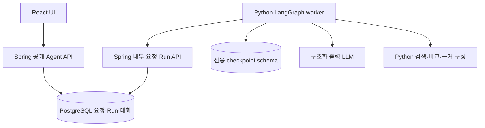
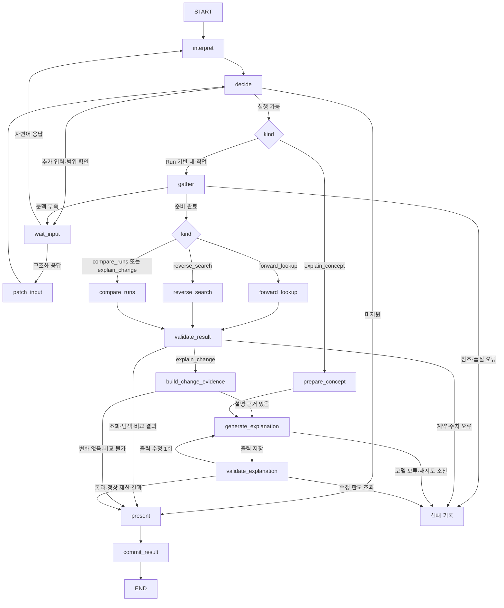

# K-PLASMA Agent Graph v1 Implementation Plan

**2026-10-05 사용자 수정 지시:** 순·역방향 검색은 v12.3.1의 결과와 화면을 유지한다. “150–160 eV에 가깝게”도 명시된 범위로 먼저 필터링한다. `target_range`는 범위 밖 후보를 허용한다고 명시한 경우에만 사용한다. 기존 F4·X6의 기본 soft 해석을 아래와 같이 수정했다. v1이 만든 결과·평가·정확한 Run 버전을 기존 순·역방향 renderer에 전달하며 JS fallback 실행은 하지 않는다. [수정 및 검증 기록](../../verification/agent-v1-search-parity.md).

**목표:** Python LangGraph 기반 **Agent Graph v1**으로 순방향 조회·역방향 탐색·Run 비교·변화 설명·개념 설명을 구현하고, 실제 수치의 정확성과 장애 후 요청·문맥 복구를 보장한다.

**구현 이름:** 기존 결정론적 JS 구현은 **`fallback`**, 이번 신규 그래프는 **`v1`**이다. fallback을 v0/v1로 개명하지 않는다. `implementationId: "v1"`과 `graphVersion: "v1"`을 신규 요청 메타데이터에 기록한다. v1 내부 실행 코드의 불변 배포 식별자는 별도 `graphBuildId`로 추적한다.

**설계 기준:** 2026-10-04 사용자와 합의한 이 문서의 Product Contract. 기존 [이관 설계](../specs/2026-10-03-v12.3.1-implementation-design.md)는 데이터·화면·저장 규칙의 기준이며, Agent 실행 위치와 구현 언어는 이 계획의 제안으로 갱신한다.

**기술:** Python LangGraph, Pydantic, PostgreSQL 영속 체크포인터, 기존 Spring Boot API와 React/TypeScript UI. Python 패키지는 `agent/python/`에 둔다. JS fallback 호출·Node bridge·Python 내 JS 평가기를 신규 실행 경로에 넣지 않는다.

이 문서는 구현 계획이며 구현·테스트 통과 보고서가 아니다. `implementation-ready`는 작업 분해와 계약이 작성됐다는 뜻이며 사용자 검토·팀 합의나 배포 승인을 대신하지 않는다. 아래 신규 기술 세부안과 명시한 제품 차이는 이 계획 검토 대상이다.

2026-10-04 확장: `compare_runs`, `explain_change`, `explain_concept`를 구현 범위에 포함한다. 다섯 도구의 계약·분기·검증·복구·작업 분해를 아래에 명시한다. 설명은 LLM 일반 지식을 사용하며 검토된 자료·RAG는 후속 업그레이드다. 세부 구현 방식과 제안 평가 기준은 구현 전 팀 검토 대상이다.

## Goal Capsule

- 우선순위: 잘못된 수치 방지, 중단 후 요청·문맥 복구, 다섯 도구의 안정적인 자연어 입력과 설명의 사실/해석 구분.
- LLM은 다섯 도구의 `status / operations / kind / inputs`를 작성한다. 코드가 Interpretation Decision, 대상 확정, 검색·계산·정렬, 검증을 수행한다. 설명 두 도구에서는 별도의 설명 단계가 LLM 일반 지식으로 서술 초안을 만들고, 검증 후 코드가 실제 수치와 결합한다.
- 기존 JS fallback은 별도 구현 버전으로 보존한다. Python MVP는 이에 의존하지 않는다. LLM 연결이 없을 때의 자동 전환은 후속 설계다.
- 의사결정 기록 기반 RAG, 자율 도구 호출 루프, 새 물리 시뮬레이션, 예측·보간은 범위 밖이다.
- 기준 우선순위: 이후 사용자 지시 → 이 문서의 합의 범위 → `AGENTS.md`·`CONTRIBUTING.md` → 기존 데이터·UX 계약. 기능·수치 차이를 발견하면 차이표를 갱신하고 합의 없이 조용히 바꾸지 않는다.
- 작업은 `main`에서 분기한 전용 브랜치와 PR로 전달한다. 필수 검증과 작성자 외 팀원 승인을 거쳐 병합한다. 이번 계획 작성은 제품 코드 변경이나 push·병합을 포함하지 않는다.

---

## Product Contract

### Decisions

- D1. 신규 그래프 이름은 `v1`, 기존 구현 이름은 `fallback`으로 유지한다. v1은 LangGraph를 사용해 실행 단계와 상태를 명시적으로 관리한다. 사용자 지정 이름과 기술이다.
- D2. Python을 기본 런타임으로 사용한다. JS/TypeScript LangGraph 대신 Python을 사용자가 선택했다. `session-settled: user-directed`.
- D3. LLM 출력은 세린더의 `status → operations → kind + inputs` 구조를 채택한다. 복잡한 대상 선택 DSL을 우선 도입하는 안 대신 순·역방향 입력을 직관적으로 표현한다. `session-settled: user-approved`.
- D4. 순방향·역방향·Run 비교에서 LLM은 질문 해석만 담당하고 수치·대상 존재 여부·정렬·실행 성공은 코드가 판단한다. LLM의 자유 계산·답변 수치 생성을 허용하는 안 대신 검증 가능한 경로를 선택했다. 설명 도구로 역할을 확장할 때도 실제 Run 수치의 계산·검증 책임은 코드에 유지한다. `session-settled: user-approved`.
- D5. 기존 JS fallback을 새 Agent의 실행 엔진으로 사용하지 않는다. Node 연결안은 철회한다. 다만 기존 소스와 테스트는 보존하고, 향후 LLM 미연결 안전장치로 쓸지 별도 결정한다. `session-settled: user-directed`.
- D6. 새 Agent의 지원 작업은 `forward_lookup`, `reverse_search`, `compare_runs`, `explain_change`, `explain_concept`다. 의사결정 기록 재사용과 RAG는 후속 범위다. 기존 기록 열람·Run 관리·수동 판단 저장은 유지한다.
- D7. 변화 설명과 개념 설명은 우선 LLM의 일반 지식을 활용한다. 검토된 문서·개념 자료 구축을 초기 설명 기능의 선행 조건으로 두지 않는다. 검토된 자료를 설명 근거로 사용하는 방식과 해당 자료의 RAG 연결은 후속 검토·업그레이드 범위다. 이는 의사결정 기록 RAG의 유예와 별개의 결정이다. `session-settled: user-directed`.
- D8. `compare_runs`를 도구 후보에서 구현 대상으로 확정한다. `session-settled: user-directed`. 최초 구현의 구체 범위는 기준 Run 1개와 대상 Run 1개의 조건·결과 비교로 제안한다. 여러 조건이 달라도 비교하며 원인 해석은 포함하지 않는다. 다중 후보 일괄 비교와 검색→비교 자동 연속 실행은 후속 확장이다.
- D9. `explain_change`, `explain_concept`도 상세 구현 대상으로 확정한다. `session-settled: user-directed`. 변화 설명은 검증된 비교 뒤에 설명 단계를 연결하고, 개념 설명은 Run 조회 없이 실행한다. 설명 모델의 응답 자체를 실제 실험 근거로 취급하지 않는다.

### Explanation principles

- 개념 설명은 LLM 일반 지식으로 작성한다. 변화 설명은 코드가 검증한 관찰과 일반 지식에 따른 가능한 해석을 별도 항목으로 보여준다. 일반 지식을 검토된 문서 근거나 입증된 인과관계처럼 표시하지 않는다.
- 실제 Run 값·차이·변화율은 코드가 계산·삽입한다. LLM은 특정 Run의 없는 수치·곡선·실행하지 않은 조건의 결과를 생성하지 않는다. 설명 단계에 보내는 최소 근거와 숫자 없는 서술 계약은 KTD3b에 명시한다.
- `explain_change`는 내부에서 비교 함수를 재사용하는 고정 workflow다. 사용자가 두 operation을 발행하거나 자율 계획기를 사용해야 하는 구조가 아니다. `explain_concept`는 Run 참조 없이 실행한다.
- R1–R19, F1–F10, U1–U9가 다섯 도구의 구현 범위를 다룬다. 검토된 문서 검색·인용·의사결정 기록 재사용은 현재 구현에 포함하지 않는다.

### Requirements

- R1. 압력·소스 전력·바이어스 전력으로 실제 Run 결과를 순방향 조회한다. 정확 일치, 근접 Run, 검색 가능 데이터 없음은 구분한다.
- R2. 역방향은 반드시 만족할 `constraints`와 최대화·최소화 등의 `goals`를 구분한다. 모든 공통 일치 후보와 기존 목표별 후보·근접 후보의 의미를 보존한다.
- R3. 질문 표현의 다양성은 LLM이 처리하되, 수치·단위·연산자·모순·필수값은 코드가 재검증한다. 스키마에 맞는 JSON이라는 이유만으로 의미까지 정확하다고 간주하지 않는다.
- R4. 기존에 명시된 문맥 규칙만 코드로 적용하고 적용 사실을 표시한다. 그 밖의 빠진 값·모호한 목표는 추가 질문한다. LLM이 임의 기본값을 만들지 않는다.
- R5. 분석에 사용한 Run ID·버전·후보 배열 순서·계산 정책 버전과 수치 출처를 기록한다. 재개 시 최신 버전으로 대체하지 않는다.
- R6. 서버 접수 완료 후 브라우저 종료, Python worker·Spring 재시작에도 접수 원문·문맥·추가 입력·저장 완료 단계·완료 답변을 복구한다.
- R7. 재시도는 허용하지만 동일 요청 revision의 최종 답변 저장 효과는 한 번으로 제한한다. LLM 호출 자체의 exactly-once는 보장하지 않는다.
- R8. 새 대화·초기화 또는 의존하는 기준 참조 변경·Run 삭제와 충돌한 이전 실행은 결과를 뒤늦게 게시하지 않는다. 과거 완료 스냅샷을 새 값으로 덮어쓰지 않는다.
- R9. `NO_DATA`·`NO_MATCH`는 정상 검색 결과, `NEEDS_INPUT`은 입력 대기, 모델/DB 장애는 실행 실패로 구별한다. 장애를 JS fallback 성공으로 숨기지 않는다.
- R10. 새 Python Agent에서는 다섯 작업 밖의 질의를 명시적으로 안내한다. 기존 JS 버전은 보존하되 신규 실행 경로에서 자동 호출하지 않는다. 구버전 기록은 계속 읽을 수 있어야 한다.
- R11. 결과 수치·후보 순서·단위 변환·근접도·직렬화는 별도 수치 명세와 인공 검증 데이터로 검증한다. 알려진 JS 오류를 무조건 정답으로 복제하지 않는다.
- R12. 실제 Run payload·그래프·판단 기록 전체는 외부 LLM에 보내지 않는다. 변화 설명에는 코드가 산출한 최소 정성 근거(지표명·변화 방향·가용성·조건 변경 여부)를 보낼 수 있다. 원문 질문에 포함된 수치와 이 정성 근거는 모델 제공자에게 전송되므로 운영 설정·배포 전 데이터 검토 범위에 명시한다. 실제 scalar 원값·계산값·Run ID/버전·파일 경로는 설명용 근거에서 제외한다. API 키·질문·체크포인트·실데이터 검증 산출물은 Git/공개 CI artifact에 넣지 않는다.
- R13. `compare_runs`는 기준/대상 역할과 각 Run 버전을 확정해 공정 조건 및 요청한 scalar 지표를 비교한다. 불명확한 역할·참조는 질문하고, 과거 후보나 기준을 최신 버전으로 바꾸지 않는다.
- R14. 차이는 대상−기준, 변화율은 `(대상−기준)/abs(기준)×100`으로 계산한다. 기준 0, 비가용 값, 단위 불일치, 계산 overflow를 명시적으로 처리한다. 값이 없는 지표를 0으로 채우거나 유효한 나머지 비교를 숨기지 않는다.
- R15. 비교 결과에는 조건 차이·지표별 원값/차이/변화율·비가용 이유·RunRef·품질 상태를 보존한다. 여러 공정 조건이 달라도 관찰된 차이는 반환하며 원인·우열을 단정하지 않는다. 비교쌍 재개·삭제·UI·과거 snapshot 호환성을 검증한다.
- R16. `explain_change`는 기준/대상 두 버전과 요청 지표를 확정하고 비교 결과를 검증한 다음 가능한 메커니즘과 확인할 사항을 설명한다. 관찰값은 코드로 표시하고 모든 원인 서술은 가능한 해석으로 구분한다. 복수 조건 변경·누락 데이터·질문의 잘못된 전제를 설명에 반영한다.
- R17. `explain_concept`는 플라즈마 도메인의 개념 정의·개념 간 차이·일반 관계를 Run 데이터 없이 설명한다. 개념이나 관계가 모호하면 추가 질문한다. 특정 Run의 수치 계산·인과 판단 요청을 개념 설명으로 우회하지 않는다.
- R18. 설명은 일반 지식 사용 여부, 관찰 참조, 적용 조건과 한계를 가진 구조화 출력으로 받는다. 존재하지 않는 근거·출처·숫자를 검증 없이 게시하지 않는다. 형식·수치 경계 검증과 과학적 설명의 정확성 평가를 구별하고 자동 검증만으로 물리적 타당성을 보장한다고 주장하지 않는다.
- R19. 설명 생성·검증 단계를 checkpoint에 포함한다. 설명 실패 시 검증된 비교만 부분 결과로 보존하고 실패 상태를 명시한다. 개념 설명은 참조 Run이 없어도 실행·저장·재개 가능해야 하며, 완료된 설명을 reload나 모델 변경으로 다시 생성하지 않는다.

### Scenarios

아래 수치는 질문 입력 예시이며 실제 Run의 존재나 결과를 주장하지 않는다. JSON은 LLM 출력 계약 v1의 제안이다. 서버가 `schemaVersion`, 요청 ID·revision을 별도로 부여한다.

#### F1. Forward lookup

질문: “압력 10 mTorr, 소스 300 W, 바이어스 100 W에서 결과를 보여줘.”

```json
{
  "status": "resolved",
  "operations": [
    {
      "kind": "forward_lookup",
      "inputs": {
        "conditions": {
          "pressure": {"value": 10, "unit": "mTorr"},
          "sourcePower": {"value": 300, "unit": "W"},
          "biasPower": {"value": 100, "unit": "W"}
        }
      }
    }
  ]
}
```

코드가 단위와 필수 조건을 확인한 뒤 `dispatch_single`로 순방향 workflow를 실행한다. 실제 데이터를 읽은 뒤 `EXACT`, `NEAREST_ONLY`, `NO_DATA` 중 결과를 확정한다. 근접 Run이면 요청 조건과 실제 조건 차이를 표시하며 요청 조건의 예측값처럼 제시하지 않는다.

#### F2. Missing forward condition

질문: “압력 10 mTorr, 소스 300 W에서 결과 보여줘.” 유효한 문맥에도 바이어스가 없으면 LLM은 없는 필드를 생략하며 `needs_input`을 반환할 수 있다. 최종 부족 여부는 코드가 판단한다.

```json
{
  "decision": "clarify",
  "operation_index": 0,
  "missing_fields": ["inputs.conditions.biasPower"],
  "question": "바이어스 전력은 몇 W로 조회할까요?"
}
```

“100 W”라는 추가 입력은 동일 요청의 바이어스 슬롯에 반영한다. 기존 압력·소스·참조 버전을 유지하고 `requestRevision`을 올려 재검증한다. UI의 구조화 입력에는 LLM을 다시 호출하지 않는다. 자연어 수정은 기존 해석과 미해결 슬롯을 포함해 다시 해석하되, 변경하지 않은 필드 보존 여부를 검증한다.

#### F3. Reverse search

질문: “압력은 10 mTorr 이하로 하고, 평균 이온 에너지가 30~40 eV 범위에 있으면서 이온 플럭스가 높은 Run을 찾아줘.”

```json
{
  "status": "resolved",
  "operations": [
    {
      "kind": "reverse_search",
      "inputs": {
        "constraints": [
          {"metric": "pressure", "operator": "lte", "value": 10, "unit": "mTorr"},
          {"metric": "meanIonEnergy", "operator": "between", "min": 30, "max": 40, "unit": "eV"}
        ],
        "goals": [
          {"metric": "ionFlux", "direction": "maximize"}
        ]
      }
    }
  ]
}
```

압력과 에너지는 공통 후보의 필수 조건이다. 플럭스는 정렬 목표다. Python이 실제 데이터로 필터·목표 평가·정렬을 수행한다. 목표별 후보는 공통 조건을 모두 만족한다고 표시하지 않는다. 공통 일치 후보를 임의의 top-k로 잘라내지 않는다.

#### F4. No match and approximate goal

F3의 공통 후보가 없으면 `NO_MATCH`를 반환한다. 근접 후보는 미충족 조건과 차이를 표시하는 별도 그룹이며 자동 조건 완화가 아니다.

“에너지 30~40 eV에 가깝게”는 기본적으로 `constraints.between(30,40)`으로 필터링한다. “범위 밖도 허용해서 가까운 순으로”처럼 범위 밖 후보를 명시적으로 허용한 경우에만 아래 목표를 사용한다. 허용하지 않는다는 표현을 허용으로 해석하지 않는다.

```json
{
  "metric": "meanIonEnergy",
  "direction": "target_range",
  "min": 30,
  "max": 40,
  "unit": "eV"
}
```

명시적으로 허용된 이 목표는 압력 등 다른 필수 조건을 만족한 후보 안에서 범위 충족·거리·기존 근접도 규칙으로 평가한다. 범위 중앙이 물리적으로 최적이라는 설명을 하지 않는다. 기본 범위 질문은 기존 프로토타입과 동일하게 필터 후 정렬한다.

#### F5. Resume and invalidation

수치 결과 체크포인트 저장 직후 worker가 종료되면 저장 결과로 검증·표시를 이어간다. 최종 DB commit 뒤 응답을 잃으면 요청 조회로 같은 완료 결과를 반환한다. 새 대화·초기화 후에는 이전 응답을 새 대화에 추가하지 않는다. 참조 Run이 삭제되면 `DATA_REFERENCE_UNAVAILABLE`로 종료하고 새 버전으로 대체하거나 체크포인트에서 Run을 복원하지 않는다.

#### F6. Compare two Runs

질문: “Run-A를 기준으로 Run-B의 평균 이온 에너지와 플럭스 차이를 비교해줘.” 아래 ID와 수치는 계약 검증용 인공 예시다.

```json
{
  "status": "resolved",
  "operations": [
    {
      "kind": "compare_runs",
      "inputs": {
        "baseline": {"kind": "run_id", "run_id": "Run-A"},
        "target": {"kind": "run_id", "run_id": "Run-B"},
        "metrics": ["meanIonEnergy", "ionFlux"]
      }
    }
  ]
}
```

“기준 Run과 선택한 Run을 비교해줘”는 각각 `{"kind":"reference_run"}`, `{"kind":"selected_run"}`으로 표현한다. LLM은 버전이나 실제 존재 여부를 결정하지 않는다. 서버가 접수한 문맥과 manifest에서 정확한 RunRef를 확정한다. `selected_run`은 UI가 요청 시 함께 전달하고 서버가 검증한 선택 참조이며, 기존 `activeRun`과 무조건 같다고 간주하지 않는다. 선택값이 없거나 역할이 모호하면 추가 질문한다.

코드 결과 예시는 다음과 같다. baseline/target 참조 순서는 그대로 보존한다. 지표 출력 순서는 사용자 요청 순서를 따른다.

```json
{
  "kind": "compare_runs",
  "resultStatus": "COMPARISON_READY",
  "baseline": {"runId": "Run-A", "runVersionId": "synthetic-a-v1"},
  "target": {"runId": "Run-B", "runVersionId": "synthetic-b-v1"},
  "conditions": [
    {"field": "pressure", "baseline": 10, "target": 10, "delta": 0, "unit": "mTorr", "status": "AVAILABLE"},
    {"field": "sourcePower", "baseline": 300, "target": 500, "delta": 200, "unit": "W", "status": "AVAILABLE"},
    {"field": "biasPower", "baseline": 100, "target": 100, "delta": 0, "unit": "W", "status": "AVAILABLE"}
  ],
  "changedConditions": ["sourcePower"],
  "metrics": [
    {"metric": "meanIonEnergy", "baseline": 20, "target": 30, "delta": 10, "percentChange": 50, "unit": "eV", "status": "AVAILABLE", "reason": null},
    {"metric": "ionFlux", "baseline": 2, "target": 3, "delta": 1, "percentChange": 50, "unit": "10¹⁸ m⁻²s⁻¹", "status": "AVAILABLE", "reason": null}
  ],
  "quality": {
    "baseline": {"qualityStatus": "VERIFIED", "convergenceStatus": "CONVERGED", "catalogStatus": "READY"},
    "target": {"qualityStatus": "VERIFIED", "convergenceStatus": "CONVERGED", "catalogStatus": "READY"}
  }
}
```

표시 카드는 “대상의 평균 이온 에너지가 기준보다 10 eV 높다”처럼 수치 비교만 구성하며 소스 전력을 원인으로 지목하는 설명은 생성하지 않는다.

#### F7. Comparison missing data, ambiguity and resume

“이 두 Run 비교해줘”에서 유효한 기준이 없고 순서도 명확하지 않으면 기준을 질문한다. 같은 RunRef를 양쪽에 선택하면 `SAME_RUN_REFERENCE`로 다른 대상을 요청한다. 동일 Run ID의 서로 다른 버전은 명시 선택했을 때 비교할 수 있다.

기준 플럭스가 0이고 대상이 3이면 delta=3, percentChange=null, status=`PERCENT_UNAVAILABLE`, reason=`ZERO_BASELINE`이다. 양쪽이 0이어도 변화율은 null이며 delta=0은 유지한다. 요청한 `iedWidth`가 한쪽에 없으면 존재하는 쪽 값은 보존하고 delta/percentChange는 null, status=`UNAVAILABLE`, reason=`MISSING_BASELINE` 또는 `MISSING_TARGET`으로 기록한다. 양쪽 모두 없으면 `MISSING_BOTH`다. 이 경우 다른 유효 지표는 계속 비교한다.

비교쌍 고정 직후 또는 계산 직후 worker가 종료돼도 동일한 두 버전으로 재개한다. 참조 삭제·접근 불가 시 `DATA_REFERENCE_UNAVAILABLE`로 실패하고 새 버전으로 대체하지 않는다. 데이터 API 장애는 비가용 지표나 정상 완료로 위장하지 않는다. 완료 후 reload는 저장된 비교 순서·조건·수치를 그대로 표시한다.

#### F8. Explain an observed change

질문: “Run-A를 기준으로 Run-B의 플럭스가 왜 달라졌는지 설명해줘.”

```json
{
  "status": "resolved",
  "operations": [
    {
      "kind": "explain_change",
      "inputs": {
        "baseline": {"kind": "run_id", "run_id": "Run-A"},
        "target": {"kind": "run_id", "run_id": "Run-B"},
        "metrics": ["ionFlux"]
      }
    }
  ]
}
```

코드는 F6와 같은 방식으로 두 Run을 비교한다. `compare_runs` operation을 별도로 발행하지 않고 동일 요청 내부의 비교 함수를 사용한다. 질문에 “증가했다”가 있어도 실제로 감소했다면 관찰 영역은 계산한 감소값을 표시하고, 설명 모델에는 검증된 방향을 전달해 잘못된 전제에 맞춰 설명하지 않게 한다.

LLM에 전달할 근거 packet의 인공 예시는 다음과 같다. actual Run ID·버전·원값·차이·변화율은 서버 상태에만 남는다. evidence ID는 코드가 발급한 요청 내부 식별자다.

```json
{
  "kind": "change_evidence",
  "scope": "paired_runs",
  "comparisonMode": "multiple_conditions_changed",
  "observations": [
    {"id": "condition_source", "subject": "sourcePower", "direction": "increased", "available": true},
    {"id": "condition_bias", "subject": "biasPower", "direction": "decreased", "available": true},
    {"id": "metric_flux", "subject": "ionFlux", "direction": "increased", "available": true}
  ],
  "limitations": ["MULTIPLE_CONDITIONS_CHANGED", "NO_CAUSAL_PROOF"]
}
```

최종 결과는 코드의 관찰 표, LLM의 가능한 해석, 코드와 LLM의 한계 항목을 분리한다. 출력 구조 예시의 짧은 해석은 계약 설명용이며 실제 Run 분석이나 특정 물리 메커니즘의 정답 fixture가 아니다.

```json
{
  "status": "answered",
  "interpretations": [
    {
      "text": "공정 조건들이 함께 바뀌었으므로 플럭스 변화에 여러 요인이 관여했을 가능성이 있습니다.",
      "observation_refs": ["condition_source", "condition_bias", "metric_flux"],
      "assumptions": ["각 조건의 개별 영향은 이 비교만으로 분리할 수 없습니다."]
    }
  ],
  "limitations": ["일반 지식에 따른 해석이며 변화의 원인을 확정하지 않습니다."],
  "suggested_checks": ["나머지 조건을 고정하고 한 조건만 바꾼 실제 Run과 비교해보세요."]
}
```

#### F9. Explain concepts without Run data

질문: “이온 플럭스와 평균 이온 에너지는 어떻게 달라?”

```json
{
  "status": "resolved",
  "operations": [
    {
      "kind": "explain_concept",
      "inputs": {
        "topics": ["ionFlux", "meanIonEnergy"],
        "aspect": "difference"
      }
    }
  ]
}
```

Run이 하나도 없는 workspace에서도 실행한다. Run catalog 조회나 비교쌍 선택을 요구하지 않는다. 기본 개념·차이·적용 한계를 설명하고 수치 예시나 실제 장비의 결과를 생성하지 않는다. 모델 출력 예시는 다음과 같다.

```json
{
  "status": "answered",
  "sections": [
    {"topic_refs": ["ionFlux"], "text": "이온 플럭스는 단위 면적을 단위 시간에 통과하는 이온의 양을 나타냅니다."},
    {"topic_refs": ["meanIonEnergy"], "text": "평균 이온 에너지는 이온의 에너지를 평균한 값입니다."},
    {"topic_refs": ["ionFlux", "meanIonEnergy"], "text": "두 지표는 각각 도달하는 이온의 양과 에너지라는 서로 다른 특성을 설명합니다."}
  ],
  "limitations": ["각 지표의 실제 변화는 공정 조건과 데이터에 따라 확인해야 합니다."]
}
```

#### F10. Limited evidence, model failure and recovery

변화 설명에서 요청 지표의 차이를 하나도 계산할 수 없으면 `CHANGE_LIMITED`로 관찰 비가용 이유만 표시하고 설명 LLM을 호출하지 않는다. 계산 가능한 요청 지표의 차이가 모두 정확히 0이어도 “관찰된 변화 없음”을 코드로 표시하며 변화 원인을 생성하지 않는다. 일부 지표만 유효하면 해당 근거로만 설명하고 `CHANGE_PARTIAL`과 누락 이유를 표시한다. 복수 조건 변경은 설명을 거절하는 사유가 아니며, 개별 원인을 분리할 수 없다는 제한을 항상 표시한다.

설명 LLM timeout 또는 repair 한도 이후의 출력 검증 실패는 요청 `FAILED`다. 이미 검증된 비교가 있으면 실패 응답의 `partialResult`로만 보존한다. 화면은 “비교 완료 / 설명 실패”로 구분하며 완성된 설명 turn을 저장하지 않는다. 개념 설명에는 partialResult가 없다. `insufficient_knowledge` 모델 응답은 정상 도메인 제한 결과이며 시스템 장애와 구분한다.

설명 검증 후 checkpoint 저장 직후 중단되면 저장된 설명으로 present·commit을 재개한다. LLM 응답 후 checkpoint 저장 전 중단 시 재호출될 수 있으나 최종 저장 효과는 한 번이다. Run 삭제·초기화로 무효화된 설명은 늦게 도착해도 게시하지 않는다. 개념 설명은 무관한 Run 삭제·선택 변경에는 계속 진행하고, 새 대화·초기화·명시 취소에는 중단한다.

### Difference Register

아래는 과거 구현을 삭제한다는 뜻이 아니라 신규 Python 버전의 명시적인 설계 차이다. 계획 승인 및 PR 검토에서 확인한다.

| ID | 항목 | 신규 버전 제안과 이유 |
| --- | --- | --- |
| X1 | 실행 위치 | 브라우저 JS 해석·검색에서 서버 Python LangGraph로 전환. 중간 상태를 영속화하기 위함 |
| X2 | JS fallback | 소스·기존 테스트·기존 버전 기준 commit을 보존. 신규 경로에서는 호출·Node bridge·자동 장애 대체를 사용하지 않음 |
| X3 | 신규 Agent 범위 | 순방향·역방향·Run 비교·변화 설명·개념 설명 다섯 작업 지원. 기타 질의는 신규 Agent에서 지원 범위를 표시하고 후속 이관. 과거 기록·수동 판단 저장·Run 관리 유지 |
| X4 | 엄격 부등호 | Python은 `lt/gt`를 실제 미만/초과로 구현. 기존 일부 표현을 이하/이상으로 다루는 해석과의 차이를 별도 검증 |
| X5 | 비가용 숫자 | `null`, NaN, Infinity, bool을 유효 수치로 취급하지 않음. JS 암묵 변환으로 잘못 포함되던 사례는 버그 호환을 하지 않음 |
| X6 | 근접 목표 (2026-10-05 수정) | 명시한 범위는 기본 `between` 필터. 범위 밖 허용을 명시한 경우만 soft `target_range`. 이전 기본 soft 규칙은 사용자 지시로 철회 |
| X7 | 복구 UI | 진행·추가 입력 대기를 서버 상태로 복원. 최종 답변 템플릿과 기존 기록 카드의 의미를 유지 |
| X8 | 독립 Run 비교 | `compare_runs`와 `RUN_COMPARISON` 결과 카드를 추가. 기존 변화 설명의 단일 조건 변경 제한을 비교에 적용하지 않으며, 원인 해석은 생성하지 않음. 기존 fallback 변화 설명은 그대로 보존 |
| X9 | 일반 지식 기반 설명 | Python에서 변화·개념 설명을 LLM으로 생성. 기존 고정 문구·기본 demo 비교를 재사용하지 않음. 복수 조건 변경은 관찰과 가능한 해석을 제공하되 단일 변수 인과로 단정하지 않음. 최소 정성 근거의 모델 전송 및 설명 실패/부분 결과 표시를 추가 |

---

## Planning Contract

### Existing Grounding

- `frontend/src/features/agent/useConversation.ts`: 현재 Run·판단 기록을 읽고 브라우저에서 `executeFallback` 실행 후 turn을 저장한다. 접수 전 서버 요청 기록은 없으므로 서버 접수 API가 필요하다.
- `agent/src/contracts/index.ts`: `RunRef`, `RunSummary`, `AgentResponse`, `StateToken`, `TurnSnapshot`을 새 Python/Java 계약과 맞춘다.
- `agent/src/fallback/engine.js`: 읽기 전용 비교 자료. usable 조건, 순방향 거리, 역검색 평가·정렬 규칙을 수치 명세로 옮긴다. Python 서비스가 import/호출하지 않는다.
- `agent/src/fallback/explanation-engine.js`: 비교 차이·변화율과 단일 조건 변경 제한의 기존 기준. 신규 비교 함수는 직접 구현하고 계산만 재사용 가능한 순수 경계로 설계한다.
- `agent/src/fallback/agent-engine.js`, `contextual-request.ts`, `answer-snapshot.ts`: 문맥 기본 규칙과 목표별 표시·compact snapshot 의미를 조사하는 자료다. 자연어를 재조합해 기존 파서에 보내지 않는다.
- `backend/.../workspace/WorkspaceService.java`: epoch·revision·중복 저장 방지·snapshot 검증을 갖는다. `appendTurn`만 호출하는 방식으로는 새 실행 상태와 최종 저장을 원자화할 수 없으므로 전용 finalizer를 추가한다.
- `backend/.../run/RunDeletionService.java`: 판단 기록이 참조한 Run만 삭제를 차단한다. 새 Agent 내부 참조를 임의 삭제 차단 사유로 추가하지 않는다.
- `docs/verification/acceptance.md`: 기존 검증은 별도 유예를 포함한다. 과거 검증 결과를 이번 Python 버전의 통과 근거로 쓰지 않는다.

### KTD1. Runtime and boundaries

Python worker가 LangGraph를 실행한다. 브라우저는 Spring 공개 API만 사용하고 worker는 내부 API로 요청을 가져간다. 별도 FastAPI 공개 서버나 메시지 브로커는 MVP에 추가하지 않는다. 요청 테이블이 durable queue 역할을 한다.



Spring은 업무 데이터와 최종 저장의 권위자다. Python은 검색·비교·해석·설명 생성과 검증·그래프 실행 및 checkpoint 저장을 담당한다. 장기 LLM 호출 동안 Spring DB 트랜잭션을 유지하지 않는다. Python 3.12 계열을 제안하며 U1에서 팀이 사용할 패치 버전을 고정한 `.python-version`, `pyproject.toml`, `uv.lock`을 작성한다. LangGraph·체크포인터·모델 SDK도 U1에서 호환 조합을 확인해 잠근다. 최신 버전 번호를 추측해 문서에 고정하지 않는다.

### KTD2. Interpretation and Decision

Pydantic 모델에서 unknown fields, 잘못된 종류·enum·값 형식을 거부한다. 원문 숫자와 단위 크기를 보존한다. LLM은 명확한 단위 표기·오타를 표준 기호로 정리하고, 코드가 같은 단위인지 재검증하며 수치 환산을 수행한다. 임의 URL·SQL·Python 코드·함수 이름·Run payload를 LLM 실행 지시로 받지 않는다.

2026-10-06 사용자 요청으로 v1의 순·역방향 수치 입력에는 명시한 단위를 필수로 한다. 평균 이온 에너지·IED 폭의 범위에도 eV를 자동으로 붙이지 않으며, 수치 단위가 없으면 `MISSING_UNIT`으로 해당 물리량의 단위를 재질문한다. LLM이 임의 단위를 반환해도 원문·추가 입력에 단위가 없으면 조회하지 않는다. 단위만 답하면 기존 값·범위·연산자·정렬을 유지해 이어간다. 숫자 없는 높게·낮게 정렬과 저장된 Run에서 유도하는 기존 문맥 규칙은 이 재질문 대상이 아니다. 이 정책은 v1에만 적용하며 보존한 JS fallback은 변경하지 않는다.

LLM envelope는 `status: resolved | needs_input | unsupported`, `operations: Operation[]`다. `Operation.kind`는 `forward_lookup | reverse_search | compare_runs | explain_change | explain_concept`다. 혼합/미지원 절은 선택적 `unresolved` 목록의 `reason`과 짧은 설명으로 표현하고 supported operation만 몰래 실행하지 않는다. `source_phrases`·chain-of-thought는 저장 계약에서 제외한다.

순방향 `conditions`는 누락을 허용하는 객체이며 실행 직전에는 세 조건 모두 필요하다. 역방향 `constraints`는 `eq/lte/gte/lt/gt/between`, `goals`는 `maximize/minimize/target_range`를 사용한다. 출력 지표의 수치 제약으로부터 목표별 평가 항목은 Python이 생성한다. LLM에게 내부 objective ID·label·score를 만들게 하지 않는다.

문맥형 요청에는 선택적 `context_rules`에 허용된 정책 이름만 담는다: `selected_run_conditions`, `energy_slightly_higher`, `flux_maintained_and_width_lower`. 코드는 기존의 해당 표현/문맥 조건을 검증해 적용한다. `energy_slightly_higher`는 기준 +5~20 eV와 기존 0.1 eV 반올림, `flux_maintained_and_width_lower`는 기준 플럭스 ±5%와 기준 폭 이하라는 의미를 보존한다. 이 외의 “비슷하게”를 해당 규칙으로 임의 확대하지 않는다. 기준 수치가 비가용이면 질문/데이터 부족으로 분기한다.

Decision은 `dispatch_single/clarify/confirm_scope/reject`다. LLM status는 참고 신호이고 코드가 실제 결정을 내린다. 단일 operation만 자동 dispatch한다. 여러 요청은 한 작업 선택을 요청하며, 지원/미지원이 섞이면 지원 부분만 실행할지 범위를 확인한다. 범위 확인은 일반 조회에 붙이는 승인 절차가 아니다.

모델 제공자·모델 ID는 실행 설정으로 받는다. 설명 provider/model은 기본값을 재사용하되 별도 설정으로도 지정할 수 있다. `Interpreter` 인터페이스와 mock으로 기본 개발·CI를 진행하고 팀이 정한 한 제공자의 structured-output 어댑터를 먼저 연결한다. 설정/자격증명이 없으면 `MODEL_NOT_CONFIGURED`, 모델 장애는 `MODEL_UNAVAILABLE`로 명시한다. JS fallback 전환은 하지 않는다. 제공자·모델 ID·prompt/schema version을 실행 메타데이터에 저장하고 실제 활성화 전에 live 평가를 통과시킨다.

### KTD2a. Compare inputs and target resolution

`CompareInputs`는 `baseline`, `target`, 선택적 `metrics`다. 두 참조는 해석 단계에서 누락을 허용하지만 실행에는 모두 필요하다. `metrics` 허용값은 `meanIonEnergy/ionFlux/iedWidth`; 생략하면 이 순서로 세 지표를 비교한다. 명시된 빈 배열·중복·미지원 지표는 조용히 교정하지 않고 추가 입력을 요청한다. 공정 조건 pressure/sourcePower/biasPower는 항상 별도 표에 포함한다. 보조 지표와 곡선 비교는 후속 확장이다.

`RunSelector`는 discriminated union으로 `run_id`(run_id 필수, 사용자가 명시한 run_version_id 선택), `reference_run`, `selected_run`, KTD2b의 `comparison_baseline`, `comparison_target`을 허용한다. 나머지 필드는 거부한다. LLM이 만드는 selector와 서버가 확정하는 `RunRef {runId, runVersionId}`는 다른 계약이다. 구조화 추가 입력의 RunRef도 서버가 workspace 접근권과 존재 여부를 검증한다.

서버는 접수 시 기준·후보 참조 및 selectedRunRef를 snapshot으로 저장한다. `reference_run`은 단일 기준만 허용하며 후보 집합이면 하나를 고르게 한다. `selected_run`은 서버가 검증한 접수 시 선택 참조를 사용한다. UI의 기존 선택 상태가 Run ID만 가진 경우 현재 카드의 버전을 함께 전달하도록 확장한다. 참조 변경과 추가 입력은 기존 revision/epoch 검증을 따른다.

버전 없는 명시 Run ID는 접수 문맥에 일치하는 버전이 하나면 그 버전을, 여러 버전이면 clarification을 사용한다. 해당 ID가 문맥에 없을 때만 최초 manifest의 현재 버전을 사용하고 선택한 버전을 표시한다. 명시된 버전은 정확 조회만 한다. 문맥상 지정된 참조의 버전이 삭제되거나 접근 불가하면 최신 버전으로 대체하지 않는다. 단순히 존재하지 않는 사용자 ID는 수정 질문을 한다. baseline/target 매핑과 버전 고정은 한 request manifest에 함께 기록한다.

같은 ID·같은 버전은 `SAME_RUN_REFERENCE`로 질문한다. 다른 버전은 역할이 명확하면 허용한다. `A와 B 비교`만 있고 유효한 기준 문맥이 없으면 방향을 확인한다. 최신 후보 중 최소 에너지 Run 선택, 세 개 이상 비교, 검색과 비교를 동시에 실행하는 계획은 지원하지 않고 필요한 대상/범위를 확인한다. 이미 찾은 후보의 구체적인 한 Run을 선택한 후 비교하는 요청은 지원한다.

### KTD2b. Explanation inputs and interpretation routing

`ExplainChangeInputs`는 CompareInputs와 같은 `baseline/target/metrics` 계약을 사용한다. 기준·대상 역할, 정확 버전, 동일 참조·미지원 지표·추가 입력 규칙도 KTD2a를 따른다. 조건만 제시해 비교쌍을 새로 탐색하는 요청은 이 버전에서 대상 Run 선택을 요청한다. 이미 완료한 비교를 가리키는 “왜 이렇게 달라졌어?”는 접수 시 직전 유효 comparison turn의 ID와 baseline/target 역할을 서버가 snapshot으로 고정해 재사용한다. 유효 비교가 여러 개이거나 참조가 모호하면 질문하고 임의의 과거 대화를 검색하지 않는다. 비교 참조는 `comparisonContext {turnId, baseline, target, metrics}`로 별도 보관하며 기존 후보 집합을 덮지 않는다. LLM은 `reference_run/selected_run` 대신 이 문맥을 쓰도록 `baseline={kind:comparison_baseline}`, `target={kind:comparison_target}`를 낼 수 있다. 이 두 selector는 비교 문맥이 존재할 때만 허용하며 compare_runs에서도 동일하게 지원한다. 해당 문맥을 참조하면서 metrics를 생략하면 저장된 비교의 metrics를 유지하고, 그 외 생략은 KTD2a 기본값을 적용한다. 변경한 metrics는 명시 요청으로만 덮어쓴다.

`ExplainConceptInputs`는 `topics: ConceptId[]`, `aspect: definition | difference | relationship`이다. 초기 ConceptId는 `ionFlux/meanIonEnergy/iedWidth/ied/sourcePower/biasPower/pressure/electronDensity/electronTemperature/sheath/plasma`다. 이 목록은 용어·별칭 registry이며 검토된 물리 설명 자료를 뜻하지 않는다. definition은 topic 1개, difference/relationship은 서로 다른 topic 2개를 요구한다. 주제가 누락·모호하거나 범위를 벗어나면 clarify/unsupported로 처리한다. 여러 일반 개념을 모두 묶는 자유 토픽 DSL과 수치 예제·수식 유도·새 Run 결과 예측은 초기 범위 밖이다. aspect가 빠지면 definition, topics가 여러 개인데 aspect가 불명확하면 질문한다.

“플럭스가 뭐야”는 explain_concept, “소스와 플럭스는 어떤 관계야”는 explain_concept/relationship, “이번 Run의 플럭스가 왜 달라졌어”는 explain_change, “얼마나 달라졌어”는 compare_runs로 해석한다. “비교하고 이유도 설명해줘”는 비교가 내부 단계인 explain_change 하나로 정규화한다. 검색+설명처럼 독립 작업이 섞이면 기존 confirm_scope 규칙을 적용한다. 변화 설명에 Run이 없다고 개념 설명으로 몰래 바꾸지 않는다.

모델에 전달하는 사용자 질문은 untrusted data로 분리한다. 문서 URL·본문 속 명령·“숫자를 만들어줘”·“출처가 있다고 해줘”를 설명 단계의 도구 실행이나 정책 변경으로 해석하지 않는다. 설명용 모델에는 검색·코드 실행·외부 tool을 연결하지 않는다. 외부 문서의 실제 확인·인용 요청은 미지원 범위를 안내한다.

### KTD3. Numerical specification

Python 엔진은 부작용 없는 함수로 구현한다. 입력은 정규화된 요청과 순서가 고정된 RunSummary 목록, 출력은 typed domain result다. 그래프와 독립적으로 테스트한다.

| 항목 | 규칙 |
| --- | --- |
| 검색 가능 Run | `qualityStatus=VERIFIED`, `convergenceStatus=CONVERGED`, `catalogStatus=READY` |
| 순방향 exact | 압력·소스·바이어스가 모두 일치. 중복 exact는 보존한 입력 순서 기준 첫 Run |
| 순방향 nearest | `(Δpressure/10)^2 + (ΔsourcePower/500)^2 + (ΔbiasPower/1000)^2`; 동률은 입력 순서 |
| 제약 | 명시한 비교 연산자를 정확히 적용. between은 양끝 포함. 단위 변환 후 비교 |
| 공통 후보 | 모든 hard 제약과 해당 평가에 필요한 데이터 가용성 충족. 전체 목록 보존 |
| 기존 공통 정렬 | goals 순서의 방향 비교 → objective 근접도 내림차순 → presentationScore 내림차순 → 기존 Run ID 비교 규칙 |
| 기존 근접도 | 기준은 범위 중앙 또는 단일 경계. 기준 0 특수 처리, `max(0, 100 - abs(actual-reference)/abs(reference)*100)`, 다중 목표 산술 평균 |
| 목표별 후보 | 해당 목표 충족 여부와 기존 목표별 거리·presentationScore·ID 규칙. 다른 공통 제약의 충족을 보장한다고 표시하지 않음 |
| soft 범위 목표 | hard 제약 통과 후보를 유지. 해당 goal comparator는 범위 충족 우선 → 범위 내부는 중앙까지 거리, 외부는 가까운 경계까지 거리. 동률이면 다음 goal → hard 출력 objective 근접도 → presentationScore → ID 순. 다중 goals는 사용자 목표 순서 유지 |
| 근접 후보 | 공통 일치가 없을 때 별도 산출. 기존 위반 delta 합과 개수 제한 3을 보존하되 서로 다른 단위를 더한 값은 물리적 거리로 설명하지 않음 |
| 비가용 | 해당 지표가 필요한 비교·정렬에서는 제외 이유 기록. 없는 값은 0으로 대체하지 않음. 무관한 지표 부재로 Run 전체를 일괄 제외하지 않음 |
| 직렬화 | 유한 binary64, `null`은 비가용, 표시 반올림과 검색 원값을 분리. NaN/Infinity 및 음수 0 표시 정책을 명시 |

단위 registry는 pressure `mTorr/Torr`, sourcePower·biasPower `W`, energy·IED width `eV`, flux의 원 단위 `m⁻²s⁻¹`와 표시 단위 `10¹⁸ m⁻²s⁻¹`를 명시 변환한다. flux 배율을 두 번 적용하지 않는다. 단위 생략은 기존에 정한 지표별 기본 단위만 적용하고 사용 사실을 표시한다. 모르는 단위는 추측하지 않는다.

`agent/python/docs/numerical-policy.md`에 위 규칙의 수식·tie·objective 투영·반올림·문자열 ID 정렬을 인공 예시와 함께 확정한다. Python `round`와 JS `Math.round`, 문자열 localeCompare, 0 분모, null 처리의 차이를 개별 시험한다. 일반적인 “허용 오차”로 후보 순서나 경계값 차이를 숨기지 않는다. 기준 패리티 대상과 X4–X6의 의도적 차이를 구분한다.

soft comparator의 필수 인공 검증 사례: hard 조건을 모두 통과한 A/B/C/D/E의 에너지를 각각 31/35/39/29/41, flux 테스트 값을 각각 9/1/10/100/200으로 둔다. 목표 순서가 `target_range(30,40) → flux maximize`이면 B → C → A → E → D다. 목표 순서가 `flux maximize → target_range(30,40)`이면 E → D → C → A → B다. 에너지 범위를 hard 조건으로 바꾸면 D/E는 공통 후보에서 제외되고 flux 순서는 C → A → B다. 이는 정렬 검증용 인공 데이터이며 실제 물리 결과가 아니다. 중앙 우선은 표시용 목표 거리 규칙이고 물리적 최적점이라는 주장이 아니다.

### KTD3a. Comparison calculation and result contract

비교의 입력은 확정된 기준/대상 두 버전의 scalar snapshot이다. 검색의 usable 조건과 동일하게 VERIFIED/CONVERGED/READY를 요구한다. 이미 고정된 참조가 이 조건을 충족하지 않으면 `DATA_NOT_COMPARABLE` 실행 실패와 이유를 반환하며 다른 Run을 고르지 않는다. 개별 지표의 누락은 Run 전체 실패와 구분한다.

| 항목 | 비교 규칙 |
| --- | --- |
| 조건 표 | pressure/sourcePower/biasPower 순서로 양쪽 값·대상−기준 차이·단위·가용 상태 표시. 정규화한 원값으로 changedConditions 결정 |
| 지표 표 | 요청 순서 유지. metric, baseline, target, delta, percentChange, unit, status, reason 필드 |
| 차이 | 정규 단위의 대상−기준. 절댓값 차이가 아닌 부호 있는 차이 |
| 변화율 | delta / abs(baseline) × 100. 기준 0이면 변화율만 null/ZERO_BASELINE, 유효 delta 유지 |
| 비가용 | null 또는 유효 숫자가 아닌 값은 누락/INVALID_VALUE 이유로 해당 계산을 중단. bool·NaN·Infinity를 숫자로 허용하지 않음 |
| 단위 | registry의 같은 단위로 변환한 뒤 계산. 변환 불가면 UNIT_NOT_COMPARABLE, delta/percentChange=null. 이 경우 원값은 비교 행에 공통 단위로 표시하지 않고 sourceValues에 원 단위와 함께 보존 |
| 범위 초과 | 유한 입력에서도 변환·차이·변화율의 유한성을 확인. NUMERIC_OVERFLOW로 실패한 계산 필드만 null 처리. 내부 원값이 보존되고 의미가 유효한 다른 값은 유지 |
| 반올림 | 원값으로 계산·검증 후 기존 지표 표시 정밀도 사용. 변화율 표시는 소수점 한 자리, 내부 값은 반올림하지 않음. 표시의 음수 0은 0 |
| 조건 누락 | 해당 조건 status=UNAVAILABLE, delta=null. changedConditions에 추정 추가하지 않으며 비교 카드에 조건 비교 불완전 표시 |
| 조건 변화 수 | 0/1/여러 개 모두 비교 허용. `NOT_CONTROLLED`로 수치 비교를 거절하지 않음. 조건 하나만 달라도 인과 확정 표현 금지 |

지표 행의 status는 `AVAILABLE`, `PERCENT_UNAVAILABLE`(delta 유효·변화율만 비가용), `UNAVAILABLE`이다. 비가용 reason은 위 규칙과 F7의 코드로 명시한다. 정상 단위에서는 sourceValues를 생략할 수 있다. 단위/변환 문제로 사용 불가능한 원값의 공개 출력은 유한 숫자와 원 단위만 허용한다.

`ComparisonResult.resultStatus`는 요청한 지표의 delta가 하나도 계산되지 않으면 `NO_COMPARABLE_DATA`, 지표/변화율/조건 중 일부만 비가용이면 `COMPARISON_PARTIAL`, 모두 가용하면 `COMPARISON_READY`다. 셋 모두 정상 업무 완료이며 `FAILED`와 다르다. Run 참조/품질 오류 및 API 장애는 정상 도메인 결과로 바꾸지 않는다. 수치 검증 실패는 기존 fail 경로다.

응답은 `intent=RUN_COMPARISON`, `candidates=[]`, `usedRunRefs=[baseline,target]`, `explanation=null`, `answerSnapshot.kind=compare_runs`로 mapping한다. answerSnapshot은 ComparisonResult와 적용 입력·버전·numericPolicyVersion·품질 상태·한계 문구를 compact하게 저장한다. 비교 대상이 검색 후보로 잘못 표시되지 않도록 answerRunRefs에는 두 참조를 보존하되 latestCandidateReferences는 갱신하지 않는다. 비교 요청은 현재 기준/선택·후보 집합을 변경하지 않는다. 완료 비교의 turn ID·두 역할·metrics는 별도 comparisonContext로 후속 질문에 사용할 수 있다. 기존 수동 판단 저장은 기존 경로로 유지하고 비교 카드에는 새 저장 동작을 임의로 추가하지 않는다.

### KTD3b. Explanation evidence, generation and validation

**변화 설명 근거 생성:** 같은 요청 안에서 Python `compare_runs`를 호출하고 validate_result로 검증한 뒤 `build_change_evidence`가 packet을 만든다. 각 observation은 코드 발급 ID, 지표/조건 키, available, direction(`increased/decreased/unchanged/unavailable`)을 가진다. comparisonMode는 `single_condition_changed/multiple_conditions_changed/no_condition_changed/conditions_incomplete`로 코드가 정한다. changedConditions·누락·품질·버전 확인 결과로 mandatory limitation codes를 생성한다. scalar 원값·delta·변화율은 packet에 넣지 않고 서버의 검증된 ComparisonResult에 유지한다. 지원 지표 외 전자 밀도 등 추가 증거를 실제로 조회·검증하지 않았다면 관련 데이터가 존재하는 것처럼 설명하지 않는다.

**개념 설명 입력:** topics/aspect, 현재 질문과 응답 언어만 전달한다. 현재 Run·과거 판단 기록·comparisonContext·대화 전체를 불필요하게 넣지 않는다. 새 질문을 이해하는 데 필요한 개념명은 해석 단계의 정규화된 입력으로 전달한다. 데이터가 없어도 실행되며 실행 상태의 usedRunRefs는 빈 배열이다.

**설명 모델 계약:** 해석과 별도 `Explainer` 인터페이스로 호출하되 같은 제공자/모델 설정을 기본으로 재사용할 수 있다. 두 prompt·schema·실행 단계를 분리해서 기록한다. 변화 출력은 F8의 `status`, `interpretations[{text, observation_refs, assumptions}]`, `limitations[]`, `suggested_checks[]`; 개념 출력은 F9의 `status`, `sections[{topic_refs,text}]`, `limitations[]`다. status는 `answered | insufficient_knowledge`이며 후자는 내용 배열이 비어 있고 limitations에 답하기 어려운 이유를 포함한다. 모델의 안전 거절/잘린 응답/빈 출력/timeout은 각각 명시 오류로 취급하고 insufficient_knowledge로 위장하지 않는다.

answered 변화 응답은 1–3개 interpretations, 각 1개 이상의 유효 observation_refs와 0–3개 assumptions를 요구한다. suggested_checks는 0–3개, limitations는 1–5개다. 각 문자열은 최대 600자다. 개념 sections는 1–5개이며 요청 topics를 모두 포함해야 한다. insufficient_knowledge에서는 interpretations/sections와 suggested_checks(변화)가 빈 배열이고 limitations는 1–5개다. 모델은 observation 값이나 변화율, 신뢰도 백분율, 출처 URL/인용을 출력하지 않는다. 일반 지식으로 메커니즘·적용 조건·추가 확인 사항을 설명하되 미측정 지표는 가정/확인 대상으로만 언급한다. suggested_checks는 제안 텍스트이며 Run 실행·조건 변경을 자동 수행하지 않는다.

**수치와 근거의 표시:** 관찰 표와 숫자 문장은 ComparisonResult에서 코드가 만들고, 지표명·단위는 registry에서 렌더링한다. LLM 서술은 물리적 의미와 가능한 해석 영역에만 사용한다. 서술 필드의 숫자 리터럴·수치 단위/백분율·숫자 없는 배수 표현·URL/문헌 인용·임의 Run ID·미허용 필드를 검증해 거부한다. 예외 용어가 필요하면 정확한 registry 용어만 허용하고, 숫자 필터 예외를 자유 문장 전체에 확대하지 않는다. 사용자가 원문에 숫자를 썼어도 LLM 설명문에서 수치를 재작성하게 하지 않는다. 문자열 검사는 수치 환각의 모든 우회 표현이나 물리적 오해를 검출하는 증명이 아니므로 아래 의미 평가를 별도로 수행한다.

**검증:** Pydantic shape/길이/enum, evidence/topic 참조 유효성·가용성, 빈 답변/중복·금지 출력 검사 및 필수 한계 코드를 확인한다. 관찰 참조는 available=true인 근거만 허용한다. 코드는 MODEL_GENERAL_KNOWLEDGE, NO_CAUSAL_PROOF, 복수 조건/누락 조건 등 필수 라벨을 model output 바깥에서 추가해 모델이 누락해도 유지한다. 근거 참조가 있다는 사실만으로 메커니즘이 입증됐다고 표시하지 않는다. 명백한 관찰 방향 모순·원인 확정·미조회 지표의 관찰 주장에 대한 보수적 규칙을 두고, 규칙으로 검출하지 못하는 과학적 오류는 live 평가에서 다룬다. LLM 자기평가를 수치 검증이나 전문가 평가의 대체로 쓰지 않는다.

**도메인 상태:** 변화의 기본 비교가 NO_COMPARABLE_DATA 또는 계산 가능한 요청 지표가 전부 unchanged이면 모델 호출 없이 CHANGE_LIMITED를 반환한다. 일부 변화가 있고 일부 값이 비가용이면 유효 근거만으로 생성해 CHANGE_PARTIAL, 비교가 완전하고 생성/검증이 성공하면 CHANGE_READY다. 모델 insufficient_knowledge는 CHANGE_LIMITED다. 개념 answered는 CONCEPT_READY, insufficient_knowledge는 CONCEPT_LIMITED다. 정상 결과에도 `knowledgeBasis=MODEL_GENERAL_KNOWLEDGE`(모델 미호출 변화 결과는 OBSERVATIONS_ONLY), `causality=NOT_ESTABLISHED`(변화만), limitations를 코드가 붙인다. 복수 조건 변경만으로는 PARTIAL로 낮추지 않으며 comparisonMode와 한계를 표시한다. 자료를 조회하지 않았으므로 citations/evidenceDocuments는 생성하지 않는다.

**최종 응답:** 변화는 `intent=CHANGE_EXPLANATION`, `answerSnapshot.kind=explain_change`; 개념은 `intent=CONCEPT_EXPLANATION`, `answerSnapshot.kind=explain_concept`다. 기존 intent 이름은 유지하되 `implementationId=v1`과 새 answer schemaVersion으로 legacy와 구별한다. `candidates=[]`; 변화 usedRunRefs/answerRunRefs는 [baseline,target], 개념은 []다. explanation 필드는 검증된 구조화 설명 또는 제한 결과이고 answerSnapshot은 동일 내용과 코드 관찰·한계·모델/prompt/evidence 버전을 보존한다. 검색 후보나 기준/선택을 바꾸지 않는다. 변화 완료도 이후 이어질문의 comparisonContext를 제공할 수 있다. 일반 설명에는 실제 Run 후보 조작·자동 판단 저장을 붙이지 않는다.

**실패와 재시도:** 일시 모델 오류 재시도와 설명 출력 repair는 제한 횟수만 수행한다. repair에는 오류 code와 동일한 고정 근거를 보내며 새 데이터를 모으거나 조건을 바꾸지 않는다. 실패 code는 MODEL_NOT_CONFIGURED/MODEL_UNAVAILABLE/MODEL_REFUSED/MODEL_OUTPUT_TRUNCATED/MODEL_ATTEMPT_LIMIT/EXPLANATION_VALIDATION_FAILED다. 검증된 비교가 존재하면 FAILED 요청의 partialResult에 보존하고 explanationComplete=false로 표시한다. 미검증 draft는 공개 API·UI에 반환하지 않는다. 새 요청을 명시적으로 재접수할 때만 다시 시도하며 새 requestId를 사용한다. FAILED를 COMPLETED로 위장하거나 JS fallback으로 대체하지 않는다.

### KTD4. Graph



모델은 `interpret`와 `generate_explanation`에서만 호출한다. 설명 repair도 generation 노드로 돌아가며 수정 한도를 상태로 관리한다. `present`는 검증된 서술·코드 관찰·필수 한계를 결합하는 고정 답변 모델 생성이다. 첫 세 도구는 설명 generation으로 가지 않는다. 개념 설명은 gather와 수치 비교를 거치지 않는다. NO_MATCH/NO_DATA, 비교의 COMPARISON_READY/COMPARISON_PARTIAL/NO_COMPARABLE_DATA 및 설명의 READY/PARTIAL/LIMITED 결과는 정상 도메인 결과다. 수치 검증 실패는 설명 단계로 진행하지 않는다. fail은 검증된 comparison만 partialResult로 저장할 수 있으며 미검증 문장을 게시하지 않는다.

`wait_input`은 질문 데이터만 가진 독립 interrupt 노드다. 앞 단계에서 재실행 불가능한 쓰기를 섞지 않는다. structured reply는 재해석 대신 상태 patch 후 decide로 보낸다. 자연어 reply는 원문과 해당 revision의 입력 문맥으로 interpret에 보낸다. 유효하지 않은 응답은 기존 대기를 유지한다.

### KTD5. State, persistence and recovery

실행 ID와 실험 Run ID는 별개다. 상태는 `requestId`, `requestRevision`, `workspaceEpoch`, `conversationEpoch`, `claimGeneration`, `graphVersion`, `graphBuildId`, `schemaVersion`, `promptVersion`, `numericPolicyVersion`, 원문/추가 입력, normalized query, 고정 RunRef 목록과 순서, 필요한 scalar 요약, 결과, 검증 상태, pending input, 오류를 담는다. 그래프 배열·원본 파일·전체 대화/판단 기록은 넣지 않는다. `graphBuildId`는 배포된 그래프 코드의 불변 ID다. 설명 요청은 추가로 explanationPromptVersion, explanationSchemaVersion, evidencePolicyVersion, explanation model/provider/config fingerprint, evidence packet hash, 검증된 ComparisonResult, explanation draft와 검증 결과를 저장한다. raw draft는 내부 상태이며 검증 전 사용자에게 공개하지 않는다. MVP 재개는 graphBuildId·schemaVersion·numericPolicyVersion·promptVersion의 정확 일치를 요구하고, 어느 하나라도 다르면 자동 재해석·재계산 대신 `RECOVERY_VERSION_MISMATCH`로 종료한다. 향후 호환 허용표는 별도 검증 후 추가한다.

설명 재개는 추가 explanation prompt/schema/evidence policy 및 model config fingerprint도 일치해야 한다. 불일치하면 RECOVERY_VERSION_MISMATCH로 명시 종료한다. generate_explanation 응답과 validate_explanation 결과를 각각 checkpoint에 저장하고, 유효 draft가 있으면 검증부터, 검증 완료이면 present부터 재개한다. 재시작으로 모델을 임의로 바꿔 재생성하지 않는다. 완료 answerSnapshot은 과거 출력 자체를 보존하며 이후 모델 변경의 영향을 받지 않는다.

업무 상태는 `QUEUED/RUNNING/NEEDS_INPUT/COMPLETED/FAILED/CANCELLED`이며 stage와 도메인 resultStatus는 별도 필드다. `requestRevision`은 사용자 입력 변경, `workspace.revision`은 기존 UI 쓰기까지 포함, `claimGeneration`은 worker 실행권이다. 서로 대체하지 않는다. 설명 요청에는 generate/validate 단계, explanationComplete, 검증된 comparison partialResult 유무를 별도로 기록한다.

요청 접수와 idempotency 기록은 Spring 단일 트랜잭션으로 저장한다. 동일 키·동일 내용은 기존 요청, 동일 키·다른 내용은 409다. 활성 요청은 대화당 하나다. 진행 중 중복 요청은 기존 요청을 안내한다. 대기 중 일반 입력은 해당 pendingInputId를 포함해 제출하며 새 작업은 명시적으로 이전 요청 취소 후 접수한다. 단순 새로고침은 취소하지 않는다.

worker가 요청을 원자적으로 claim하고 heartbeat/lease를 갱신한다. 기본 제안은 lease 60초, heartbeat 10초, 실패한 claim 최대 3회이며 설정·메타데이터로 관리한다. claim 획득 시 generation을 증가시킨다. 모든 업무 write는 current generation·revision·epoch·상태를 확인한다. LLM timeout은 30초/시도, 일시 장애 최대 3시도, schema repair는 최대 1회다. 설명 stage도 timeout 30초, 일시 오류 최대 3시도, 출력 repair 최대 1회로 제안한다. stage별 provider 호출은 최초+일시 재시도+repair를 모두 합쳐 최대 4회, 두 모델 stage를 합쳐 요청 revision당 최대 8회로 제한한다. crash 뒤 재호출도 서버의 durable attempt counter에 먼저 예약해 상한에 포함한다. model config의 출력 token 상한 기본값은 설명 2000이며 truncated 응답을 완료로 처리하지 않는다. 이 값은 운영 관찰로 조정 가능하지만 무한 재시도는 금지한다.

checkpoint는 PostgreSQL 기반, `durability="sync"`로 단계 경계에서 저장한다. 메모리 saver는 단위 테스트 전용이다. 체크포인트만으로 재시작 실행이 자동 생성되지는 않으므로 worker startup scanner가 QUEUED 및 만료 lease 요청을 복구한다.

**체크포인트 쓰기의 fencing:** 동일 graph thread에 만료 worker가 늦게 쓰는 것을 막아야 한다. 표준 PostgreSQL saver를 감싼 저장 어댑터에서 매 `put/put_writes` 트랜잭션에 request row를 잠그고 generation·revision·lease 유효기간·취소 상태를 확인한 뒤 같은 DB 트랜잭션으로 checkpoint를 기록한다. saver가 별도 connection/commit을 쓰면 이 보장은 깨지므로 U5에서 이 경계를 검증한다. 해당 버전에서 보장 불가하면 업무 write만 fence한 채 출시하지 말고, 동일 트랜잭션 구현 가능한 전용 saver로 범위를 한정해 conformance test를 수행한다. worker에 업무 테이블 UPDATE 권한을 주는 대신, migration으로 제한된 `lock_and_validate_agent_claim` SECURITY DEFINER 함수를 제공한다. 고정 search_path·명시 schema·PUBLIC 실행권 제거·worker 전용 EXECUTE를 적용하고 함수가 취득한 row lock과 checkpoint write를 같은 호출자 트랜잭션에 유지한다. worker는 전용 checkpoint schema만 직접 수정한다.

graph thread는 요청마다 하나로 고정하며 동일 대화의 새 요청과 공유하지 않는다. resume 시 임의 latest가 아니라 요청의 저장된 thread/현재 유효 revision과 checkpoint를 확인한다. pending 입력은 Spring에 먼저 idempotent 저장하고 worker가 해당 입력 이벤트를 `Command(resume=...)`로 전달한다. 적용한 input event ID를 상태에 남겨 응답 유실 후 중복 적용을 막는다. checkpoint와 대기 상태 표시 간 장애는 scanner가 checkpoint의 interrupt와 request input event를 대조해 복구한다.

Spring finalizer는 workspace → request 순서로 잠그고 epoch·참조 유효성·claim·revision·취소·snapshot을 검사한다. 최종 turn 삽입, idempotency 기록, 요청 COMPLETED를 하나의 트랜잭션으로 묶는다. UI 접힘 등 workspace revision만 변한 경우는 현재 revision으로 안전하게 저장한다. 이미 commit된 동일 답변은 재조회하고, 같은 ID의 다른 payload는 충돌로 종료한다. checkpoint에 완료가 안 남아도 업무 DB의 완료 사실을 우선한다.

### KTD6. APIs and migration ownership

공개 API는 기존 `/api` 아래 Spring이 제공한다. v1 wire 명세는 `docs/contracts/agent-v1.openapi.yaml`, 공유 인공 wire fixture는 `agent/contracts/fixtures/`에 둔다. 이 경로들은 신규 제안이다.

| Endpoint | 계약 |
| --- | --- |
| `POST /api/agent/requests` | 원문·stateToken·명시 참조·선택적 selectedRunRef, Idempotency-Key. durable 접수 후 requestId와 상태 반환 |
| `GET /api/agent/requests/{id}` | stage·status·pending input·오류·완료 answer/turn ID 조회. FAILED 설명은 검증된 comparison partialResult와 explanationComplete=false만 선택적으로 반환 |
| `POST /api/agent/requests/{id}/resume` | expectedRequestRevision·pendingInputId·input·idempotency key 검증 |
| `POST /api/agent/requests/{id}/cancel` | 해당 요청 실행권 무효화. 중복 취소는 안전 |
| `GET /api/workspace` 확장 | 현재 epoch의 activeAgentRequest 및 lastFailedAgentRequest 요약 포함. 재접속 시 진행/실패 표시 복원 |
| `/internal/agent/*` | claim·heartbeat·input acknowledgement·모델 시도 예약·대기/실패·완료 처리, Run snapshot 제공. 브라우저 비공개 |

내부 API는 localhost 바인딩을 기본으로 하고 서버 전용 토큰을 검사한다. 공개 프록시 노출과 브라우저 번들 내 토큰을 금지한다. 신규 권한·멀티테넌트 제품은 범위 밖이지만 기존 workspace 경계는 검사한다.

U1의 계약에는 internal endpoint의 path·body·오류도 동일하게 명시한다. 내부 snapshot API는 latest summary와 순서를 한 DB snapshot에서 읽고 requestId별 manifest로 최초 저장한다. 비교 요청에서는 baseline/target 역할 및 정확 버전 scalar를 같은 manifest에 고정하고 역할별 품질·단위·가용성을 제공한다. 재호출은 같은 manifest를 반환한다. historical ref는 별도 역할로 정확 버전 조회한다. snapshot 생성 후 장애가 나도 latest를 다시 수집하지 않는다. 순방향 카드에 필요한 `sourceFileCount`는 RunSummary에 없으므로 같은 버전의 compact metadata로 별도 제공한다. 원본 파일 목록·경로·그래프 배열을 worker checkpoint에 저장하지 않으며, 개수 조회 실패를 0으로 대체하지 않는다.

개념 요청의 context endpoint는 빈 Run manifest를 명시적으로 허용하며 Run catalog를 조회하지 않는다. workspace의 lastFailedAgentRequest는 현재 대화의 가장 최근 요청이 FAILED일 때 ID·stage·오류 code만 제공하고 partialResult는 요청 조회 API에서 읽는다. 다음 요청 접수 또는 새 대화/초기화 시 이 표시 참조를 비우며, 오래된 실패를 현재 실행처럼 복원하지 않는다. comparisonContext는 현재 대화의 완료 비교/변화 설명 turn에서만 가져오고 서버가 참조 유효성을 재검증한다.

Flyway 새 migration은 요청·input event·lease·idempotency·context snapshot·checkpoint schema/권한을 추가한다. 기존 V1–V3는 수정하지 않는다. checkpoint 라이브러리의 DDL은 잠근 버전에서 필요한 내용을 확인해 별도 버전 migration으로 관리하고 worker 시작 시 무조건 `setup()`을 호출하지 않는다. 업그레이드 호환을 검사하며 미완료 요청의 graph/schema 정책이 다르면 `RECOVERY_VERSION_MISMATCH`로 명시 종료한다.

### KTD7. Invalidation and retention

Run 삭제의 기존 잠금 순서(intake → workspace)를 유지하고 그 뒤 request를 잠근다. finalize는 workspace → request, saver는 request만 잠근다. 순서를 역전시키는 경로를 만들지 않는다. 삭제 시 영향받는 미완료 요청을 무효화하고 이미 완료한 과거 스냅샷은 유지한다. 내부 manifest/checkpoint 때문에 삭제가 FK에 막히지 않도록 런타임 참조는 삭제 제한 FK로 만들지 않는다.

새 대화·초기화는 모든 해당 활성 요청을 fence/cancel한다. 현재 참조 변경은 그 참조에 의존하는 활성 요청을 fence/cancel한다. 개념 설명은 Run 의존성이 없으므로 무관한 참조 변경·Run 삭제로 취소하지 않는다. 카드 접기·탭 변경은 취소하지 않는다. 새 대화/초기화는 해당 삭제 범위의 request 원문·inputs·scalar/checkpoint payload도 정리한다. 먼저 실행권을 무효화하고 cleanup job으로 잔여 정리를 재시도한다. 최소 tombstone은 ID·epoch·취소 사실만 보존하며 사용자 텍스트/수치를 담지 않는다. 늦은 saver write는 취소 검사로 차단한다.

완료 checkpoint와 scalar manifest는 durable 최종 snapshot을 확인한 뒤 반드시 cleanup job에 등록해 제거한다. 실패한 cleanup은 재시작 후 재시도한다. 완료 상태 조회는 이 transient payload에 의존하지 않는다. 실패 요청의 raw 설명 draft와 checkpoint도 실패 확정 후 cleanup job으로 제거하며 재시도한다. 검증된 partialResult는 현재 대화의 실패 표시용으로 보존하되 관련 Run 삭제·새 대화·초기화 때 정리한다. 정상 운영에서는 현재 대화의 사용자 입력·완료 요청 메타데이터를 복구에 필요한 범위로 유지하고 새 대화/초기화 시 제거한다. Run 삭제 시 미완료 요청뿐 아니라 cleanup이 남아 있는 완료 요청의 삭제 Run transient payload도 정리한다. 기존 판단 기록 및 과거 채팅 snapshot의 삭제 정책은 별도로 유지한다.

### KTD8. UI and preserved JS version

`useConversation.ts`의 신규 Agent submit 경로는 fetch Runs + executeFallback + appendTurn에서 durable submit + status polling으로 전환한다. 결과 완료 시 기존 카드용 스냅샷을 렌더링한다. 프런트에서 새 answer를 다시 계산하거나 최종 turn을 이중 저장하지 않는다. 상세 그래프는 기존 version endpoint로 필요 시 읽는다.

진행 중·NEEDS_INPUT 패널은 서버 요청에서 재구성한다. final turn은 한 번만 저장하고 pending input event는 별도 요청 기록에 남긴다. 질문·사용자의 추가 답변·현재 적용 조건을 패널과 완료 카드의 해석 요약에서 확인할 수 있어야 하며 reload 후에도 순서를 보존한다. 새 대화/초기화 후에는 이전 active request를 표시하지 않는다. 기타 새 질의는 지원 범위를 안내하며 기존 완료 기록은 읽기 전용으로 표시할 수 있다.

JS fallback 소스와 기존 회귀 테스트를 보존한다. `31bf91e`는 조사 시점의 레거시 구현 기준 commit이며 현재 변경사항의 구현 완료를 뜻하지 않는다. 과거 카드 렌더링에 필요한 순수 표시 함수는 UI/compatibility 경계로 분리하고 신규 계산·분류·검색에 재사용하지 않는다. 활성 Python 경로에서 `executeFallback`, JS engine, Node subprocess를 호출하지 않는 의존성 검증을 둔다. 장애 시 이전 배포 버전으로 운영자가 되돌리는 것과 요청별 자동 fallback은 구별한다.

---

## Implementation Units

각 단위는 먼저 해당 계약·회귀 테스트를 작성하고, 실패 원인을 확인한 뒤 최소 구현과 검증을 수행한다. 아래 경로의 “신규” 파일은 구현 시 생성할 대상이며 이번 문서 작성에서 생성하지 않는다. 순서는 U1 → U2/U3/U4 → U9(U2·U3 이후) → U5 → U6 → U7 → U8이다. U9는 설명 도구 추가 단위로 기존 번호를 유지해 문서 끝에 배치한다.

### U1. Contracts and Python foundation

**요구사항:** R1–R4, R10–R19. **의존:** 없음.

**파일:** 신규 `agent/python/pyproject.toml`, `uv.lock`, `.python-version`, `src/kplasma_agent/contracts.py`, `metric_registry.py`, `config.py`, `docs/numerical-policy.md`; 신규 `docs/contracts/agent-v1.openapi.yaml`, `agent/contracts/fixtures/`; 수정 `agent/src/contracts/index.ts`, backend `contract/WorkspaceDto.java`.

**인터페이스:** `Interpretation`, `ForwardInputs`, `ReverseInputs`, `CompareInputs`, `ExplainChangeInputs`, `ExplainConceptInputs`, `ChangeEvidence`, `ChangeExplanationDraft`, `ConceptExplanationDraft`, `RunSelector`, `ComparisonResult`, `NormalizedQuery`, `ExecutionContext`, `DomainResult`, `AgentRequestView`; `normalize_interpretation(interpretation, context) -> NormalizedQuery | Decision`. 기존 `AgentResponse`와 `TurnSnapshot`에 대한 출력 mapping을 문서화한다. 설명 두 종류의 신규 answer schemaVersion, 실패 partialResult와 knowledgeBasis/limitations도 고정한다. Intent enum에 RUN_COMPARISON을 추가하고 Java/TS의 validator·switch·snapshot schema도 함께 확장한다. 구버전 snapshot을 새 형식으로 강제 변환하지 않는다.

**작업:** envelope와 operation별 JSON Schema, strict/soft 규칙, nullable·단위·문맥 규칙, public/internal API wire, 업무 상태와 domain status를 먼저 고정한다. 모든 소비자의 schemaVersion과 오류 code를 맞춘다. 모델 제공자와 무관한 strict Pydantic validation 및 단위 변환을 구현한다. KTD2a/KTD3a의 CompareInputs·selector·결과 상태·비가용 reason, optional selectedRunRef와 sourceValues 계약을 포함한다.

**테스트:** 신규 `agent/python/tests/test_contracts.py`, `test_units.py`; 기존 `agent/tests/contracts.test.ts` 확장; 신규 backend `agent/AgentWireContractTest.java`. F1/F3/F6/F8/F9 fixture가 세 언어에서 같은 의미로 읽힘, unknown fields/enum, bool-as-number, inverted range, 중복·모순 조건, `Torr→mTorr`, flux 배율·0·null, lt/gt 경계, missing vs null 구분. 비교 selector variant, SAME_RUN_REFERENCE, metrics 기본 순서/빈 배열/중복/미지원, 신규 intent의 세 언어 직렬화와 구버전 snapshot 허용을 검증한다.

**완료:** wire fixture와 수치 정책에 해석이 갈리는 연산자·단위가 없고 Python 패키지/lock으로 재현 가능하다.

**설명 계약 추가:** ConceptId 별칭 registry, topics/aspect의 개수 조건, 두 설명 draft의 엄격 schema, evidence/topic refs와 unavailable 상태를 정의한다. 출력 provenance는 모델 입력이 아니라 코드가 부여하며, legacy 설명 카드와 v1 설명 카드의 fixture를 분리한다. 숫자 없는 서술 계약·sourceValues·comparisonContext 및 개념 요청의 빈 usedRunRefs를 세 언어에서 검증한다.

### U2. LLM interpretation and Decision

**요구사항:** R3, R4, R9, R12, R13, R16–R18. **의존:** U1.

**파일:** 신규 `agent/python/src/kplasma_agent/interpretation/{interpreter,models,decision,prompts}.py`, `providers/model_client.py`; 신규 `agent/python/tests/test_interpretation.py`, `test_decision.py`, `test_model_boundary.py`; 신규 `agent/python/evals/interpretation_cases.jsonl`.

**인터페이스:** `interpret(text, context_hint, previous, reply) -> Interpretation`; `decide(interpretation, context) -> Decision`. `context_hint`는 참조 유무·허용 정책 정도이며 실데이터 묶음이 아니다.

**작업:** 고정 prompt+schema로 한 번 해석하고 schema 오류에만 제한 repair를 적용한다. 일반 조회에 approval을 넣지 않는다. 단위·누락·범위·지원 조합 검증, 추가 입력 patch, mixed request 범위 확인, 모델 미설정/장애 처리를 구현한다. 자유 SQL/코드/네트워크 tool을 제공하지 않는다. 비교의 기준/대상 역할·명시 ID·버전·선택 참조를 해석하되 실제 버전 확정은 gather가 수행한다. 요청에 없는 ID나 버전을 LLM이 추가하면 dispatch하지 않는다.

**테스트:** F1–F4 및 F6–F10, 한국어/영문 지표명·오타, 이하/미만/이상/초과, 부정·범위, 공정 입력과 출력 목표 혼동, 플럭스 최대화+에너지 최소화의 지표별 방향, 부분 수정 보존, 여러 operations, injection 문구, timeout/429, invalid JSON, 최대 repair 초과. model spy로 Run payload·판단 기록·그래프 미전송 확인. “A 기준 B”와 “B 기준 A”, “이 두 Run”, 기준/선택 누락, 모델의 버전 생성, 비교+원인 설명의 explain_change 단일 정규화, 순수 개념 설명의 Run 비의존성, 일반 관계와 실제 변화의 구분, 비교 이어질문의 두 역할 보존, 미지원 개념·수치 예측 요청을 검증한다.

**완료:** 고정 critical 해석 세트에서 숫자·연산자·단위의 조용한 변경이 없고 모호한 경우 dispatch하지 않는다. mock 테스트와 live 모델 평가는 별도로 기록한다.

**설명 해석 추가:** 신규 test_interpretation 사례는 definition/difference/relationship, 비교+설명의 단일 operation, 비교 완료 후 “왜?”, 조건만 있는 변화 질문의 Run 선택 요청, 문서 검색 요청의 범위 안내를 포함한다. Interpreter가 실제 비교 사실·원인·출처를 생성하면 거부한다. 개념에는 현재 Run 데이터가 없는 context_hint를 사용한다.

### U3. Python numerical workflows and presentation

**요구사항:** R1, R2, R5, R11, R13–R16, R18. **의존:** U1.

**파일:** 신규 `agent/python/src/kplasma_agent/domain/{forward,reverse,compare,ranking,availability,validation}.py`, `presentation/{answer_model,snapshot}.py`; 신규 `agent/python/tests/test_forward.py`, `test_reverse.py`, `test_compare.py`, `test_ranking.py`, `test_snapshots.py`, `test_numeric_properties.py`; 신규 소량 인공 fixtures.

**인터페이스:** `lookup_forward(query, ordered_runs) -> ForwardResult`; `search_reverse(query, ordered_runs) -> ReverseResult`; `compare_runs(query, baseline, target) -> ComparisonResult`; `validate_result(query, result, source) -> ValidationResult`; `build_answer(result, context) -> AgentResponse`.

**작업:** JS 런타임 호출 없이 KTD3와 KTD3a를 Python으로 구현한다. 출력 수치 규칙의 objective 평가와 카드용 정보는 Python이 생성한다. 검증 단계가 source value·Run version·경계·순서·단위를 확인한다. 숫자 원값을 보존하고 표시 문자열만 반올림한다. compare.py의 순수 함수는 두 snapshot과 요청 지표로 차이를 계산하고, validate_result는 역할·버전·입력 원값·delta·변화율·가용 상태를 재검증한다. 고정 비교 카드 모델은 원인 해석과 후보 순위를 만들지 않는다.

**테스트:** exact/nearest/no-data, nearest 동률, 중복 exact, usable 제외, 전체 match 보존, no-match/near-match 그룹, 목표별/공통 차이, hard/soft 범위, KTD3의 A–E 정확 순서, goals 우선순위, 목표별 동률, null width 제외, 원값/표시값, 0 분모·음수 0·반올림·ID 정렬, 정확 버전의 sourceFileCount 보존과 조회 실패. 비교 테스트는 F6 손계산 값, 역방향 delta 부호, 30→20의 변화율 −33.333…%, 0→0/0→3, 한쪽/양쪽 누락, bool/NaN/Infinity, 단위 변환·flux 배율·비호환 단위, overflow, 표시 반올림, 동일 조건/복수 조건 변경, 지표 순서, PARTIAL/NO_COMPARABLE_DATA를 포함한다. 상대 변화율은 방향을 바꾸면 단순 부호 반전이 아님을 검증한다. 인공 사례는 손계산된 expected와 수치 불변식을 사용한다. 외부 기준 패키지와의 비교는 별도 opt-in 실행이며 JS fallback은 테스트 서버나 Python 실행 엔진으로 사용하지 않는다.

**완료:** 기존과 유지할 수치 정책은 정확히 일치하고 X4–X6 변경은 구분된 기대값을 가진다. X8의 신규 비교 동작은 F6/F7과 KTD3a 기준으로 검증한다. 출력은 기존 UI 계약과 호환되며 실험 결과를 생성하지 않는다. 신규 RUN_COMPARISON 계약과 renderer는 생산자·소비자를 함께 확장한다.

**설명 연계 추가:** compare_runs의 독립 응답과 explain_change 내부 계산이 같은 인공 입력에서 같은 값·가용성을 내는지 검증한다. 설명 결과의 숫자·관찰 문장·단위는 이 엔진과 registry가 렌더링하며 model text로 덮어쓰지 않는다. generation/의미 검증은 U9 책임이다.

### U4. Durable backend requests and APIs

**요구사항:** R5–R9, R13, R15, R19. **의존:** U1.

**파일:** 신규 backend `agent/AgentRequestController.java`, `AgentRequestService.java`, `AgentRequestRepository.java`, `AgentWorkerController.java`, `AgentCompletionService.java`; 신규 `db/migration/V4__agent_requests.sql`, `V5__agent_checkpoints.sql`; 수정 `workspace/WorkspaceService.java`, `WorkspaceController.java`, `contract/WorkspaceDto.java`.

**인터페이스:** KTD6의 submit/status/resume/cancel 및 claim/heartbeat/context/finalize API. 완료 처리는 최종 turn과 request row를 같은 트랜잭션에서 갱신한다.

**작업:** 접수 key/payload 충돌, active request, 요청 revision, lease generation, server context snapshot, finalizer와 readback을 구현한다. checkpoint DDL의 버전 관리 및 내부 API 토큰 검증을 포함한다. 새 데이터 수집 endpoint는 요청별 최초 manifest를 재사용한다. 비교용 명시/과거 RunRef와 selectedRunRef의 workspace 유효성을 검증하고 두 역할의 버전을 원자적으로 고정한다.

**테스트:** 신규 backend `agent/AgentRequestPersistenceTest.java`, `AgentRequestConcurrencyTest.java`, `AgentCompletionTest.java`, `AgentInternalAccessTest.java`. 접수 응답 유실·같은 key 다른 본문, 두 worker claim, 잘못된 resume revision/input ID, final commit 후 응답 유실, 도메인 실패와 시스템 실패 구분, UI revision만 증가한 완료, 내부 API 인증 부재 거절. 비교용 두 참조의 정확 버전 조회, 잘못된 선택 참조 거절, 접수 후 재처리되어도 manifest 재사용, 신규 비교 결과의 finalizer/snapshot 검증을 추가한다.

**완료:** isolated PostgreSQL에서 단일 durable 접수와 한 번의 final turn 저장을 확인한다. Java LLM 호출이나 긴 트랜잭션을 추가하지 않는다.

**설명 영속 추가:** request 모델에 stage별 provider attempt 예약 카운터, comparisonContext 및 실패 partialResult를 추가한다. 내부 failure endpoint는 claim/revision/epoch·Run 참조·비교 snapshot을 검증한 뒤 FAILED와 partialResult를 원자 저장한다. raw draft를 공개 응답에서 제외한다. 개념 요청에는 manifest/RunRef 없이 완료를 허용한다. 예약 후 process kill의 상한 유지, 설명 실패 후 reload, 개념 완료의 빈 참조, 잘못된 partialResult 거절을 통합 테스트한다.

### U5. LangGraph worker and checkpoint recovery

**요구사항:** R5–R9, R12, R13–R19. **의존:** U2, U3, U4, U9.

**파일:** 신규 `agent/python/src/kplasma_agent/graphs/v1.py`, `agent/python/src/kplasma_agent/{state,worker,backend_client,recovery}.py`, `persistence/{checkpointer,fencing}.py`; 신규 `agent/python/tests/test_graph_v1.py`, `test_interrupt_resume.py`, `test_checkpoint_fencing.py`, `test_worker_recovery.py`.

**인터페이스:** `build_graph(interpreter, backend, checkpointer)`; `run_claim(claim)`; `reconcile_request(request_id)`. 요청당 stable thread와 current generation을 사용한다.

**작업:** KTD4 노드·명시 분기, sync checkpoints, claim heartbeat, startup recovery, pending input event 적용, cancellation 전파, retry budget, 완료 DB 사실 우선 복구를 구현한다. saver·lease 검사 트랜잭션 경계와 graph version 검사를 독립 검증한다. compare_runs 분기는 두 참조 확정 후 validate_result→present로 진행하며 상태에 baseline/target 역할·버전·지표 순서를 보존한다.

**테스트:** 각 node/checkpoint 직전·직후 process kill, LLM 호출 뒤 저장 전 kill, interrupt 저장 뒤 request 상태 반영 전 kill, input event 접수 후 적용 전/후 kill, stale worker의 checkpoint/put_writes/finalize 거절, heartbeat 실패·lease 인계, 최신 Run 재처리 후 구버전 유지, graphBuildId/schema/numericPolicy/prompt mismatch. 실제 worker DB role로 checkpoint 성공·업무 테이블 직접 변경 거절·locking 함수의 잘못된 generation 거절을 검증한다. 메모리 saver만으로 crash 복구 통과를 주장하지 않는다. 비교 manifest 고정 직후와 비교 계산 후 kill, 복수 조건 변경의 정상 분기, 비교 완료 후 후보 집합 보존을 검증한다.

**완료:** 실제 PostgreSQL·worker 재시작에서 동일 분석 기준과 한 번의 최종 저장을 보인다. LLM 중복 호출 가능성과 비용은 별도 메타데이터로 관측한다.

**설명 그래프 추가:** KTD4의 prepare_concept/build_change_evidence/generate_explanation/validate_explanation과 1회 repair edge를 연결한다. 설명 없는 세 도구는 generation 호출 0회, change는 비교 검증 후만 호출, concept는 Run 조회 0회를 spy로 검증한다. test_explanation_recovery.py에서 generation 전/후·draft checkpoint 전/후·validation 후·finalize 후 kill과 stage 재개, 설정 fingerprint 불일치, late reply fencing, durable 호출 상한을 확인한다. 최소 근거/출력/검증 metadata를 checkpoint하고 모델의 숨은 추론은 수집하지 않는다.

### U6. Context invalidation and deletion integration

**요구사항:** R5, R8, R10, R12, R15, R19. **의존:** U4, U5.

**파일:** 수정 backend `workspace/WorkspaceService.java`, `run/RunDeletionService.java`; 신규 `agent/AgentCleanupService.java`; 신규 backend `agent/AgentInvalidationTest.java`, `AgentRunDeletionTest.java`, `AgentCleanupRecoveryTest.java`.

**작업:** 새 대화/reset/참조 변경 시 활성 실행권 무효화, 삭제 Run을 사용하는 미완료 작업 종료, checkpoint·manifest purge와 재시도 tombstone, 기존 판단 기록 삭제 보호를 연동한다. 완료 snapshot을 다시 계산하지 않는다. 비교쌍의 baseline 또는 target 중 어느 쪽이 삭제돼도 동일하게 처리한다.

**테스트:** 계산 중 new-conversation/reset/setReference, UI-only patch는 계속 진행, 삭제와 finalize 경합, 동일 Run ID 재등록의 새 버전 대체 금지, 이전 pending 버튼 재전송, purge 도중 재시작, purge 이후 늦은 checkpoint write 차단, 완료 → cleanup 실패 → Run 삭제 → 재시작 후 transient payload 제거. Run 삭제가 신규 FK나 active request 때문에 임의 차단되지 않음을 확인한다. 비교 기준/대상 각각의 삭제와 finalize 경합, 완료 비교 snapshot 보존을 양쪽 역할에 대해 검증한다.

**완료:** 기존 삭제 범위와 snapshot 보존 의미를 유지하고 새 실행 상태가 지운 문맥을 복원하지 않는다.

**설명 삭제 추가:** 진행 중 change의 두 참조 삭제·선택 참조 무효화와 concept의 무관한 Run 삭제를 구분한다. 새 대화/reset은 둘 다 취소·정리한다. 실패 partialResult와 explanation draft까지 cleanup에 포함하고 purge 도중 재시작·늦은 응답 차단을 검증한다. 기존 완료 설명 스냅샷은 기존 삭제 정책을 유지한다.

### U7. Frontend transport and compatible answer cards

**요구사항:** R1, R2, R6–R10, R13–R19. **의존:** U5, U6.

**파일:** 신규 `frontend/src/api/agent.ts`, `frontend/src/features/agent/PendingRequest.tsx`, `frontend/src/features/agent/RunComparisonCard.tsx`, `frontend/src/features/agent/ExplanationCard.tsx`, `agent-contract.ts`; 수정 `useConversation.ts`, `AgentPage.tsx`, `AnswerView.tsx`, `answer-markup.js`, `frontend/src/api/workspace.ts`; 필요 시 순수 legacy 표시 함수를 `frontend/src/features/agent/presentation/`로 분리.

**인터페이스:** submit/status/resume/cancel 클라이언트, activeAgentRequest 복원, 기존 `AgentResponse/TurnSnapshot` renderer adapter. polling은 요청 완료·취소·페이지 해제 시 중단하되 서버 요청을 자동 취소하지 않는다.

**작업:** 브라우저 계산 경로를 서버 요청으로 교체하고 기존 결과 카드와 별도 pending 상태를 표시한다. 구조화 추가 입력, 네트워크 재연결, 같은 idempotency key 재전송, 지원 범위 안내를 추가한다. 과거 fallback 결과 카드·수동 기록 저장·상세 그래프는 유지한다. 신규 RunComparisonCard는 기준/대상과 버전·품질, 조건 차이, 지표별 값/차이/변화율, 비가용 이유를 표시한다. selectedRunRef를 접수 본문에 연결하고 비교용 기준/대상 추가 선택을 지원한다. 기존 CHANGE_EXPLANATION renderer를 수치 비교로 재해석하지 않는다.

**테스트:** 신규 `frontend/src/features/agent/server-conversation.test.tsx`, `frontend/src/features/agent/RunComparisonCard.test.tsx`, `frontend/src/features/agent/ExplanationCard.test.tsx`, `agent-v1.pw.ts`; 기존 `conversation.test.tsx`, `workspace.integration.pw.ts` 확장. reload 중 RUNNING/NEEDS_INPUT/COMPLETED 복원, 추가 입력 → 완료 → reload 후 같은 적용 조건·수정 이력 표시, duplicate submit, late poll, input 오류, noncore 질의, 구버전 snapshot, 결과 저장 중복 없음. 비교 방향·부분 비가용·여러 조건 변경 표시, 비교 완료/reload 후 과거 후보·기준 유지, 기존 변화 설명 카드와의 분리를 확인한다. 390/800/1008/1440px에서 입력·카드·모달·가로 넘침 확인.

**완료:** 사용자 화면에서 실제 서버 작업만 보이고 신규 실행 경로에 JS fallback 호출이 없다. 기존 JS 소스와 기존 테스트는 보존된다.

**설명 화면 추가:** ExplanationCard는 변화의 관찰/가능한 해석/한계/추가 확인과 개념의 정의·차이·관계 sections를 구분하고 일반 지식 사용을 표시한다. HTML 삽입 없이 안전한 텍스트로 렌더링한다. CHANGE_LIMITED/CHANGE_PARTIAL/CONCEPT_LIMITED, “비교 완료 / 설명 실패” 패널, 모델 거절/timeout을 별도 표시한다. 실패 partialResult에 성공 배지를 붙이지 않는다. comparisonContext 이어질문과 Run 없는 개념 요청, 완료 설명의 reload 무재생성, legacy 카드 보존, 악성 HTML·미검증 draft 비표시를 네 화면 폭에서 검증한다.

### U8. Evaluation, fault injection and rollout documentation

**요구사항:** 전체. **의존:** U1–U7, U9.

**파일:** 신규 `agent/python/tests/integration/test_process_recovery.py`, `agent/python/src/kplasma_agent/evals/run.py`, `docs/verification/agent-v1.md`; 수정 `scripts/reference/verify.mjs`, `.github/workflows/ci.yml`, `scripts/verify-public-files.mjs`, `.gitignore`, `.env.example`, `docs/development.md`, `docs/verification/acceptance.md`.

**작업:** isolated DB·worker·frontend 통합 실행기를 구성한다. Python lint/typecheck/test와 dependency lock 검증을 CI에 추가한다. 실데이터·키 없는 CI는 mock model과 인공 데이터만 사용한다. 외부 기준 비교와 live LLM 평가는 별도 명령으로 분리한다. worker 시작/정지·DB migration·미완료 요청·복구 오류·비밀값 없는 설정 예시를 문서화한다.

**테스트:** F1–F10 및 U1–U9 장애 행렬을 종단 검증한다. live 모델 평가셋은 시작 기준 140개 이상(기존 조회·탐색·비교 100개 이상과 설명 40개 이상), 경계/단위/누락/문맥/혼합요청/오타 및 비교 방향·동일 ID의 버전·참조 누락, 설명 두 종류의 라우팅·허위 전제·증거 부족·다중 조건·과도한 인과·없는 인용 사례를 포함한다. 지정 모델로 3회 실행해 critical 수치·단위·연산자 사례의 잘못된 dispatch 0건, 정상 범위 질의의 필수 slot exact match 95% 이상을 활성화 제안 기준으로 둔다. clarification/reject로 모두 회피하면 exact match를 통과할 수 없게 채점한다. 설명 평가는 U9의 별도 기준도 충족해야 한다. 기준과 실제 측정 결과는 구분해 보고한다.

**완료:** 필수 검증 결과·미실행 이유·의도적 차이 목록이 남고, Python 배포를 켜기 전에 live 기준을 충족한다. 모델 미설정 시 명시 장애를 보여주고 자동 JS 전환이 없음을 검증한다.

**설명 운영 추가:** explanation model/prompt/schema/evidence policy 버전과 유한한 retry/출력 한도, 정성 근거의 모델 전송, 실패 partialResult 보존/삭제를 운영 문서에 기록한다. CI는 인공 근거와 mock 출력만 사용하고 live 설명 평가는 별도 로컬 명령·비공개 결과로 관리한다. 모델 변경은 설명 회귀 평가를 다시 수행하며 자동으로 과거 답변을 재생성하지 않는다.

### U9. Change and concept explanation workflows

**요구사항:** R3–R6, R9, R12, R16–R19. **의존:** U1, U2, U3. U4와 병행 가능하며 U5는 이 단위 완료 뒤 두 설명 경로를 통합한다.

**파일:** 신규 `agent/python/src/kplasma_agent/explanations/{contracts,evidence,explainer,prompts,validation}.py`, `agent/python/src/kplasma_agent/domain/concepts.py`; 확장 `presentation/{answer_model,snapshot}.py`, `providers/model_client.py`; 신규 `agent/python/tests/test_change_evidence.py`, `test_change_explanation.py`, `test_concept_explanation.py`, `test_explanation_validation.py`, `test_explanation_recovery.py`, `agent/python/evals/explanation_cases.jsonl`. providers 경로는 U2의 `agent/python/src/kplasma_agent/` 기준이며 새 외부 서비스는 추가하지 않는다.

**인터페이스:** `build_change_evidence(comparison) -> ChangeEvidence | LimitedChangeResult`; `explain_change(evidence, question, config) -> ChangeExplanationDraft`; `explain_concept(inputs, question, config) -> ConceptExplanationDraft`; `validate_explanation(draft, evidence_or_topics, policy) -> ValidationResult`; `compose_explanation_answer(validated, comparison_or_none, context) -> AgentResponse`. 설명 모델 adapter는 해석 adapter와 같은 injected client 패턴을 사용한다. plan의 operation.kind와 Python 함수 이름이 같아도 자유 tool-call 루프를 의미하지 않는다.

**작업:** KTD2b/KTD3b의 개념 alias와 입력 계약, 정성 근거 생성, 도구별 prompt/strict output, 모델 거절·truncation·제한 응답, 보수적 검증·repair를 구현한다. build_change_evidence는 코드 관찰만 사용하고 generated text를 관찰로 역수입하지 않는다. 수치 표시는 비교 result에만 접근하는 composer에서 수행한다. mandatory limitation과 provenance는 코드로 부여한다. explain_change의 기본/복수 조건/누락/변화 없음 분기와 explain_concept의 Run 비의존 경로를 먼저 단위 검증한다.

**테스트:** F8–F10의 인공 fixtures와 다음 실패 사례를 포함한다.

- 사실/해석: 실제 감소인데 질문은 증가라고 주장, 조건 하나/여러 개/없음/누락, 없는 보조 지표의 측정 주장, 서로 반대인 observation_refs, 코드 observations를 model text가 덮으려는 응답.
- 수치/근거: 임의 값·퍼센트·한글 배수·Unicode 숫자·단위·URL/허위 인용·존재하지 않는 근거 ID, unavailable 근거 참조, 요청하지 않은 concept ID, extra field, 길이 초과. 사전에 정한 registry 용어만 예외 허용.
- 정상 제한: NO_COMPARABLE_DATA/계산 가능한 모든 delta=0이면 LLM 호출 0회, 일부 유효 지표만 근거 전송, insufficient_knowledge의 LIMIT 표시, 복수 조건의 한계 유지, 주제가 모호할 때 clarification.
- 실행 경계: Run 없는 workspace의 개념 설명, 수치 예측 요청 미지원, 원문/근거의 prompt injection, 실제 scalar/Run ID/파일 경로 미전송, 모델 미설정/거절/timeout/truncation, repair 소진, draft 비공개, 비교 실패 시 설명 호출 0회.
- 저장 경계: 검증된 비교만 partialResult로 전달, 설명 source/prompt/evidence 버전 보존, 재개 시 검증된 draft 재사용. 실제 DB/worker kill 검증은 U5/U8에서 수행한다.

**live 의미 평가:** 도메인 담당자가 인공 시나리오의 허용 관찰·금지 주장·필수 한계를 먼저 작성하고, 개념/변화 각각 최소 20개 사례를 지정 모델로 3회 실행해 검토한다. 수치 변조·없는 관찰/인용·확정 인과를 critical 오류로 분류해 0건을 목표로 한다. 각 답변은 개념 정확성, 질문 관련성, 관찰/해석 구분, 한계 적절성을 각각 0–2점으로 채점한다. 답변 가능한 사례에서 네 항목 모두 1점 이상이고 총 6/8점 이상인 비율 90% 이상을 활성화 제안 기준으로 둔다. 답변 가능한 질문에 전부 insufficient_knowledge로 응답하면 통과할 수 없다. 모델 자기평가 점수로 사람 검토를 대체하지 않는다. 이 기준은 측정 전 제안이며 전체 과학적 정확성을 보장하지 않는다.

**완료:** 입력·출력·예외·수치 경계·provenance·단위 검증이 갖춰져 U5/U7과 연결할 수 있다. live 평가·프로세스 복구·화면까지 통과해야 최종 활성화하며 mock/schema 통과만으로 설명 품질이 검증됐다고 보고하지 않는다. 검토된 지식 문서나 RAG 구축은 이 단위의 선행 조건이 아니다.

---

## Verification Contract

기존 명령은 현재 저장소에 존재한다. Python·새 통합 명령은 U1/U8에서 도입할 예정이며 이번 문서 작성에서 실행하지 않았다.

| Gate | 명령/방식 | 통과 기준 |
| --- | --- | --- |
| Python 단위·계약 | 예정 `uv run --project agent/python pytest agent/python/tests` | deterministic 계약·검색·비교·분기 사례 통과 |
| Python 정적 검증 | 예정 `uv run --project agent/python ruff check agent/python` 및 `uv run --project agent/python mypy agent/python/src` | 오류 없음, 신규 스크립트/설정도 저장소에 포함 |
| 기존 TS 회귀 | `npm test`, `npm run typecheck`, `npm run lint`, `npm run build` | fallback 보존 테스트·구버전 UI·계약 통과 |
| Spring 계약·영속 | `backend/gradlew -p backend test --console=plain` | durable 접수·fencing·finalize·삭제 경합 통과 |
| 종단·화면 | 확장한 `npm run test:e2e` | Python worker 포함, 네 화면 폭과 복구 시나리오 통과 |
| 실데이터 기준 | `KPLASMA_REFERENCE_ROOT` 제공 후 확장한 `npm run verify:reference` | 유지 정책의 scalar/순서/표시 정확 일치, X4–X6 차이 별도 승인 기록 |
| LLM live 평가 | 예정 `uv run --project agent/python python -m kplasma_agent.evals.run` | 모델·prompt·schema 버전과 점수 기록. mock 통과를 live 통과로 대체하지 않음 |
| 설명 단위·의미 평가 | 예정 위 pytest의 explanation tests 및 eval runner의 explanation 사례 + 도메인 담당자 평가표 | F8–F10, 숫자/근거 경계·Run 없는 개념 실행·U9 live 기준 검증. 일반 지식의 타당성을 schema 검사만으로 보장하지 않음 |
| 공개 파일 | `npm run verify:public-files`, diff 점검 | 키·질문·실데이터·checkpoint·trace 유출 없음 |
| 문서 | Markdown 링크·JSON 예시·경로·명령·용어·차이표 점검 | 잘못된 완료 주장 및 누락된 계약 없음 |

수치 oracle은 인공 hand-calculated fixture와 수식 불변식, 별도로 공급한 읽기 전용 기준 패키지다. 새 Python 엔진 스스로 생성한 결과를 그대로 golden으로 삼지 않는다. 사용자 원본 폴더를 수정하지 않는다. 실제 검증의 상세 payload/그래프/로그는 ignored 경로에 두고 공개 보고에는 성공 여부와 비식별 요약만 남긴다.

## Review Focus

- 브라우저 접수 응답 유실 뒤 같은 질문을 다시 보내도 요청/turn이 한 건인지: U4/U7.
- 유효 JSON 안에서 연산자·단위·목표 방향이 바뀌는지: U2/U8.
- Python 숫자·문자열 정렬 차이가 순위를 바꾸는지: U3.
- 비교 방향·버전·변화율 분모가 정확하고 다중 조건 차이를 원인으로 단정하지 않는지: U2/U3/U7.
- 비교쌍 중 어느 쪽을 삭제해도 진행 중 실행은 무효화되고 완료 snapshot은 유지되는지: U5/U6.
- 오래된 worker가 체크포인트를 덮거나 초기화 후 결과를 게시하는지: U5/U6.
- 과거 fallback 기록을 유지하면서 신규 경로에서 fallback을 호출하지 않는지: U7/U8.
- 변화 설명의 수치·관찰은 코드가 책임지고 일반 지식의 메커니즘을 관측 사실로 표시하지 않는지: U3/U9.
- 개념 요청이 Run 조회/참조 변경에 종속되지 않고, 설명 실패가 성공으로 저장되지 않는지: U4–U7/U9.
- 설명의 제한된 근거 전송·출력 검사·live 의미 평가가 구분되고 미검증 draft가 노출되지 않는지: U8/U9.

## Definition of Done

- R1–R19와 F1–F10이 해당 U 단위 및 검증 결과로 추적된다.
- 신규 Agent에서 다섯 도구가 각 계약대로 동작한다. 순방향·역방향·Run 비교와 변화 설명의 관찰 수치는 실제 데이터와 Python 코드로 계산한다. 비교 방향·버전·지표별 비가용 이유와 다중 조건 차이가 보존된다. LLM 생성 수치·가짜 Run·예측/보간이 없다.
- 변화·개념 설명은 일반 지식 사용과 한계를 표시하고 검토된 자료/RAG 없이 동작한다. 설명 실패·제한 응답·partialResult·관찰 없음·개념의 Run 비의존성이 각각 검증된다. 설명 live 의미 평가와 코드의 수치 검증은 별도 결과로 보고한다.
- 접수·추가 입력·장애·재시작·최종 저장·삭제/초기화 경합에서 상태와 수치 근거가 보존되거나 명시적으로 무효화된다.
- JS fallback 구현 버전은 보존되며 새 Python 요청의 실행 엔진이나 자동 오류 대체로 사용되지 않는다.
- 과거 스냅샷·Run 상세·수동 판단 기록 저장이 손상되지 않는다. 신규 미지원 Agent 기능과 X1–X9를 문서·UI·PR에서 명확히 설명한다.
- Python/TS/Java 계약, migrations, dependency locks, 설정 예시와 운영 문서가 함께 갱신된다.
- 필수 검증 통과와 외부 데이터/live 모델 검증의 실행 여부를 구분해 보고한다. 미실행 gate가 남으면 전체 완료로 주장하지 않는다.
- 미사용 실험 코드·Node bridge·임시 mock 제품 응답을 최종 diff에 남기지 않는다. PR과 팀 리뷰를 거쳐 반영한다.

## Deferred Decisions

- LLM provider/model의 실제 배포 설정·질문 및 설명용 정성 근거의 외부 전송 허용 범위: U2 개발은 injected client로 시작 가능하나 live 활성화 전 팀 설정과 평가 필요.
- JS fallback 안전장치: LLM 미설정·장애 중 어느 경우에 작동할지, 명시 표시·사용자 선택·결과 차이·재시도 정책은 후속 계획에서 정한다.
- 검토된 자료 기반 설명·문헌 인용·RAG는 후속 업그레이드. 현재 변화·개념 설명은 LLM 일반 지식으로 구현한다.
- 다중 후보 일괄 비교·검색 후 자동 비교·자율 도구 탐색: 현재 다섯 operation의 단일 실행 계약을 확장하는 별도 계획.
- 다중 사용자·공용 서버·분산 대규모 worker: 현재는 로컬 팀 환경과 대화당 단일 실행을 기준으로 한다.

## Sources

- `AGENTS.md`, `CONTRIBUTING.md`, `docs/development.md`.
- `docs/superpowers/specs/2026-10-03-v12.3.1-implementation-design.md`, `docs/verification/acceptance.md`, `docs/verification/run-deletion.md`.
- `agent/src/fallback/engine.js`, `agent/src/fallback/agent-engine.js`, `agent/src/fallback/contextual-request.ts`, `agent/src/contracts/index.ts`: 도메인 규칙 조사 자료. 신규 runtime dependency가 아님.
- 사용자가 제공한 세린더 Graph v4 설명: Structured Interpretation → Interpretation Decision → 고정 workflow, 요청 revision, 중복·실행 결과 검증 원칙. 개인 첨부 경로에 의존하지 않도록 필요한 결정을 본문에 재기록했다.
- [LangGraph Python checkpointers](https://docs.langchain.com/oss/python/langgraph/checkpointers): 단계별 영속화·sync durability·PostgreSQL saver. 2026-10-04 확인.
- [LangGraph Python interrupts](https://docs.langchain.com/oss/python/langgraph/interrupts): stable thread·resume·노드 재실행. 2026-10-04 확인.
- [LangChain structured output](https://docs.langchain.com/oss/python/langchain/structured-output): 구조화 출력은 형식 계약이며 의미 정확성은 별도 검증. 2026-10-04 확인.
