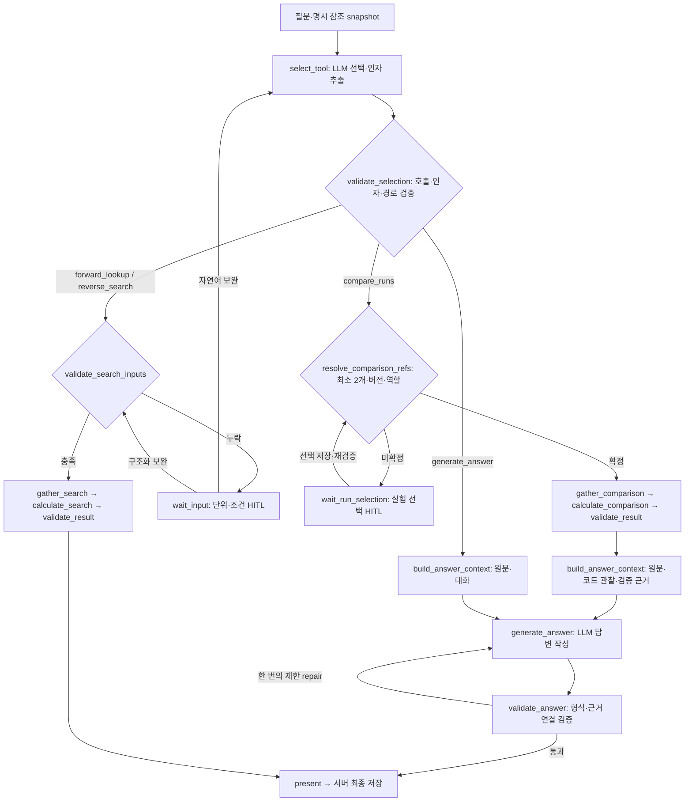

# K-PLASMA Graph v1 Tool Calling and Answer Implementation Design

**목표:** Graph v1의 작업 선택을 OpenAI Tool Calling으로 전환하고, 명시적으로 참조된 여러 실험의 비교·설명과 일반 질문의 답변을 분리한다.

**구조:** 선택 LLM이 네 도구 중 하나와 입력을 반환한다. LangGraph가 입력 검증, 실험 선택 HITL, 실제 조회·계산·검증, 답변 LLM과 결과 저장을 연결한다. 순·역방향의 기존 검색 결과와 프로토타입에서 사용한 출력 화면은 반드시 유지한다.

**기술:** 기존 Python LangGraph·OpenAI Python SDK·Pydantic·PostgreSQL 체크포인터·Spring Boot·React/TypeScript. 모델은 기존 설정 `gpt-5.6-luna`, 추론 설정은 `none`을 유지한다. API 키는 기존 `OPENAI_API_KEY`, Phoenix Cloud 프로젝트는 기존 `K-PLASMA` 설정을 사용한다.

**설계 원본:** 이 대화에서 사용자가 승인한 네 도구와 그래프 구조, [기존 v1 계획](2026-10-04-agent-graph-v1-plan.md), [기존 이관 설계](../specs/2026-10-03-v12.3.1-implementation-design.md).

이 문서는 구현 전 설계서다. 제품 코드 수정, 테스트 통과, 비용 절감 또는 모델 정확도 향상을 보고하는 문서가 아니다. 세부 계약·계산 정책은 아래에 명시한 구현 결정이며, 사용자가 직접 확정한 제품 요구와 구분한다. 작업은 사용자의 지시에 따라 단독으로 진행한다.

**2026-10-07 Karpathy 검토 반영:** 네 도구와 승인된 그래프 분기는 유지한다. 숫자 치환용 fact-slot 언어를 제거하고 코드의 관찰 결과와 LLM의 해석을 구분한다. 비교 전용 참조 검증·조회 범위를 명시하고, 새 결과·추가 입력 JSON을 구체화한다. 실험 선택은 고정 목록의 단일 조회와 명시 키 배열을 기본으로 하며 서버 paging·scope/excluded 선택은 필수 범위에서 제외한다. Product Contract의 R1–R14와 기존 단위·화면·복구 정책은 유지하며 구현 방법과 검증 범위를 보완한다.

## Goal Capsule

- 도구는 `forward_lookup`, `reverse_search`, `compare_runs`, `generate_answer` 네 개다. 기존 `explain_change`는 비교에, `explain_concept`는 일반 답변에 흡수한다.
- 순·역방향은 선택 LLM 1회와 코드 실행으로 처리한다. 비교·일반 답변은 선택 LLM과 답변 LLM을 각각 호출한다. 추가 입력, 제한된 재시도·repair는 별도이며 호출·비용 exactly-once는 보장하지 않는다.
- 비교는 명시적인 서로 다른 Run 버전 참조가 최소 두 개 필요하다. 불명확한 비교 요청을 일반 답변으로 우회하거나, 과거 대화의 조건만으로 비교 대상을 추정하지 않는다.
- 비교 답변은 원문 질문과 코드가 검증한 결과를 사용한다. 일반 답변은 원문과 관련 대화를 사용하며 개념 ID·개념 개수·숫자 금지 규칙으로 질문을 축소하지 않는다.
- `v1`·`fallback` 이름, fallback 비활성 상태, 현재 순·역방향 UI·필터·정렬·단위 정책, 완료된 대화 스냅샷을 보존한다.
- RAG·검토 문헌 구축·물리 예측·보간·자율 도구 반복 호출·실험 곡선 비교는 이번 범위 밖이다.
- 본 설계가 기존 계획의 작업 선택, 비교·설명 계약을 갱신한다. 나머지 저장·삭제·실데이터 관리·프로토타입 보존 규칙은 기존 계획과 `AGENTS.md`·`CONTRIBUTING.md`를 따른다.

## Product Contract

### Problem Frame

현재 `model_client.py`는 `text.format=json_schema`로 `Interpretation.status/operations/kind/inputs`를 받으며 API의 `tools`는 사용하지 않는다. `graphs/v1.py`의 공통 해석 프롬프트에 다섯 작업의 안내가 들어 있다. 실제 LangGraph 노드·조건 엣지·체크포인터는 이미 구현되어 있으므로 실행 기반을 다시 만들 필요는 없다.

현재 비교 계약은 기준·대상 두 Run뿐이다. 설명 생성에는 원문 질문이 전달되지 않고 제한된 `topics/aspect` 또는 정성 근거만 전달된다. `explain_concept`의 정의 한 개념·차이/관계 두 개념 제한 때문에 재질문이 반복되거나 질문에 없던 개념이 설명된다. `compare_runs`는 현재 숫자 표만 출력하고 설명 단계는 `explain_change`에만 연결된다.

따라서 변경은 API의 출력 형식 교체, 비교 참조·다중 Run 계약, HITL UI와 재개 API, 원문 기반 답변, 과거 스냅샷 호환성까지 포함한다. Tool Calling 자체가 의미 오류·단위 오류를 자동으로 해결하지는 않는다.

### Settled Decisions

| 결정 | 합의 내용 | 근거 |
|---|---|---|
| D1 | JSON `kind` 선택을 네 도구의 Tool Calling으로 전환한다. | 관리·표준 호출 형식과 비용·스키마 보장의 차이를 논의한 후 사용자가 전환을 선택했다. |
| D2 | 비교·변화 이유 설명을 `compare_runs` 하나로 처리한다. | 별도 설명 도구 선택이 겹치는 대신 사용자 질문에 맞춰 비교 도구가 설명하도록 사용자가 제안·승인했다. |
| D3 | 비교 실행에는 명시적인 Run 참조 최소 두 개가 필요하며 부족하면 실험 선택 HITL을 사용한다. | 임의 과거 문맥 추론 대신 사용자의 실험 선택을 확정하는 방식으로 합의했다. |
| D4 | 일반 질문은 `generate_answer`에서 원문과 관련 문맥으로 답한다. | 고정 개념 목록으로 질문을 재작성하는 대신 일반 LLM 답변을 사용한다. |
| D5 | 수치 계산은 코드, 답변 구성·정성 해석은 LLM이 담당한다. | 잘못된 실험 수치와 작업·문맥 유실 방지가 최우선이다. |
| D6 | 선택 LLM과 답변 LLM을 구분한 고정 그래프를 유지한다. | 승인된 그래프이며 Tool Calling을 자유 반복 루프로 확장하지 않는다. |
| D7 | 실제 Run 태그·후보 전체·HITL 선택을 동일한 명시적 참조 체계로 취급한다. | 후보 전체를 임의의 두 Run으로 축소하지 않는다. |

### Requirements

| ID | 요구사항 | 담당 단위 |
|---|---|---|
| R1 | 한 번의 선택 LLM 호출에서 등록 도구 하나와 해당 인자를 받는다. | U1, U4 |
| R2 | 순·역방향의 수치·명시 단위·단위 오타·재질문·필터·정렬·프로토타입 화면을 유지한다. | U1, U4, U5, U6 |
| R3 | 비교 의도와 참조 충족 여부를 별도로 판단한다. 무참조 비교는 HITL이다. | U2, U4, U5 |
| R4 | Run 태그·명시적으로 선택한 후보 집합·HITL 선택의 정확 버전과 순서를 고정한다. | U2, U4, U5 |
| R5 | 선택 화면은 두 개 이상의 Run, 같은 ID의 서로 다른 명시 버전, 후보 전체를 지원한다. | U2, U5 |
| R6 | 비교가 원값·차이·변화율·경향·가능한 이유 질문에 맞춰 답한다. | U3, U4, U5 |
| R7 | 비교와 일반 답변 LLM 모두 저장된 원문 질문을 받는다. LLM이 복사·요약한 질문으로 대체하지 않는다. | U1, U4 |
| R8 | 일반 답변에 개념 ID 목록, 정확히 두 개념 제한, 숫자·수식의 일괄 금지를 적용하지 않는다. | U4, U5 |
| R9 | 실제 비교 수치·단위·방향은 검증된 근거에서 나오며 인과 단정과 측정 사실을 구분한다. | U3, U4 |
| R10 | HITL 전후 원문·추출 인자·선택 참조·입력 이벤트·계산 결과·검증 결과를 복구한다. | U2, U4, U6 |
| R11 | 설명 실패는 검증된 비교의 부분 결과를 보존하고 실패로 표시한다. | U2, U4, U5 |
| R12 | 예전 다섯 종류의 완료 답변은 그대로 읽는다. 새 설명 계약으로 재생성하지 않는다. | U2, U5, U6 |
| R13 | 실제 자료·대화·검증 로그·스크린샷·비밀값은 Git/공개 산출물에서 제외한다. | 전체 |
| R14 | Phoenix에서 선택·검증·HITL·계산·답변 생성의 흐름과 호출량을 구분해 추적한다. | U1, U4, U6 |

### Scope Boundaries

이번 변경에는 다중 Run의 scalar 비교, 명시적인 공정 축에 따른 관찰 경향, 비교 질문에 맞는 설명, 일반 플라즈마 질문, 실험 선택 UI가 포함된다. 분포·곡선 비교, 통계적 인과 추론, 자동 회귀 모델·상관계수, 실험 추천 생성, 자료 검색은 추가하지 않는다. 단일 Run의 결과는 `forward_lookup`, 결과 목표에 따른 후보 찾기는 `reverse_search`로 유지한다. 특정 단일 Run의 상대적 변화·원인 분석에는 비교 대상을 요청한다.

## Planning Contract

### KTD1. Native Tool Registry

OpenAI Responses API의 `tools`에 네 함수 정의를 전달한다. 기존 OpenAI SDK를 유지하며, `@tool` 데코레이터 사용을 위해 LangChain이나 다른 실행기를 새로 도입하지 않는다. 도구명·description·Pydantic 입력 모델·허용 그래프 경로를 `tools.py` 레지스트리에 묶고 기존 `strict_schema` 변환을 재사용한다. 이 레지스트리를 API 정의, 인자 검증, dispatch 허용 목록의 단일 출처로 사용한다. `(session-settled: user-approved — chosen over interpretation JSON: 도구 정의 관리와 표준 호출 연결을 개선한다.)`

선택 호출은 `strict=true`, `tool_choice=required`, `parallel_tool_calls=false`로 구성한다. 인자를 채울 수 없으면 허용된 nullable 필드를 `null`로 반환하게 한다. required는 키의 존재이고 업무상 입력 충족 여부는 코드가 별도로 판단한다. 자유 문자열 unit을 enum으로 좁혀 누락 단위를 강제로 추정하게 하지 않는다.

`function_call`의 `call_id/name/arguments`를 읽고 등록명·호출 수·인자 형식을 검증한다. 함수 호출 요청을 받았다는 이유만으로 실행하지 않는다. 거절·미완료·잘린 출력·알 수 없는 도구·복수 호출·잘못된 인자는 실행 전 차단한다. 유효하지 않은 호출에 한정해 기존 내구성 있는 attempt 예산 내에서 repair하며, 예산 초과는 명시적 실패다. 후속 답변 호출에는 실행 도구를 노출하지 않는다.

서로 독립적인 조회와 비교를 한 요청에서 순차 수행해야 하는 혼합 질문은 자동 다중 실행하지 않는다. 실행 전에 어느 요청을 먼저 처리할지 범위를 확인한다. 비교 계산과 그 결과의 이유 설명은 혼합 작업이 아니라 `compare_runs` 하나의 정상 범위다.

### KTD2. Tool Inputs and Original Question

| 도구 | LLM이 반환하는 인자 | 코드가 확인·주입하는 정보 |
|---|---|---|
| `forward_lookup` | 기존 `ForwardInputs`: `conditions`, `context_rules` | 원문 수치·단위 grounding, 허용 문맥 규칙, 실제 Run |
| `reverse_search` | 기존 `ReverseInputs`: `constraints`, `goals`, `context_rules` | 원문 grounding, 단위 환산, 필터·정렬 정책 |
| `compare_runs` | `ref_keys`, `metrics`, `analysis`, `baseline_key`, `trend_axis`; 모두 미확정 시 nullable | 키에 대응하는 명시적 RunRef, 원문 질문, 참조 출처, 정확 버전 |
| `generate_answer` | 빈 객체 `{}` | 저장된 원문 질문, 관련 대화, 일반 지식 답변 지침 |

`compare_runs.analysis`는 `auto/values/differences/trend/interpretation` 안내값이며 원문을 대체하지 않는다. `metrics`는 기존 `ionFlux/meanIonEnergy/iedWidth`, `trend_axis`는 `pressure/sourcePower/biasPower` 또는 null이다. 입력은 조회용 자유 SQL·코드·파일 경로를 포함하지 않는다. `ref_keys`와 `baseline_key`는 서버가 제공한 명시 참조의 별칭만 허용한다. 키가 null이면 명시적으로 연결된 집합 전체를 사용한다. 집합 중 일부만 요청했다면 원문과 일치하는 키인지 확인하며 임의 top-k나 두 개 축소를 허용하지 않는다.

선택 LLM에는 질문, 추가 입력, 기존 추출값, 필요한 최근 대화, 연결된 참조의 별칭·개수·출처를 제공한다. 관련 대화는 접수 시 최근 최대 6개 완료 turn의 질문·표시 답변 텍스트와 출처를 snapshot으로 고정하며 초기 상한은 합계 16,000자다. 상한은 오래된 turn부터 전체 단위로 제외하고 원문 질문은 별도 필드로 온전히 보존한다. 생략 사실을 metadata에 남긴다. 현재 backend의 lastAnswer 하나만으로 일반 후속 질문을 처리하지 않으며, 전체 과거 대화·판단 기록을 외부로 전송하지 않는다. 과거 대화에 Run이 언급됐다는 사실만으로 명시 참조 집합을 만들지 않는다. `comparisonContext`의 자동 최신 비교쌍 추론도 새 경로에서는 사용하지 않는다. 사용자가 이전 답변의 실험들을 다시 선택·태그하면 해당 정확 버전을 사용할 수 있다.

공통 prompt에는 작업 경계·추측 금지·명시 단위 정책만 두고, 도구별 역할은 description, 각 인자의 의미는 parameter description에 둔다. 상세 계산·수치 표현·정성 설명 규칙은 각 실행·답변 단계가 담당한다. tools 설명도 문맥·입력 토큰에 포함되므로 양·비용 감소는 전환만으로 주장하지 않는다.

### KTD3. Units and Missing Input

기존 [단위·재질문 정책](../../verification/search-unit-clarification.md)을 그대로 적용한다. `와트/왓트/왛트/오ㅏ트→W`, `e볼트/전자볼트→eV` 등 명확한 표기만 정규화하고 숫자와 단위 scale은 보존한다. `0.3 kW→300 W`, `Torr→mTorr` 같은 환산은 코드가 수행한다. 숫자·범위에 단위가 없으면 null로 남기고 지표별로 재질문한다. `maximize/minimize` 정렬에는 단위를 묻지 않는다.

자연어 추가 답변은 pending의 지표·기존 인자를 함께 선택 LLM에 전달하여 해당 슬롯을 보완한다. 구조화 답변은 허용 필드에만 직접 적용한다. 두 방식 모두 기존 숫자·범위·연산자·정렬 순서와 관련 없는 슬롯이 변하지 않았는지 검증한다. 이전 검증 함수를 새 `ToolSelection`에서 호출하는 adapter를 두며, 현재 오류 방지를 약화시키지 않는다.

### KTD4. Explicit Comparison References and HITL

`ComparisonReferenceSnapshot`은 정확 `RunRef[]`, 선택 순서, 출처(`run_tag/candidate_group/hitl`), 출처 turn/group ID, 지정한 기준 참조를 보존한다. 후보 전체 버튼은 해당 시점의 해당 후보 그룹 전체를 넘기며 이후 탭 변경·등록 변화로 다시 계산하지 않는다. 접수 시 사용자 태그와 candidateReferences를 검증해서 합치고 exact ref 기준으로 중복을 제거한다. 참조가 모호하거나 접근할 수 없으면 추가 입력을 요청한다.

질문 작성 중 선택한 Run들은 추가·제거 가능한 명시 참조 목록으로 표시한다. 기존 단일 activeRun 표시만으로 비교 목록을 대신하지 않는다. 이미 진행 중인 요청의 HITL 선택은 workspace의 `setReference`를 호출하지 않고 해당 request의 resume로 저장한다. 기존 setReference는 진행 요청을 무효화할 수 있으므로 두 동작을 섞지 않는다.

채팅의 조건·모호한 지시어·텍스트 Run ID만 있고 명시 참조가 없다면 실험 선택 HITL로 보낸다. 텍스트는 검색창의 후보 찾기 힌트로 쓸 수 있지만, 유일하게 검색됐더라도 자동 선택하지 않는다. 최소 두 개의 서로 다른 `(runId,runVersionId)`를 확보한 후에만 비교한다. 같은 ID의 다른 버전은 사용자가 정확 버전을 선택했을 때 허용한다.

새 pending 타입은 `run_selection`이다. 프론트엔드가 기존 디자인의 카드·조건 표·체크박스·선택 개수·선택된 Run 칩·선택 해제·확인 버튼으로 HTML 화면을 렌더링한다. LLM이 임의 HTML을 생성하거나 실험 목록을 만들지 않는다. 두 개 미만이면 계속 버튼을 비활성화하며 서버도 재검증한다. 방향 있는 비교를 요청했으나 기준이 불명확하면 같은 화면에서 기준 Run 선택을 받는다.

선택 목록은 서버가 pending 진입 시 고정한 선택 가능 버전 목록에서 제공한다. `GET /api/agent/requests/{id}/run-options?pendingInputId=...`는 해당 목록의 참조 키·정확 버전·조건·가용성 요약을 한 번에 반환한다. 요청별 고정 버전과 과거 태그의 일관성을 위해 이 좁은 endpoint를 기존 controller/service에 추가하며 별도 선택 서비스 계층은 만들지 않는다. 기존 최신 catalog 목록만으로 과거 버전을 대체하지 않는다. 초기에는 화면에서 검색·정렬·다중 선택하고, 서버 cursor·limit·검색 범위 selector는 구현하지 않는다. 이미 태그한 과거 버전도 포함하고 삭제되거나 비가용해진 버전은 이유를 표시한다.

pending에는 목록 전체가 아니라 ID·메시지·선택 정책·목록 endpoint 정보를 담는다. 각 옵션의 `key`는 서버가 고정하고, submit/Tool Calling에서 이미 사용하는 참조 별칭과 같은 체계를 사용한다. UI 정렬·검색·재접속으로 키를 다시 부여하지 않는다. resume는 `runKeys` 배열과 nullable `baselineKey`만 보내며 서버가 정확 refs로 해석해 이벤트와 checkpoint에 저장한다. 전체 선택도 화면이 명시한 고정 목록의 모든 key를 배열로 보낸다. 별도 `scopeId/excludedRunRefs` 표현은 도입하지 않는다.

현재 pending/input 20,000자 제한은 유지한다. 검토에서 인공 RunRef 150개를 직접 직렬화한 입력도 11,755자였으므로 150개라는 개수만으로 paging이 필요하다고 가정하지 않는다. 이 값은 인공 ID 길이에 따른 예시이고 실데이터·최대 ID 길이의 보장이 아니다. 구현 검증에서는 실제 serializer의 `runKeys` 150개·pending·옵션 응답 크기와 화면 성능을 측정한다. 한도를 넘으면 명시적 오류로 알려 주고 선택을 조용히 줄이지 않는다. 규모 확장이 실제로 확인될 때 전송·페이지 계약을 별도 변경한다.

목록은 명시 참조의 후보일 뿐이다. 선택하지 않은 Run을 비교 데이터·`usedRunRefs`·비교 실행의 삭제 의존성으로 포함하지 않는다. request/revision/epoch·pending ID·idempotency key를 기존 resume API로 검증하고 고정 목록에 없는 키·중복·기준 미포함·삭제된 버전을 거절한다. 목록의 조건은 bulk 조회하며 옵션마다 전체 Run을 조회하지 않는다.

### KTD5. Multi-Run Calculations

비교 결과의 계약은 `ComparisonResultV2`로 확장한다. `runs`는 모든 선택 Run의 버전·조건·요청 지표·단위·가용성·품질을 보존하며 `usedRunRefs`는 같은 순서다. pair 결과 계산에는 기존 `domain/compare.py`의 수치 정책을 재사용한다. 기본 지표는 기존 세 scalar이고 명시 지표는 원문과 대조한다. 계산 입력과 결과는 최소 두 refs로 검증한다.

| 질문·상황 | 계산 정책 |
|---|---|
| 원값만 요청 | 모든 참조의 요청 지표·조건·가용성을 표로 제공한다. |
| 두 Run의 차이, 기준 미지정 | 원값과 절대 차이를 제공한다. 선택 순서를 임의의 증감 기준으로 삼지 않는다. |
| 명시 기준 대비 차이·변화율 | 각 대상−기준과 `(대상−기준)/abs(기준)×100`. 기준 0이면 변화율은 비가용이다. |
| 세 개 이상, 기준 미지정 | 전체 원값과 가용한 최솟값·최댓값·범위를 코드로 제공한다. 임의 기준·모든 쌍 비교를 생성하지 않는다. |
| 세 개 이상, 기준 지정 | 지정 기준에 대한 나머지 모든 Run의 비교를 제공한다. |
| 명시 공정 축에 따른 경향 | 다른 조건이 동일한 그룹 안에서 축값 정렬 후 인접 지표 변화·증가/감소/비단조 관찰을 계산한다. |

경향 질문의 축이 불명확하면 먼저 전체 조건 차이와 데이터 범위를 확인한다. 축별 경향을 요청하는데 축을 고를 수 없으면 HITL로 축을 선택하게 한다. 같은 축값·다른 결과는 반복/버전 차이로 표시하며 임의 평균을 만들지 않는다. 축값 중복 그룹은 원값 전부를 표시하고 단일 인접 경향은 unavailable로 남긴다. 집계 유효 지표가 하나뿐이면 원값은 보존하지만 비교 범위는 INSUFFICIENT_DATA로 남긴다. 다른 공정 조건이 바뀐 자료를 단일 조건의 순수 효과처럼 해석하지 않는다. 두 점은 두 Run의 관찰 차이로 설명하고 넓은 조건 범위의 일반 법칙으로 확장하지 않는다. 곡선·원본 샘플이 필요하면 현재 지원 범위를 안내한다.

기존 `context(..., references_only=true)`는 그대로 재사용하면 충분하지 않다. 현재 `AgentRequestService.context`는 `activeRun/selectedRunRef/candidateReferences/comparisonContext`의 모든 참조를 합치며, `references_only`는 catalog 수치 전체 조회만 막는다. 신규 `compare_runs` 경로에서는 저장된 `ComparisonReferenceSnapshot`을 유일한 조회 inventory로 사용한다. worker가 보낸 `requiredRunRefs`가 이 inventory와 순서까지 일치하는지 확인하고, 관련 없는 legacy context·이전 비교쌍·catalog 후보를 합치지 않는다. 선택 목록 snapshot은 따로 보관하고 비교 manifest에는 선택한 정확 버전과 필요한 scalar만 고정한다. 순·역방향의 기존 문맥 조회 의미는 바꾸지 않는다.

또한 현재 `SnapshotValidator.refs/ref/compact`는 참조마다 `getVersion`으로 전체 Run을 읽을 수 있다. 비교 경로의 신원·접근·버전 검증은 ID/version 쌍을 bulk 조회해서 수행하고, 검증된 inventory로 결과 내부 참조를 대조한다. `scalarVersions` 한 번만 최적화하고 검증 루프의 N+1을 남겨 두지 않는다. 최초 비교 materialization은 참조 신원 검증과 scalar 조회가 각각 고정 횟수의 bulk query이고 Run마다 full payload를 가져오지 않는다. 반복 context 호출은 고정 manifest를 재사용하며 삭제·epoch/fence 검증은 유지한다. 응답의 정렬은 요청한 refs 순서로 코드가 복원한다.

회귀 검증은 문맥에 150개 후보와 이전 비교가 있지만 새로 선택한 Run은 2개인 상태를 사용한다. 조회 버전 집합·manifest·계산 입력·`usedRunRefs`가 선택한 두 개뿐인지 확인한다. 2/5/150개로 선택 개수를 바꿔도 참조 검증·scalar materialization의 DB 호출 수가 Run 개수에 비례하지 않는지 계측한다. 삭제된 비선택 Run은 비교를 취소하지 않고 선택한 Run의 삭제는 취소해야 한다. 이는 기존 전체 후보 정렬 방식과 별개인 실제 참조 검증 N+1의 방지다.

기본 계산은 전체 표·범위·기준 대비 비교로 O(N), 축 정렬은 O(N log N)이며 모든 N² 쌍을 기본 생성하지 않는다. 150개 최소 근거가 모델 입력 한도에 들어오는지 구현 전에 계측한다. 한도를 넘으면 전체 계산 결과를 보존하고 데이터 범위를 명시적으로 확인한다. 자동 분할 답변·합성 LLM을 이번 필수 구현에 추가하지 않으며 참조나 계산값을 조용히 줄이지 않는다.

### KTD6. Comparison Answer and Numerical Grounding

비교 답변 LLM은 `originalQuestion`, 관련 후속 입력·대화, 선택한 Run의 별칭·조건·요청 지표와 코드의 검증된 `ComparisonEvidence`를 받는다. 원문에 잘못된 전제가 있으면 실제 관찰과 구분해 답한다. 숫자 표만 출력하는 기존 `compare_runs`를 확장해 사용자가 요청한 차이·경향·이유를 설명한다. `(session-settled: user-directed — chosen over numeric-only comparison and separate explain_change: 사용자 질문에 맞는 비교 답변을 한 도구에서 처리한다.)`

실제 수치가 있는 비교 답변에서는 코드가 원값 표와 관찰 문장을 생성한다. 예를 들어 인공 근거에서 플럭스가 100→120이고 기준이 앞 Run이면 코드가 `이온 플럭스가 기준 대비 20% 증가했습니다.`라는 문장을 만든다. 관찰마다 ID와 지표·대상·계산 출처를 붙인다. `ComparisonEvidence`는 이 검증된 관찰과 선택 Run의 최소 scalar이고, LLM에는 원문 질문과 함께 전달한다. 숫자를 넣기 위한 `{{fact:...}}` 슬롯·사용자 정의 템플릿 언어·문장 composer는 도입하지 않는다.

비교 답변 LLM은 표시할 `observationIds`, 질문에 맞는 `interpretations`, `limitations`를 반환한다. 해석은 원인 가능성·조건 차이에 따른 해석과 한계를 설명하며 실험 숫자·변화율·배율을 직접 다시 쓰거나 계산하지 않는다. 관찰 문장과 표는 코드 결과에서 렌더링한다. 값만 요청하면 해석을 비워도 되며, 경향·이유 질문에는 원문에 맞는 해석을 붙인다. 일반 답변 경로의 자유로운 숫자·수식 사용에는 이 비교 전용 규칙을 적용하지 않는다.

자동 검증과 내용 평가의 경계를 다음처럼 고정한다.

| 항목 | 코드로 검증할 범위 | 별도 평가가 필요한 범위 |
|---|---|---|
| 원값·차이·변화율·증감 방향 | 유한 값·단위·0/누락·공식·기준과 대상·정확 버전. 코드 생성 표/관찰이 같은 결과를 사용하는지 검증한다. | 원본 실험의 과학적 타당성은 계산 검증으로 보장하지 않는다. |
| 관찰 연결 | ID가 실제 존재하고 현재 선택·지표·계산 출처에 속하는지 검증한다. 표시되는 관찰 문장은 모델 텍스트로 대체하지 않는다. | 참조 ID가 맞다는 것만으로 LLM 해석 문장의 의미까지 맞다고 보장하지 않는다. |
| 모델의 출력 | 스키마·빈 응답·알 수 없는 ID·raw HTML·명시적인 실험 수치/퍼센트/배율의 재서술을 검사한다. 숫자 표기의 우회 표현도 평가셋에 포함한다. | 자유문장의 모든 수치 주장·잘못된 지표 연결·반대 방향 해석을 자동 검출한다는 보장은 하지 않는다. |
| 가능한 이유 | 관찰과 분리해 일반 지식 해석으로 표시하고 복수 조건 변화·누락을 입력에 포함한다. | 물리적 설명의 타당성·관찰과의 모순·단정적 인과 설명은 지정 모델 답변 평가로 확인한다. 별도 LLM 판정기를 필수 실행 노드로 추가하지 않는다. |

검출 가능한 형식·근거·수치 재서술 오류는 게시 전에 차단하고 한 번만 repair한다. 내용 평가에서 지표 혼동·관찰 반전·근거 없는 인과 단정이 나온 사례는 전환 완료 기준을 충족하지 못한 것으로 기록한다. `validated` 표기를 LLM 설명 전체의 과학적 정확성 보장으로 사용하지 않는다.

관찰 사실과 가능한 원인 해석은 구분한다. 복수 조건 변화·누락·관찰 변화 없음도 LLM에 전달하고, 이유를 단정하거나 증거가 없는 곡선을 생성하지 않는다. 설명 검증 repair는 한 번까지만 허용하고 모든 provider 호출은 기존 stage별 내구 예산을 사용한다. 답변 LLM 장애·검증 실패 시 `FAILED`, `partialResult=검증된 ComparisonResultV2 + schemaVersion:2 + explanationComplete:false`로 저장한다. 사용자에게 비교 계산 완료/설명 실패를 표시하며 가짜 성공으로 저장하지 않는다.

### KTD7. General Answer

`generate_answer`는 원문과 관련 최근 대화를 답변 LLM에 전달한다. `ConceptId`, `topics`, `aspect`, 한 개/두 개 제한, 숫자·수식 일괄 금지와 현재 ConceptDraft의 topic_refs 검증을 새 일반 경로에 적용하지 않는다. 질문을 해석용 개념 목록으로 대체하지 않는다. 모델 출력은 일반 Markdown 텍스트이며 서버가 provenance·버전·status 메타데이터를 별도 envelope에 넣는다. `(session-settled: user-approved — chosen over registered-topic rewriting: 질문 원문을 바탕으로 일반 LLM이 설명한다.)`

“평균 이온 에너지와 이온 에너지의 차이”는 실제 그 두 표현을 설명해야 하며 질문에 없는 이온 플럭스를 두 번째 비교 대상으로 치환하지 않는다. 일반적인 소스·플럭스·에너지 관계는 여러 개념이어도 답한다. 실제 실험 비교 요청은 참조가 없어도 `compare_runs`의 HITL로 보내며 일반 답변으로 숫자·경향을 만들어 주지 않는다. 태그가 있어도 질문이 순수 정의라면 일반 답변이 가능하다.

일반 답변은 특정 Run의 실제 조회를 수행하지 않아 `usedRunRefs=[]`, manifest 없이 완료한다. 대화 문맥에 기록된 텍스트는 질문 이해용이며 새 검증 결과로 주장하지 않는다. 수식·일반 단위 설명은 허용하지만 저장된 실험을 조회했다고 주장하거나 RAG·검토 문헌을 사용했다고 표현하지 않는다. 관련 없는 질문에는 지원 범위를 안내한다. 명백하게 불명확한 표현에 대한 내용상 질문은 가능하나 정형 개념 개수 제한으로 재질문하지 않는다.

화면은 일반 지식 기반 표기를 한 번 제공하고 Markdown을 안전하게 렌더링한다. 사용자 메모·Run 이름·모델의 raw HTML/script는 실행하지 않는다. 새로운 markdown renderer 도입 시 안전한 HTML 비활성화와 필요한 의존성·잠금 파일을 함께 관리한다. 시스템 장애를 일반 설명으로 덮어쓰지 않는다.

### KTD8. Graph Nodes and Edges

기존 `StateGraph(GraphState)`와 DurableSaver를 유지하고 노드를 아래처럼 개편한다. 공통 노드와 비교/일반 답변 분기는 한 그래프에 둔다. 조회 도구마다 새 실행기를 만들거나 모델에 자유 실행권을 주지 않는다.



`generate_answer`라는 외부 도구 이름과 내부 답변 노드 이름은 동일한 설명 책임을 가지지만, 비교에서도 내부 노드를 사용할 수 있다. 비교의 호출 이후 또 외부 `generate_answer`를 선택하는 세 번째 LLM 호출을 만들지 않는다. 일반적인 완료 경로는 조회 선택 1회, 비교·일반 선택+답변 2회다. 조회 결과 카드 출력을 위해 모델에게 전체 결과를 다시 보내지 않는다.

답변 호출을 Tool Calling 대화로 이어갈 때는 선택 응답의 필요한 output items와 `call_id`를 보존하고, 매칭하는 `function_call_output`에 코드가 만든 최소 비교 근거 또는 일반 답변 context를 넣어 전달한다. 모델이 reasoning items를 반환했다면 해당 연결에 필요한 items도 유지한다. 답변 전용 지침을 사용하고 도구 호출은 비활성화해 추가 선택 루프를 막는다. 원문은 저장된 request에서 그대로 전달하며 LLM이 arguments에 원문을 다시 작성하게 하지 않는다. `store=false`를 유지하고 서버 저장 previous response ID에 의존하지 않는 명시 input round trip을 사용한다.

모든 HITL은 checkpoint와 request revision에 연결한다. interrupt 노드는 처음부터 다시 실행될 수 있으므로, pending 생성·이벤트 소비·외부 호출·선택 저장을 재실행 안전하게 분리한다. 실험 선택은 확정된 operation을 보존한 채 코드로 재검증하므로 선택 LLM을 다시 부르지 않는다.

계산 전 비교 옵션 검증도 수행한다. 기준·경향 축이 필요한데 확정되지 않았다면 `comparison_options` HITL로 기다리고, 구조화 선택을 적용한 뒤 같은 계산 경로로 돌아간다. 이 재개에서도 선택 LLM을 호출하지 않는다. 위 그림의 비교 참조·계산 구간에 포함된 내부 분기이며 조회 입력 대기 노드로 잘못 보내지 않는다.

### KTD9. Wire Contracts, Backend and Snapshots

제품 식별자 `implementationId=v1`, `graphVersion=v1`은 유지한다. 신규 완료 답변은 `schemaVersion=2`를 사용하고 구버전 `schemaVersion=1`도 읽는다. `isV1AnswerSnapshot`의 구현 식별 검사와 지원 schema 검사를 분리한다. `graphBuildId`, `toolSchemaVersion`, `toolRegistryHash`, `selectionPromptVersion`, `answerPromptVersion`, `answerSchemaVersion`, `evidencePolicyVersion`, config fingerprint를 새 실행에 기록한다. 기존 숫자 정책을 재사용하는 pair 계산은 기존 정책 버전을 유지하고 다중 Run 집계 정책은 별도 버전으로 기록한다.

새 operationKind는 네 도구, 새 일반 답변 intent는 `GENERAL_ANSWER`, 비교 intent는 `RUN_COMPARISON`이다. 기존 `CHANGE_EXPLANATION/CONCEPT_EXPLANATION`과 schema 1 renderer는 완료 기록 읽기용으로 유지한다. 신규 결과·추가 입력의 계약은 KTD9a–KTD9d로 고정한다. Python 모델·TypeScript 타입·OpenAPI·backend validator가 이 계약을 함께 구현하며, 이름만 정해 두고 소비자마다 다른 모양으로 만들지 않는다. 순·역방향 result 자체는 기존 계약과 renderer adapter를 그대로 사용한다.

새 submit 계약에 `attachedRunRefs: RunRef[]`, `referenceOrigins:{ref:RunRef,kind:run_tag/candidate_group,turnId:string,groupId:string 또는 null}[]`를 추가한다. 두 배열의 refs 집합은 같아야 하고 candidate_group은 groupId가 필수다. 기준을 지정하면 기존 baseline 필드에 첨부된 RunRef를 보내며 activeRun을 자동 baseline으로 복사하지 않는다. 기존 baseline/selectedRunRef/candidateReferences는 호환 입력으로 읽되 서버가 실제 태그·선택 동작과 연결된 출처를 검증한다. 단순히 오래된 activeRun이나 마지막 비교가 존재한다는 이유만으로 새 비교의 명시 참조 조건을 충족시키지 않는다. 명시적으로 첨부된 refs와 legacy workspace context는 별도 필드로 저장한다.

`AgentPendingInput`은 기존 text 입력과 새로운 `run_selection/comparison_options`를 구분하는 discriminated union으로 확장한다. `AgentResume.input`에는 기존 text/slot patch와 typed selection을 허용하고 pending 타입별 허용 필드를 서버에서 검증한다. 아래 JSON은 모두 계약을 설명하는 소량의 인공 데이터이며 실제 실험 결과가 아니다.

#### KTD9a. Common Envelope and Value Rules

`AgentResponse`의 기존 바깥 필드 `intent/status/candidates/explanation/answerSnapshot/usedRunRefs`를 유지한다. schema 2 비교·일반의 `candidates=[]`, `explanation=null`이며 실제 답변은 아래 snapshot에만 저장한다. 응답 `status`는 result의 `resultStatus`이고 요청 상태 `COMPLETED/FAILED`와 구분한다.

| 계약 | 필수 필드·타입 |
|---|---|
| `AnswerSnapshotV2` | `implementationId:"v1"`, `graphVersion:"v1"`, `schemaVersion:2`, `kind:네 도구 enum`, `summary:string`, `originalQuestion:string`, `toolSelection:ToolSelection`, `resolvedInputs:해당 도구의 검증된 입력`, `result:도구별 result`, `answer:ComparisonAnswer 또는 null`, `contextProvenance:기존 출처 snapshot`, `inputHistory:기존 저장 이벤트 배열`, `usedRunRefs:RunRef[]`, `versions:설정 버전 객체`. 비교에서만 answer가 non-null이고 조회·일반은 null이다. |
| `ToolSelection` | `call_id:string`, `name:네 도구 enum`, `arguments:도구별 입력 객체`. API의 arguments JSON 문자열은 파싱·검증해 저장한다. native output/reasoning items는 비공개 checkpoint에만 둔다. |
| `ComparisonReferenceSnapshot` | `entries:{key:string,ref:RunRef,origin:{kind:run_tag/candidate_group/hitl,turnId:string 또는 null,groupId:string 또는 null,pendingInputId:string 또는 null}}[]`, `baselineKey:string 또는 null`. 입력 출처를 서버가 검증해 확정하고 순서·키를 유지한다. candidate_group의 turn/group, run_tag의 turn, hitl의 pending ID는 필수다. |
| 비교 입력 | `ref_keys:string[] 또는 null`, `metrics:MetricId[] 또는 null`, `analysis:auto/values/differences/trend/interpretation 또는 null`, `baseline_key:string 또는 null`, `trend_axis:ConditionId 또는 null`. 빈 배열·중복은 불허하고 null은 KTD2의 미확정/기본 정책이다. |
| `ScalarDatum` | `value:유한 number 또는 null`, `unit:string`, `status:AVAILABLE/UNAVAILABLE`, `reason:Reason 또는 null`, `sourceValue:{value:유한 number 또는 null,unit:string} 또는 null`. value는 정규화된 값이다. 정상은 reason=null, 비가용은 value=null과 reason 필수. 비교 불가 단위의 원값·원단위는 sourceValue에 보존한다. |

`MetricId=ionFlux/meanIonEnergy/iedWidth`, `ConditionId=pressure/sourcePower/biasPower`, `Reason=MISSING_VALUE/MISSING_BASELINE/MISSING_TARGET/MISSING_BOTH/ZERO_BASELINE/INVALID_VALUE/UNIT_NOT_COMPARABLE/NUMERIC_OVERFLOW/INSUFFICIENT_DATA`. 원래 비교의 오류 이유는 유지하고 단일 scalar·집계에 필요한 이유만 추가한다. 수치 `0`은 AVAILABLE이고 누락·비가용의 null과 다르다. NaN/Infinity는 JSON 값으로 저장하지 않는다. `%`도 단위를 가진 ScalarDatum으로 반환한다.

새 타입은 위 표와 아래 표의 필드를 필수로 쓰며 nullable와 빈 배열을 명시적으로 직렬화한다. 임의 추가 필드는 거절한다. `versions`는 기존 설정 serializer를 확장해 위의 build/prompt/tool/evidence/config 식별자를 기록하며 값이 아직 생성되지 않은 실행을 완료 snapshot으로 저장하지 않는다. 조회 result·기존 inputHistory/provenance의 기존 타입은 재정의하지 않는다.

일반 답변의 `resolvedInputs={}`, `contextProvenance={}`, `usedRunRefs=[]`이며 대화 출처는 참조 ID가 아닌 turn 식별 메타데이터로만 남긴다. 사용하지 않은 첨부 Run이나 과거 대화의 RunRef를 일반 답변 snapshot에 넣어 inventory 검증·삭제 의존성을 만들지 않는다. 비교 provenance 역시 실제 선택한 refs에 한정한다.

#### KTD9b. Comparison Result and Answer

| 계약 | 필수 필드·타입 |
|---|---|
| `ComparisonResultV2` | `kind:"compare_runs"`, `resultStatus:COMPARISON_READY/COMPARISON_PARTIAL/NO_COMPARABLE_DATA`, `mode:values/pair/overview/baseline/trend`, `metricIds:MetricId[]`, `baselineKey:string 또는 null`, `trendAxis:ConditionId 또는 null`, `runs:ComparisonRun[]`, `comparisons:ComparisonDifference[]`, `summaries:MetricSummary[]`, `trends:TrendGroup[]`, `observations:Observation[]`, `usedRunRefs:RunRef[]`, `numericPolicyVersion:string`, `aggregationPolicyVersion:string`. |
| `ComparisonRun` | `key:string`, `ref:RunRef`, `conditions:세 ConditionId의 ScalarDatum map`, `metrics:metricIds에 해당하는 ScalarDatum map`, `quality:{convergenceStatus:string,qualityStatus:string,catalogStatus:string}`. 표시 ID·버전은 ref에서만 가져온다. |
| `ComparisonDifference` | `id:string`, `kind:absolute_difference/baseline_delta/adjacent_delta`, `leftKey:string`, `rightKey:string`, `metric:MetricId`, `difference:ScalarDatum`, `percentChange:ScalarDatum 또는 null`, `direction:increase/decrease/unchanged/not_applicable/unavailable`. absolute는 절대 차이·percent=null·direction=not_applicable이다. 나머지는 right−left이고 left가 기준이다. 0 기준의 percent는 UNAVAILABLE/ZERO_BASELINE이다. |
| `MetricSummary` | `id:string`, `metric:MetricId`, `availableCount:정수`, `minimum:ScalarDatum`, `minimumKeys:string[]`, `maximum:ScalarDatum`, `maximumKeys:string[]`, `range:ScalarDatum`. 동일 최솟값/최댓값의 모든 key를 보존한다. |
| `TrendGroup` | `id:string`, `metric:MetricId`, `axis:ConditionId`, `fixedConditions:axis를 제외한 두 ConditionId의 ScalarDatum map`, `orderedKeys:string[]`, `comparisonIds:string[]`, `direction:increasing/decreasing/constant/non_monotonic/insufficient_data/unavailable`. 축값 중복은 모두 보존하고 임의 평균·중복 순서로 변화율을 만들지 않는다. |
| `Observation` | `id:string`, `source:{kind:run/comparison/summary/trend,key:string,metric:MetricId}`, `text:string`. source.key는 run key 또는 해당 계산 항목의 id이며 text는 코드가 생성한다. |
| `ComparisonAnswerDraft` | `observationIds:string[]`, `interpretations:{text:string,observationIds:string[],assumptions:string[]}[]`, `limitations:string[]`. 이 객체만 비교 답변 LLM의 structured output이다. |
| `ComparisonAnswer` | Draft의 필드 + `kind:"comparison_answer"`, `status:"COMPLETE"`, `knowledgeBasis:"VERIFIED_RUNS_AND_LLM_GENERAL_KNOWLEDGE"`. kind/status/knowledgeBasis는 검증 후 코드가 부여한다. |

runs 순서와 usedRunRefs 순서는 고정 참조 snapshot과 같다. 모든 key·id는 유일하며 baselineKey·계산 항목의 key·관찰 출처가 실제 결과에 속하는지 검증한다. 비가용 지표도 runs에서 삭제하지 않는다. 값만 요청하면 comparisons/summaries/trends가 비고, 경향 결과의 인접 차이는 comparisons에서 연결한다. 전체 원값 표는 항상 보존하고 observationIds는 설명에 표시할 관찰 선택만 정한다. LLM이 id를 적게 골랐다는 이유로 Run 표나 계산 결과를 줄이지 않는다.

resultStatus는 요청한 수치 결과가 모두 가용하면 READY, 일부만 가용하면 PARTIAL, 필요한 비교/집계의 가용 결과가 없으면 NO_COMPARABLE_DATA다. 값만 요청한 경우에는 요청 원값의 가용성으로 판단한다. 조건·품질 제한도 결과와 코드의 limitations에 반영한다. 원값·기존 pair 공식은 numericPolicyVersion=v1을 승계하고 신규 집계의 초기 버전은 aggregationPolicyVersion=multi-run-1이다.

다음은 `압력이 같은 두 Run의 소스 변화와 플럭스 차이를 설명해줘`에 대해 두 인공 Run 중 R1을 기준으로 지정한 수치 result 예시다.

```json
{
  "kind": "compare_runs",
  "resultStatus": "COMPARISON_READY",
  "mode": "baseline",
  "metricIds": ["ionFlux"],
  "baselineKey": "R1",
  "trendAxis": null,
  "runs": [
    {
      "key": "R1",
      "ref": {"runId": "SYN-A", "runVersionId": "00000000-0000-4000-8000-000000000001"},
      "conditions": {
        "pressure": {"value": 4, "unit": "mTorr", "status": "AVAILABLE", "reason": null, "sourceValue": null},
        "sourcePower": {"value": 100, "unit": "W", "status": "AVAILABLE", "reason": null, "sourceValue": null},
        "biasPower": {"value": 200, "unit": "W", "status": "AVAILABLE", "reason": null, "sourceValue": null}
      },
      "metrics": {"ionFlux": {"value": 100, "unit": "10¹⁸ m⁻²s⁻¹", "status": "AVAILABLE", "reason": null, "sourceValue": null}},
      "quality": {"convergenceStatus": "CONVERGED", "qualityStatus": "VERIFIED", "catalogStatus": "READY"}
    },
    {
      "key": "R2",
      "ref": {"runId": "SYN-B", "runVersionId": "00000000-0000-4000-8000-000000000002"},
      "conditions": {
        "pressure": {"value": 4, "unit": "mTorr", "status": "AVAILABLE", "reason": null, "sourceValue": null},
        "sourcePower": {"value": 200, "unit": "W", "status": "AVAILABLE", "reason": null, "sourceValue": null},
        "biasPower": {"value": 200, "unit": "W", "status": "AVAILABLE", "reason": null, "sourceValue": null}
      },
      "metrics": {"ionFlux": {"value": 120, "unit": "10¹⁸ m⁻²s⁻¹", "status": "AVAILABLE", "reason": null, "sourceValue": null}},
      "quality": {"convergenceStatus": "CONVERGED", "qualityStatus": "VERIFIED", "catalogStatus": "READY"}
    }
  ],
  "comparisons": [
    {
      "id": "D1", "kind": "baseline_delta", "leftKey": "R1", "rightKey": "R2", "metric": "ionFlux",
      "difference": {"value": 20, "unit": "10¹⁸ m⁻²s⁻¹", "status": "AVAILABLE", "reason": null, "sourceValue": null},
      "percentChange": {"value": 20, "unit": "%", "status": "AVAILABLE", "reason": null, "sourceValue": null},
      "direction": "increase"
    }
  ],
  "summaries": [],
  "trends": [],
  "observations": [
    {"id": "O1", "source": {"kind": "comparison", "key": "D1", "metric": "ionFlux"}, "text": "SYN-B의 이온 플럭스는 기준 SYN-A 대비 20% 증가했습니다."}
  ],
  "usedRunRefs": [
    {"runId": "SYN-A", "runVersionId": "00000000-0000-4000-8000-000000000001"},
    {"runId": "SYN-B", "runVersionId": "00000000-0000-4000-8000-000000000002"}
  ],
  "numericPolicyVersion": "v1",
  "aggregationPolicyVersion": "multi-run-1"
}
```

이 result와 원문을 받은 LLM의 draft를 검증한 뒤 snapshot.answer에 저장하는 비교 설명 예시는 다음과 같다. O1의 실제 관찰 문장은 위 코드 result에서 가져오며 모델 텍스트와 합쳐 다시 계산하지 않는다.

```json
{
  "kind": "comparison_answer",
  "status": "COMPLETE",
  "knowledgeBasis": "VERIFIED_RUNS_AND_LLM_GENERAL_KNOWLEDGE",
  "observationIds": ["O1"],
  "interpretations": [
    {
      "text": "소스 전력 변화가 플라즈마의 이온 생성과 공급에 영향을 주었을 가능성으로 해석할 수 있습니다. 이 비교만으로 원인을 확정할 수는 없습니다.",
      "observationIds": ["O1"],
      "assumptions": ["다른 장치 설정과 경계 조건의 동일성은 별도로 확인해야 합니다."]
    }
  ],
  "limitations": ["두 Run의 관찰 차이이며 넓은 공정 범위의 일반 경향을 입증하지 않습니다."]
}
```

#### KTD9c. General Answer and Failed Comparison

`GeneralAnswerResult`의 필수 필드는 `kind:"generate_answer"`, `resultStatus:"ANSWER_READY"`, `markdown:string`, `knowledgeBasis:"LLM_GENERAL_KNOWLEDGE"`, `usedRunRefs:[]`다. markdown은 원문을 받은 LLM의 빈 값이 아닌 자유 텍스트이며 코드가 개념을 바꿔 재작성하지 않는다. schema 2 snapshot.result에 이 객체를 넣고 snapshot.answer=null로 저장해 본문을 중복 보관하지 않는다.

```json
{
  "kind": "generate_answer",
  "resultStatus": "ANSWER_READY",
  "markdown": "이온 에너지는 이온이 갖는 에너지를 가리키는 넓은 표현이고, 평균 이온 에너지는 이온 에너지 분포를 하나의 평균값으로 요약한 물리량입니다. 따라서 평균값이 같아도 분포의 폭이나 형태는 다를 수 있습니다.",
  "knowledgeBasis": "LLM_GENERAL_KNOWLEDGE",
  "usedRunRefs": []
}
```

`PartialComparisonV2`는 KTD9b의 모든 수치 result 필드에 `schemaVersion:2`, `explanationComplete:false`만 추가한 객체다. 이것이 기존 `AgentRequestView.partialResult`에 들어간다. 설명 상태를 수치 resultStatus와 혼동하지 않는다. 실패 시 `status=FAILED`, `answerSnapshot=null`, `turnId=null`, `error={code,message}`이고 실패한 draft는 공개 payload에 넣지 않는다. 기존 schema 1의 flat partial도 읽기 경로에서 유지한다. 실패 상태에서도 원문·inputEvents와 partial의 전체 Run 표·코드 관찰을 렌더링한다.

예를 들어 기준 지표가 0이면 difference는 가용할 수 있지만 percentChange는 아래처럼 비가용이다. 이를 문자열 무한대나 0%로 바꾸지 않는다.

```json
{
  "value": null,
  "unit": "%",
  "status": "UNAVAILABLE",
  "reason": "ZERO_BASELINE",
  "sourceValue": null
}
```

#### KTD9d. Pending, Options and Resume

| 계약 | 필수 필드·검증 |
|---|---|
| 새 `run_selection` pending | `type:"run_selection"`, `id:string`, `message:string`, `minSelections:2`, `baselineRequired:boolean`, `optionsUrl:string`. optionsUrl은 서버가 생성한 같은 request의 상대 API 경로다. |
| run-options 응답 | `requestId:string`, `requestRevision:정수`, `pendingInputId:string`, `options:RunOption[]`. 다른 pending·revision·epoch 응답은 적용하지 않는다. |
| `RunOption` | `key:string`, `ref:RunRef`, `conditions:세 ConditionId의 ScalarDatum map`, `selectable:boolean`, `unavailableReason:string 또는 null`. 선택 불가는 이유 필수이고 최신 버전으로 교체하지 않는다. |
| 실험 선택 resume.input | `type:"run_selection"`, `runKeys:string[]`, `baselineKey:string 또는 null`. 서로 다른 selectable key 최소 두 개이며 기준은 선택한 집합에 속해야 한다. |
| 새 `comparison_options` pending | `type:"comparison_options"`, `id:string`, `message:string`, `fields:baselineKey/trendAxis의 부분집합`, `allowedRunKeys:string[]`, `allowedTrendAxes:ConditionId[]`. 현재 선택 refs에 속한 key와 요청 가능한 축만 허용한다. |
| 비교 옵션 resume.input | `type:"comparison_options"`, `baselineKey:string 또는 null`, `trendAxis:ConditionId 또는 null`. pending이 요구한 필드를 채우며 이미 확정된 다른 입력은 바꾸지 않는다. |
| text pending/resume | 기존 fields/options/text/slot patch 계약을 유지하고 새 pending에는 type=text를 부여한다. schema 1에서 type이 없는 입력도 읽는다. 단위 재질문과 비교 실험 선택을 같은 자유 입력으로 처리하지 않는다. |

다음은 실험 선택 pending의 전체 본문 예시다.

```json
{
  "type": "run_selection",
  "id": "pending-synthetic-1",
  "message": "비교할 실험을 두 개 이상 선택해 주세요.",
  "minSelections": 2,
  "baselineRequired": false,
  "optionsUrl": "/api/agent/requests/00000000-0000-4000-8000-000000000010/run-options?pendingInputId=pending-synthetic-1"
}
```

두 인공 실험을 선택한 뒤 기존 resume API에 보내는 body는 아래와 같다. `Idempotency-Key`는 기존 헤더 계약이고 키의 정확 RunRef 대응은 고정 옵션에서 서버가 해석한다.

```json
{
  "expectedRequestRevision": 1,
  "pendingInputId": "pending-synthetic-1",
  "input": {
    "type": "run_selection",
    "runKeys": ["R1", "R2"],
    "baselineKey": null
  }
}
```

접수·재개에서 확정한 정확 refs·별칭·선택 순서·기준·출처를 `ComparisonReferenceSnapshot`에 저장한다. 원문 질문은 resume로 덮어쓰지 않는다. endpoint 응답이나 resume에 원본 그래프·전체 Run을 포함하지 않는다. provider 응답의 call_id/argument 형태와 위 공개 DTO의 차이는 adapter에서 처리한다.

`AgentRequestService.fail`의 explain_change-only/정확히 두 refs 조건을 신규 compare_runs의 validated partial 계약으로 확장한다. SnapshotValidator와 finalizer는 실제 고정 manifest 및 비교 result와 완료/부분 결과가 일치하는지 확인하고, prompt나 draft를 공개 응답에 섞지 않는다. 부분 결과도 다중 refs·정확 버전·지표·유한 숫자·가용성·계산 정책을 검증한다. read용 구계약과 write용 신규계약은 구분한다.

현재 `agent_request.operation_kind`는 varchar이고 pending/context/manifest는 JSON이므로 네 도구를 위해 DB 컬럼을 새로 만들 필요는 없다. 선택 가능 refs snapshot과 input event는 기존 JSON 영속 영역을 확장한다. 실제 구현에서 제약·index 또는 보관 구조 변경이 필요해지면 별도의 Flyway migration을 추가하며 기존 데이터 backfill·삭제는 하지 않는다.

### KTD10. Recovery, Cancellation and Upgrade

기존 claimGeneration·requestRevision·epoch fencing, stage별 attempt 예약, sync checkpoint, 완료 저장 idempotency를 유지한다. 선택 호출과 답변 호출의 원문·입력·call_id·결과·attempt를 구분해서 저장하며 checkpoint가 있으면 완료한 계산·검증을 재사용한다. provider 응답 수신 직후 저장 전 장애는 재호출될 수 있음을 기록한다.

구 build의 진행·입력 대기 요청은 새 노드 순서로 자동 이식하지 않는다. 기존 version mismatch 정책에 따라 명확한 재시작 안내로 실패 처리한다. 완료한 과거 답변은 영향을 받지 않는다. 업그레이드 전에 진행 요청을 확인하고 가능하면 완료 후 worker를 교체한다. rollback 시에도 완료 스냅샷을 덮어쓰지 않는다.

참조 변경·실험 삭제·새 대화·초기화는 기존 삭제 정책을 유지한다. 비교에 사용한 어느 Run 버전이든 삭제되면 실행권을 무효화하고 늦은 응답을 차단한다. 일반 답변에는 Run 의존성을 만들지 않으며, 기존 explain_concept의 무관한 Run 삭제 예외를 generate_answer에도 확장한다. 일반 답변도 새 대화·초기화로는 취소한다. stale Run picker 응답과 늦은 checkpoint write도 같은 fencing을 적용한다.

일반 경로가 확정되면 수치 실행용 후보/Run 참조 의존성을 분리하고 `dependsOnContext`를 일반 대화의 epoch 의존성과 실험 참조 의존성으로 구분한다. 과거 답변에 포함된 refs나 관련 없는 catalog inventory가 일반 답변을 실험 삭제 취소 대상으로 만들지 않도록 한다. 필요한 대화 텍스트 snapshot과 새 대화·초기화 취소 조건은 유지한다.

### KTD11. Minimal Evidence and Phoenix

선택 단계에는 전체 실험 데이터·원본 샘플·곡선·메모·판단 기록을 보내지 않는다. 비교 설명에는 사용자 질문에 필요한 선택 Run의 scalar·조건·검증된 계산값을 최소 근거로 보낼 수 있다. 이는 기존 계획 R12의 정성 근거만 허용하던 범위를 이번 사용자 합의에 따라 바꾸는 부분이다. Run 식별은 내부 별칭을 사용하고 파일 경로·키·원본 payload는 제외한다. 일반 답변은 원문과 관련 최근 대화만 사용한다. 대화 길이·근거 payload 한도는 실행 평가로 확인하고 조용한 Run 탈락으로 맞추지 않는다.

기존 Phoenix Cloud 설정을 재사용한다. `agent.request` 아래 `select_tool` LLM span, 도구명·call_id·인자, `validate_selection`, 실험 선택/HITL revision·선택 refs 수, 실제 조회·계산·validation, `generate_answer` LLM span, 답변 검증·최종 저장을 기록한다. 각 LLM의 input/output/usage와 stage·tool/schema/prompt 버전을 구분한다. 여러 worker의 재개 span은 request ID·revision·trace link로 연결한다. 비용·지연·정확도는 이전 방식과 측정 비교하며 개선을 미리 단정하지 않는다. 내용 추적은 사용자가 허용한 기존 Cloud 범위를 사용하되 비밀값은 항상 제외하고 실데이터 trace export를 Git에 넣지 않는다.

### KTD12. Scope of the Old Plan

이번 설계는 기존 계획 D3/D6/D8/D9, R12/R13/R16/R17/R18/R19의 관련 계약, F8–F10, KTD2a/KTD2b/KTD3b/KTD4/KTD8와 U2/U3/U4/U5/U7/U9의 설명·비교 부분을 갱신한다. 숫자 정책·단위 수정·내구 실행·순역방향 UI·실데이터 비공개·fallback 보존은 승계한다. 기존 U9의 ConceptId 범위나 한 개/두 개 제한을 신규 일반 답변에 재도입하지 않는다.

## Implementation Units

기능 단위별로 먼저 의미 있는 실패 사례와 계약 회귀를 고정한 뒤 구현한다. 사용자 지시에 따라 서브 에이전트 없이 진행한다. 아래 파일명 중 Create는 예정 파일이며 이미 존재한다고 가정하지 않는다.

### U1. Tool Registry and Model Adapter

**파일:** Create `agent/python/src/kplasma_agent/tools.py`, `agent/python/src/kplasma_agent/prompts.py`; Modify `model_client.py`, `contracts.py`, `config.py` in the same package. Tests: `agent/python/tests/test_tool_calling.py`, 기존 `test_model_client.py`, `test_contracts.py`, `test_search_units.py`.

**산출물:** 네 registry entry와 `ToolSelection(call_id,name,arguments)`, typed Compare/General inputs, `ModelClient.select_tool(...)`, KTD9b의 비교 draft·일반 text 답변 adapter. 공통/도구별/답변별 지침과 hash를 명시적으로 관리한다. 위 method 이름은 구현 인터페이스이며 도구 함수가 직접 DB 실행을 수행하는 구조가 아니다.

- [ ] 기존 SDK에서 네 tools·strict·required·parallel false가 전달되는 adapter를 구현한다.
- [ ] tool name/arguments/call count·refusal/incomplete·retry를 검증하고 원문 grounding에 연결한다.
- [ ] prompt/registry metadata를 기존 config fingerprint·Phoenix에 연결한다.

**검증:** R1/R2/R7. 등록되지 않은 이름·복수 호출·잘린 arguments는 dispatch 0회; `왓트/오ㅏ트/e볼트`, 단위 null, range·정렬 보존; nullable와 업무 필수의 구분; 추가 슬롯 수정 시 기존 값 보존; 같은 SDK에 도구 호출용/일반 텍스트용 요청이 명확히 구분되는지 확인한다.

### U2. Explicit References and Durable HITL Contract

**파일:** Modify `agent/src/contracts/index.ts`, `docs/contracts/agent-v1.openapi.yaml`, `agent/python/src/kplasma_agent/contracts.py`, `backend/src/main/java/com/kplasma/analysisagent/agent/AgentRequestService.java`, `AgentRequestController.java`, `AgentRequestRepository.java`, `backend/src/main/java/com/kplasma/analysisagent/workspace/SnapshotValidator.java`. 기존 controller/service에 선택 목록·bulk 검증을 추가한다. Tests: 기존 `AgentRequestPersistenceTest.java`, `RunDeletionReferencesTest.java`, `ContractSerializationTest.java`; Create `backend/src/test/java/com/kplasma/analysisagent/workspace/AgentRunSelectionTest.java`.

**산출물:** KTD9a–KTD9d의 공통 계약, 명시 참조 snapshot, typed pending/resume, 고정 옵션의 단일 조회 API, 선택 refs만 가져오는 비교 manifest, schema 2와 다중 비교 partial 검증, 신규 GENERAL_ANSWER·operation metadata. 별도 selection 서비스·paging·scope selector를 만들지 않는다.

- [ ] 제출 참조의 출처·버전·집합·순서·고정 별칭과 최근 대화 텍스트 snapshot을 영속 계약에 반영한다.
- [ ] 최소 두 refs·정확 버전·집합 선택·기준 선택을 server-side 검증한다.
- [ ] 단일 목록 응답과 runKeys resume의 확정 refs, fail/finalize와 schema 1/2 호환성을 연결한다.
- [ ] 비교의 legacy 참조 자동 합산을 제거하고 ref/compact 검증의 full Run 반복 조회를 bulk 신원 검증·고정 inventory 검사로 대체한다. 순·역방향 문맥 조회는 유지한다.

**검증:** R3–R5/R9–R13. 무참조/하나/두 개/후보 전체; exact 중복과 같은 ID의 다른 버전; 전체 선택 후 새 Run 등록에도 집합 고정; 다른 request·pending·epoch의 key 거절; 실제 serializer로 150개 runKeys·pending 크기 확인; 삭제/재등록 최신 대체 금지; idempotent resume; partial의 모든 refs·수치 보존. 문맥의 150개와 선택한 2개를 분리하고 2/5/150개에서 신원·scalar 조회가 고정 횟수의 bulk인지 검증한다. KTD9 인공 JSON을 생산자·소비자 계약 fixture로 재사용한다.

### U3. Multi-Run Comparison and Evidence

**파일:** Modify `agent/python/src/kplasma_agent/domain/compare.py`, `domain/validation.py`; Create `domain/comparison_evidence.py`, `explanations/answers.py` in the same package. Tests: 기존 `agent/python/tests/test_compare.py`, `test_numeric_properties.py`; Create `test_multi_run_compare.py`, `test_comparison_answer.py`.

**산출물:** KTD9b의 `ComparisonResultV2`, pair·overview·baseline·trend 계산, 코드 생성 관찰과 `ComparisonEvidence`, 비교 draft의 형식·ID 검증. 기존 pair engine과 단위/0/누락 정책은 유지하며 자유문장의 모든 의미를 판정하는 검증기를 만들지 않는다.

- [ ] 모든 선택 Run의 요청 scalar와 가용성·품질·조건을 보존하는 결과 계약을 구현한다.
- [ ] KTD5의 기준 유무·다중 Run·축별 경향 정책을 결정론적으로 계산한다.
- [ ] 수치·증감 방향과 관찰 문장을 코드로 생성하고 draft의 ID가 그 관찰에 연결되는지 검증한다.
- [ ] 해석의 실험 수치 재서술 같은 검출 가능한 위반은 차단하고, 지표 혼동·인과 해석의 의미 평가는 U6로 구분한다.

**검증:** R6/R9. 기준 반전·0·null·overflow·단위 불일치; 세 개 이상 전부 포함; 기준 없는 signed percent 금지; 코드 관찰의 대상·지표·단위·방향·수치 일치; 비단조 데이터; 동일 축값의 unavailable·복수 조건 변화·유효 값 하나의 범위 비가용; 없는 관찰 ID·다른 비교의 ID·명시적 수치 재서술·비가용 관찰의 가용 위장 차단; refs 순서 일치. pair 수치 결과는 기존 값과 동일해야 하며 LLM 해석 전체의 진위를 이 테스트 통과로 주장하지 않는다.

### U4. Graph Routing and Answer Generation

**파일:** Modify `agent/python/src/kplasma_agent/graphs/v1.py`, `worker.py`, `backend_client.py`, `persistence/checkpointer.py`, `tracing.py`; 새 prompt/answer 모듈은 U1/U3 사용. Tests: 기존 `test_graph_v1.py`, `test_worker.py`, `test_checkpoint_adapter.py`, `test_tracing.py`; Create `test_answer_routing.py`, `test_run_selection_resume.py`.

**산출물:** KTD8의 실행 그래프, typed resume, shared answer node와 두 경로별 prompt·검증, versioned checkpoints, compare_runs partial 실패 처리. 새로운 일반 답변에서 기존 ConceptDraft·topics gate를 사용하지 않는다.

- [ ] 기존 interpret/decide를 native selection·guard로 전환하고 조회 실행은 재사용한다.
- [ ] 최소 두 refs→선택 HITL→계산→답변과 일반 원문→답변 분기를 연결한다.
- [ ] 내구 예산·원문 보존·재개·부분 실패·삭제 예외·trace를 새 operation에 연결한다.

**검증:** R1–R4/R6–R11/R14. 비교 의도인데 refs 없음은 general 호출 0회; 태그 있어도 순수 정의는 general; 두 경로 모두 원문 정확 전달; 개념 하나/둘/넷의 자유 설명; 단위 text resume만 선택 재호출, Run 선택은 재호출 없음; 조회 1회·비교/일반 2회; 모델 timeout/429/refusal; 계산 후 설명 실패·worker 재시작; checkpoint 이전/이후 process kill; 완료 중복 저장·새 대화/reset/Run 삭제 늦은 응답 차단.

### U5. Run Picker and Answer UI

**파일:** Modify `frontend/src/features/agent/PendingRequest.tsx`, `useConversation.ts`, `references.ts`, `AgentPage.tsx`, `V1AnswerView.tsx`, `RunComparisonCard.tsx`, `ExplanationCard.tsx`, `agent-contract.ts`, `frontend/src/api/agent.ts`; Create `RunSelectionPanel.tsx`, `GeneralAnswerCard.tsx`, `run-selection.test.tsx`, `general-answer.test.tsx`, `comparison-answer.test.tsx`, `tool-calling.pw.ts` in the agent feature. 필요한 스타일은 `frontend/src/prototype/styles.css`의 기존 디자인에 맞춘다. 기존 RunComparisonCard를 확장해 숫자 표·코드 관찰·LLM 해석을 함께 표시하며 별도 비교 카드 복제를 만들지 않는다.

**산출물:** 입력 타입별 pending 화면, 안전한 Markdown 일반 답변, 모든 비교 Run·수치 표·질문에 맞는 설명, 구 스냅샷 renderer. 순·역방향은 기존 `v1-search-model`·PrototypeAnswerMarkup 경로를 유지한다.

- [ ] Run 태그·후보 전체의 명시 참조를 제출하고 pending 선택 scope와 연결한다.
- [ ] 단일 고정 목록의 화면 검색·정렬·다중 선택·선택 칩·필요시 기준 선택·재개·실패 UI를 구현한다.
- [ ] 새 비교/일반 답변 renderer와 schema 1 읽기, 해석 요약·참조 출처 표시를 연결한다.

**검증:** R2–R8/R11/R12. 최소 두 개·전체 선택·검색/정렬 전환에도 동일한 key·선택 해제·reload·stale/cancel·키보드/label/오류; 원문·추가 입력과 선택 Run 보존; 일반 수식·Markdown·HTML 비활성; 설명 실패 시 계산 결과 유지; 과거 설명 답변 읽기; 코드 관찰과 가능한 원인의 표시 구분. 150개 목록 응답·화면 처리 성능을 기록한다. 390/800/1008/1440px에서 표·선택 패널·모달·입력의 잘림과 가로 넘침을 확인한다. 순·역방향 기존 카드·탭·이어서 질문 동작의 회귀를 별도로 비교한다.

### U6. Evaluation, Recovery and Documentation

**파일:** Modify `agent/python/evals/cases.py`, `run_interpretation.py`, `explanation_cases.py`, `run_explanations.py`, `judge.py`, eval README; 관련 test harness와 `scripts/agent/verify.mjs`, `restart-verification.mjs`, `reference-parity.mjs`, `docs/development.md`, `docs/verification/phoenix-tracing.md`. Create `docs/verification/tool-calling-and-answers.md`. Test paths: 기존 eval harness tests와 U1–U5의 종단 테스트.

- [ ] 승인 시나리오와 이전 순·역방향 평가를 새 선택/답변 adapter로 이관한다.
- [ ] 실제 지정 모델·Phoenix Cloud에서 selection·원문 전달·답변·HITL·재개를 검증한다.
- [ ] 이전 build 완료·진행 요청, 전환/rollback, 호출수·비용·지연·내용 오류를 기록한다.

**검증:** 아래 acceptance cases를 지정 모델로 확인하고 인공 자료 기반 trace·화면을 사용한다. 민감한 실데이터 비교가 필요하면 기존 외부 보관 경로에서 수행하며 요약만 문서화한다. 기존 계획의 큰 평가 목표를 이미 통과한 것으로 취급하지 않고 이번 변경의 평가 결과·미실행 범위를 보고한다.

**의존 순서:** U1과 U2의 계약 확정 → U3 → U4 → U5 → U6. 제품 코드를 변경하기 전에 producer·consumer·문서의 신규 계약을 같이 정리한다. 현재 사용자 요청은 설계서 작성까지이며 구현은 다음 작업이다.

## Verification Contract

### Acceptance Examples

| ID | 입력·상태 | 기대 결과 |
|---|---|---|
| AE1 | `압력 8 mTorr, 소스 300 오ㅏ트, 바이어스 600 왓트 결과 보여줘` | forward 선택, 숫자 보존·W 정규화, 기존 순방향 결과 화면. |
| AE2 | 같은 질문에서 소스 단위 누락 후 `와트` 답변 | 소스 단위 HITL, 다른 조건 보존, 재개 성공. |
| AE3 | `Flux는 높게, Energy는 150–160 e볼트에 가깝게 후보 찾아줘` | reverse 선택, 에너지 범위 필터 후 flux 정렬, 전체 범위 결과 유지. |
| AE4 | AE3에서 단위 누락 후 `e볼트` 답변 | 에너지 단위 재질문. 정렬용 flux 단위는 묻지 않는다. |
| AE5 | 무참조 `방금거랑 아까 압력 8 mTorr일 때 플럭스 경향 차이 분석해줘` | compare 선택 후 실험 선택 화면. 조건만으로 Run 자동 연결하지 않는다. |
| AE6 | AE5에서 정확 버전 두 개 선택 | 원문을 유지하고 선택 LLM 재호출 없이 계산·질문에 맞는 설명. |
| AE7 | Run 하나만 태그한 비교 요청 | 두 번째 Run 선택 요청. 일반 답변·임의 비교를 생성하지 않는다. |
| AE8 | 후보 전체 5개를 참조하고 플럭스 차이 질문 | 5개 모두 포함. 기준 없으면 전체 표·범위; 기준 지정 시 모든 대상 비교. |
| AE9 | 기준 Run의 지표가 0/누락 | 절대 차이 또는 비가용 이유를 표시. 무한 퍼센트·누락을 0으로 치환하지 않는다. |
| AE10 | `평균 이온 에너지가 뭐야? 이온 에너지랑 다른 건가?` | general 원문 답변, 개념 수 gate 없이 두 표현의 차이 설명. |
| AE11 | 무참조 일반 질문 `소스 전력을 올리면 플럭스와 평균 에너지가 다르게 변하는 이유는?` | 일반 물리 설명. 실험을 먼저 고르도록 강요하거나 개념 네 개라 거절하지 않는다. |
| AE12 | 같은 실험들을 참조하고 `차이 값만` / `경향` / `왜`로 각각 질문 | 같은 검증 데이터에서 질문별 적합한 답변. 원문이 답변 LLM에 그대로 전달된다. |
| AE13 | 계산 완료 후 답변 API 실패·재시작 | 다중 Run 비교 partial 보존·설명 실패 표시·중복 완료 없음. |
| AE14 | 선택 대기 중 reload·worker 재시작·뒤늦은 이전 선택 전송 | pending 복구와 stale 입력 거절, 정확 버전·원문 보존. |
| AE15 | 참조 Run 삭제/새 대화/reset과 최종 저장 경합 | 이전 비교 결과 게시 차단. 무관한 Run 삭제는 general 요청을 취소하지 않는다. |
| AE16 | 기존 schema 1 explain_change/concept/조회 완료 답변 | 변경·재생성 없이 기존 표시·기록 유지. |
| AE17 | 기존 문맥 150개 후보+이전 비교쌍, 선택 refs는 2개 | 비교 조회·manifest·계산·usedRunRefs가 2개만 포함. 비선택 삭제는 영향 없음. 2/5/150개의 신원·scalar 조회는 bulk. |
| AE18 | LLM이 없는 관찰 ID 또는 직접 쓴 `200% 증가`를 반환 | 게시 전 검출·한 번 repair. 계속 실패하면 FAILED와 계산 partial 보존. 코드 관찰의 수치·지표·방향은 변경되지 않음. |
| AE19 | 같은 축값의 다른 결과 또는 집계 유효 값이 하나뿐 | 원값/버전 모두 유지, 임의 평균·경향 없음. 해당 경향/범위 비가용과 이유 표시. |
| AE20 | KTD9의 비교 result/answer·일반 result·pending/resume 예시 | Python·TypeScript·OpenAPI·backend의 동일 필드·null·enum 검증. ZERO_BASELINE과 실패 partial·구 schema 읽기 호환. |

질문 수치는 입력 예시다. AE5–AE9/AE12–AE15/AE17–AE20의 실험 결과는 인공 fixture로 공급하며 실제 데이터의 결과를 문서에 기재하지 않는다. 150개 성능 사례는 소량의 seed로 메모리에서 생성하며 실데이터나 큰 정적 payload를 커밋하지 않는다.

### Checks and Evidence

실행 단계의 확인 명령은 아래와 같다. 이 설계 작성에서는 제품 테스트나 실제 API 요청을 실행하지 않는다.

- Python unit/evals: `uv run --project agent/python --frozen pytest agent/python/tests agent/python/evals`.
- Python lint/type: `uv run --project agent/python --frozen ruff check agent/python/src agent/python/tests agent/python/evals`, `uv run --project agent/python --frozen mypy agent/python/src`.
- 공통/프론트: `npm run typecheck`, `npm test`, `npm run build`, `npm run lint`.
- Backend: `./gradlew test` in `backend/`.
- 종단: 기존 `npm run test:e2e`, 신규 tool-calling browser suite, `npm run test:agent:restart`, `npm run verify:agent-reference`.
- Live 모델: `npm run test:e2e:live`와 개편한 eval harness. 키·실데이터 출력은 로컬 비공개 경로에 보관한다.
- 공개 파일 보호: `npm run verify:public-files`.

형식·계산 테스트와 모델의 의미 정확도 평가는 구분한다. 인공 Run으로 AE 시나리오를 반복 평가하고 잘못된 도구/지표/참조/단위의 실제 dispatch, 불필요한 HITL, 원문 누락, 잘못된 실험 수치, 인과 단정, general 오답을 각각 기록한다. 수치·참조·원문 보존의 실패 사례가 있으면 전환 완료로 보고하지 않는다. Tool Calling 전후 비용·지연·선택 정확도는 같은 평가셋과 모델 설정으로 측정한다.

이번 전환의 확인 가능한 통과 기준은 다음과 같다.

- KTD9 예시와 0/누락/실패 변형을 네 생산자·소비자 계약으로 검증한다. 필수 누락·다른 enum·추가 필드·틀린 타입은 거절하고 null과 0을 구별한다.
- 선택한 2/5/150 refs의 조회 identity 집합과 usedRunRefs는 저장 참조와 정확히 일치한다. 최초 신원·scalar materialization 호출 수를 계측해 N에 비례하는 반복 조회가 없는지 확인한다. 원문 보존·복구·중복 완료·삭제 fencing은 모든 해당 회귀 사례에서 실패 0건이다.
- 실제 모델의 AE1–AE12와 기존 단위 오타 사례를 각 3회 실행한다. 원문이 답변 역할에 그대로 전달됐는지 trace로 확인하고 잘못된 도구 실행·참조 추정·수치 훼손·불필요한 개념 개수 HITL이 한 번이라도 발생하면 완료로 보고하지 않는다.
- AE6/AE8/AE12 설명은 코드 관찰과 모순 없는 지표·대상, 요청한 값/경향/이유의 응답 여부, 복수 조건/두 점/누락의 한계, 인과 단정 여부로 사람이 평가한다. AE10은 평균 이온 에너지와 이온 에너지를 설명하고 이온 플럭스로 바꾸지 않아야 한다. AE11은 여러 개념을 정상 설명해야 한다. 각 3회 결과와 실패 유형을 기록하며 위반 사례가 남으면 전환 완료가 아니다. 평가셋 통과를 일반 지식의 보편적 정답 보장으로 주장하지 않는다.

### Review Focus

- 후보 집합의 선택과 단순 최신 후보 존재를 혼동하지 않는지; 무참조 비교가 general로 우회되지 않는지.
- 세 개 이상·여러 버전·전체 선택·화면 검색/정렬에서 일부 참조가 조용히 탈락하지 않는지.
- 기준이 없는 비교에서 퍼센트 방향을 임의 지정하거나 여러 조건의 변화로 인과를 단정하지 않는지. 코드 관찰 검증을 LLM 해석 전체의 정확성 보장으로 취급하지 않는지.
- 일반 답변이 원문을 읽고도 기존 개념 ID·숫자 금지·정확히 두 개념 정책을 다시 적용하지 않는지.
- 설명 실패 partial, 구 snapshot, Run 삭제·새 대화·reset·stale resume가 새 계약에서도 일관적인지.

## Definition of Done

- [ ] 네 도구만 신규 선택 후보에 등록되고 함수 호출 형식으로 선택·인자를 받는다.
- [ ] 순·역방향의 단위·수치·필터·정렬·기존 프로토타입 UI 회귀가 없다.
- [ ] 최소 두 명시 참조·후보 전체·Run 선택 HITL·정확 버전·reload/재시작이 동작한다.
- [ ] 비교가 원문과 검증 근거를 사용하고 다중 Run·값·차이·경향·이유 질문에 답한다.
- [ ] 일반 질문은 고정 개념 목록 없이 원문으로 답하며 실험 조회를 가장하지 않는다.
- [ ] 실제 비교 숫자는 코드의 검증 근거와 일치하고 설명 실패는 부분 결과·실패로 보존된다.
- [ ] schema 1 기록을 읽고 schema 2 새 결과를 저장하며 구 진행 요청을 잘못 재개하지 않는다.
- [ ] Phoenix에서 두 LLM 역할·HITL·도구·usage·재개·검증 흐름을 확인할 수 있다.
- [ ] 필수 테스트·브라우저 폭·실제 모델 평가 결과와 미실행 범위를 기록한다.
- [ ] 문서·API·소비자·생산자 계약이 일치하고 실제 자료·대화·키가 Git에 포함되지 않는다.
- [ ] 비교의 legacy 참조 합산·full Run 반복 검증 없이 정확 선택 refs만 bulk 조회하며 계측 결과를 남긴다.
- [ ] KTD9의 구체 JSON·필수값·null·enum을 계약 검증에 사용하고 슬롯 언어·필수 paging·scope selector를 재도입하지 않는다.

## Assumptions and Deferred Questions

네 도구·명시 최소 두 refs·원문 답변·고정 그래프는 사용자 합의다. 기준 미지정의 절대 차이·전체 표/범위, 기준 지정 변화율, 고정 조건별 축 경향, 코드 관찰+LLM 해석, 단일 옵션 조회와 runKeys는 이 보완안의 구현 결정이다. 최근 6개 turn/16,000자 문맥 상한은 초기 제안값으로 기록하고 대화 유지·모델 입력 크기를 평가한 뒤 조정한다. 참조 삭제·질문 변경·자동 단위 추정으로 한도를 맞추지 않는다.

네 검토 지적은 계약과 작업·검증 항목으로 반영했다. 아직 측정하지 않은 것은 옵션 응답/화면 성능, 150개 최소 근거의 모델 입력 크기, 실제 지정 모델의 tool/설명 정확도·지연이다. 이를 이미 통과한 것으로 취급하지 않는다. 서버 paging·검색 scope/excluded 선택·자동 분할 답변·추가 의미 판정 LLM은 필요한 측정 결과가 생길 때 검토하며 이번 필수 구현에서 제외한다.

RAG·문헌 검토, 곡선/분포 분석, 자율 검색→비교 반복, 자동 fallback 전환, 통계 모델은 후속 범위다. 새 외부 저장소·새 서비스·모델 변경·큰 의존성 도입을 이번 전환의 전제로 만들지 않는다.

## Sources and Review

- [기존 v1 계획](2026-10-04-agent-graph-v1-plan.md), [단위 재질문 검증](../../verification/search-unit-clarification.md), [순역방향 프로토타입 연결](../../verification/agent-v1-search-parity.md), [Phoenix 설정](../../verification/phoenix-tracing.md).
- 코드 확인: `graphs/v1.py`의 실제 노드·엣지·checkpoint, `model_client.py`의 strict text schema, `contracts.py`·`domain/compare.py`의 pair 계약, `worker.py`의 version fence/partial, `AgentRequestService.java`의 submission/resume/context/fail/finalize, `PendingRequest.tsx`·`V1AnswerView.tsx`·참조 전달 UI. 모두 앞서 명시한 저장소 상대 경로의 파일이다.
- [OpenAI Function Calling](https://developers.openai.com/api/docs/guides/function-calling): 도구 정의·strict/nullable·호출 제한·앱 실행과 토큰 처리의 기준.
- [LangGraph Interrupts](https://docs.langchain.com/oss/python/langgraph/interrupts), [LangGraph Persistence](https://docs.langchain.com/oss/python/langgraph/persistence): 중단·재개·checkpoint 기준.

작성 단계에서 사용자의 승인 요구와 현재 계약을 대조하고 단독으로 설계 정합성을 검토한다. 별도 에이전트 리뷰나 제품 테스트를 수행한 것으로 보고하지 않는다. 구현 후 검증 기록은 `docs/verification/tool-calling-and-answers.md`에 남긴다.

설계 자체의 단독 검토에서 원문 전달, 두 refs 최소 조건, 다중 Run 손실, 기준 미지정 계산, 일반 답변 자유도, HITL의 setReference 취소 충돌, partial/finalize와 구 snapshot, version mismatch를 확인해 반영했다. 문서의 필수 섹션·상대 링크·인공 예시·변경 범위도 확인한다. 이는 구현의 안전성·모델 정답률 검증과 별개다.

2026-10-07 Karpathy 검토의 네 지적에 따라 슬롯 언어를 제거하고 자동 검증/내용 평가의 경계, 실제 비교 조회·검증 코드의 범위, 구체 wire JSON, 필수 paging의 축소를 반영했다. Think Before Coding·Simplicity First·Surgical Changes·Goal-Driven Execution으로 단독 재검토하며 문서 검증과 제품 실행 검증을 구분한다.

보완 단계 문서 검증: JSON 예시 6개의 구문·필수 필드·인공 계산값·참조/관찰 ID 정합성, 로컬 문서 링크 7개, 코드 블록 닫힘, U1–U6·AE1–AE20, 이식 가능한 경로와 후행 공백을 확인했다. `git diff --check`도 통과했다. 이는 문서에 대한 검사이며 아직 구현되지 않은 네 생산자·소비자의 계약 테스트나 제품 테스트·실제 모델 API·Phoenix 전송 검증을 실행한 것은 아니다.
