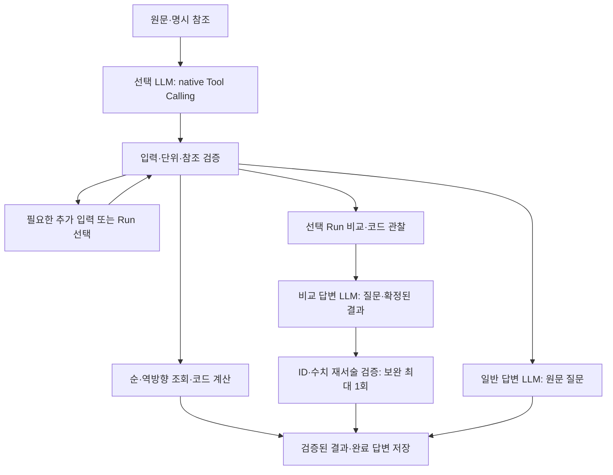

# Graph v1 Tool Calling·답변 전환 검증

2026-10-07, `feat/agent-graph-v1`. 사용자가 승인한 [보완 설계](../superpowers/plans/2026-10-07-agent-v1-tool-calling-and-answer-design.md)를 단독 구현했다. Python v1만 신규 요청을 처리하며 JS fallback은 비활성 상태로 보존한다. 실제 실험 데이터·사용자 기록·키·원문 모델 응답·trace·스크린샷은 이 문서와 Git에 포함하지 않는다.

## 구현 결과

- 선택 LLM에 네 strict native tools를 전달한다. `forward_lookup`, `reverse_search`, `compare_runs`, `generate_answer` 중 하나만 선택하며 알 수 없는 이름·복수 호출·잘린 출력·유효하지 않은 인자는 실행 전 차단한다. 조회는 선택 호출 한 번, 비교/일반 답변은 정상 경로에서 선택과 답변 호출 두 번이다. 재질문·실패 보완 호출은 별도다.
- 순·역방향은 기존 수치 계산과 프로토타입 표시 경로를 재사용한다. 범위 조건을 먼저 필터링하고 그 결과를 정렬한다. 와트 오타/e볼트 정규화·배율 보존·누락 수치 단위 HITL·단위 없는 순위 요청 정책을 유지한다.
- 비교는 명시한 정확한 Run 버전 두 개 이상만 사용한다. 참조가 부족하면 고정된 목록에서 선택하며 검색·정렬은 화면에서 처리한다. 선택·기준·축 resume는 도구 선택 LLM 재호출 없이 이어진다. 서로 독립적인 조회/탐색과 비교를 함께 명시한 명령은 먼저 처리할 작업을 확인한다. 모든 자연어 혼합 의도를 완전 탐지하는 분류기는 아니다.
- 코드가 원값·차이·변화율·범위·통제 조건별 경향과 관찰 문장을 계산한다. 기준 없는 두 Run은 절대 차이, 세 개 이상은 전체 원값과 범위, 명시 기준은 signed 차이·변화율이다. 0 기준 변화율·단위 불일치·누락·overflow·중복 축값을 비가용 사유로 보존한다. 값만 요청하면 추가 차이/집계를 만들지 않는다.
- 비교 답변 LLM은 원문 질문과 확정한 결과에서 관찰 ID를 선택하고 정성적 해석·가정·한계를 반환한다. provider schema의 ID enum과 별도 검증을 함께 사용한다. 알려진 ID/수치 재서술 오류는 한 번 보완하며 지속 실패 시 검증된 전체 수치만 실패 부분 결과로 남긴다. 완료 turn이나 실패 draft를 게시하지 않는다.
- 일반 개념은 원문과 제한된 최근 대화로 자유 답변한다. 기존 ConceptId·두 개념 제한·Run 조회를 제거했다. 일반 예시 숫자와 수식은 허용하며 실제 실험 수치를 측정 근거처럼 재인용하지 않도록 안내한다. 안전한 Markdown/GFM으로 표시하고 raw HTML과 위험한 링크를 비활성화한다.
- 새 결과는 schema 2로 저장한다. TS/Python/Java/renderer가 같은 소량 인공 fixture를 읽고 필수 필드·0/null·정확 버전·부분 실패를 확인한다. 구 schema 1 완료 답변은 읽기 호환으로 유지한다. raw native items와 reasoning은 공개 DTO에서 제외하고 private checkpoint에만 둔다.
- sync checkpoint·generation/revision/epoch/lease fencing·단계별 attempt 예산·원자적 완료 저장을 승계했다. 일반 답변은 무관한 Run 삭제에 취소되지 않으며 비교에 선택한 Run 삭제는 실행과 늦은 게시를 차단한다.

## 최종 검증 기록

| 범위 | 실행·결과 |
|---|---|
| Python 도메인·그래프·adapter·복구·평가 harness | `cd agent/python; PYTHONPATH=src .venv/bin/python -m pytest tests evals -q`: **318 통과** |
| Python 정적 검사 | `.venv/bin/ruff check src tests evals`, `.venv/bin/mypy src`: 통과, 23 source files |
| Frontend·TS Agent·검증 도구 | `npm test`: **147 + 33 + 34 통과**, 외부 원본 전용 4건 명시 skip |
| Backend HTTP·DB·삭제·저장·공통 계약 | Java 21에서 `backend/gradlew -p backend test --console=plain`: **152 통과 / 17 suite**, 실패·오류 0 |
| 타입·lint·빌드 | `npm run typecheck`, `npm run lint`, `npm run build`: 통과 |
| 실제 모델 전체 그래프 | `PYTHONPATH=src:. .venv/bin/python -m evals.run_acceptance --repeat 3`: **54/54 통과** |
| 실제 모델 혼합 요청 | 같은 원문에서 조회 먼저/비교 먼저를 각 3회 선택: **6/6 통과**, 선택 전 데이터 조회 없음 |
| 실제 모델 브라우저 | `npm run test:e2e:live`: **5/5 통과**; 390/800/1008/1440px와 layout geometry |
| 고정 모델 CI 브라우저 | `npm run test:e2e`: **5/5 통과**, 실제 HTTP·DB·worker, 모델만 test double |
| 실제 프로세스 재시작 | `npm run test:agent:restart`: **4/4 통과**, 인공 DB·모델 test double |
| 외부 원본 검색 대조 | `KPLASMA_PROTOTYPE_ROOT=/supplied/prototype npm run verify:agent-reference`: **150 Run / 151 순방향 / 26 역방향 / 177 사례 PASS**(아래 정책 차이 포함) |

브라우저는 인공 Run을 등록한 격리 서버에서 순·역방향, 미참조 비교→선택→같은 요청 재개, 명시 참조 이유 설명, 평균 이온 에너지와 이온 에너지 구분, 누락 조건 추가 입력, 모달·reload·완료 turn 중복 방지를 확인했다. 가로 넘침·페이지 오류는 없었다. Playwright Chromium 153.0.8010.12, ko-KR, Asia/Seoul, 고정 시각·1배율을 사용했다. 전체 프로토타입 픽셀/곡선/모든 대화 시나리오 동등성을 의미하지 않는다.

재시작 검증은 접수 후 서버 종료, 추가 입력 대기 후 서버 종료, 완료 답변 replay, **Run 선택 대기 중 자기 worker와 서버 강제 종료**를 포함한다. 같은 옵션·별칭·선택 순서·정확 버전으로 재개하며 완료 turn은 한 번 저장한다. 계산/검증/답변 draft/게시 경계의 재구성은 추가 Python checkpoint 테스트로 확인했다. 이 모의 경계 테스트를 모든 위치의 실제 SIGKILL 시험으로 표현하지 않는다.

외부 원본 대조는 실제 Run 값을 프로세스 메모리에서만 읽고 집계와 해시만 출력했다. 기존 null IED 폭을 0으로 해석하지 않는 X5 차이 세 건은 의도된 정책 차이로 집계한다. 사용자 예시의 조건 일치 후보 5개·순서·근접도는 일치한다. 전체 Flux 목표 탭은 사용자 요청대로 제거한 정책이며 oracle의 그 탭은 비교하지 않는다. 원본을 변경하거나 실제 데이터 fixture를 추가하지 않았다.

## 조회 수·지연·토큰·Phoenix

- 선택한 2/5/150 Run의 비교 context 준비는 매 크기에서 **bulk identity 1 + scalar 1, SQL 조회 2회**다. 고정 manifest 재사용은 identity 확인 1회이며 선택하지 않은 catalog/분포/원본 파일 payload를 읽지 않는다. JdbcTemplate spy에서 실제 최상위 SQL 실행을 측정했다. 같은 메서드의 내부 delegation을 별도 SQL로 중복 집계하지 않는다.
- 150개 인공 Run 비교 계산 50회: 중앙값 **4.52ms**, 최댓값 **15.31ms**. 모델·HTTP·DB를 제외한 로컬 도메인 측정이다.
- 150개 인공 옵션의 컴포넌트 테스트에서 검색·정렬·선택 유지·선택 가능한 149개 전체 선택·재조회 0회를 확인했다. 해당 테스트 **326ms**는 jsdom에서 여러 동작을 함께 실행한 시간이며 실제 브라우저 사용자 지연이나 서버 지연으로 해석하지 않는다.
- 최종 핵심 전체 그래프 54회: **LLM 호출 90회**, 입력 **230,058**, 출력 **11,420 토큰**. 단위 추가 입력의 선택 재호출을 포함한다. 경과 중앙값 **4.041s**, 최대 **7.957s**이며 메모리 backend의 합성 평가다. 검색 1회/비교·일반 2회라는 정상 경로와 API 전체 호출 수를 구분한다. 이 표본에서는 답변 repair가 없었다.
- 같은 데이터·질문·문맥으로 이전 구조와 A/B 비용 비교를 실행하지 않았으며 비용 절감이나 정확도 개선율을 주장하지 않는다. 계정의 실제 과금 단가를 확인하지 않아 금액으로 환산하지 않는다. 150개 실제 데이터와 실제 모델을 함께 연결한 비용·지연 시험은 이번 검증 범위에 없다.
- Phoenix K-PLASMA의 Cloud REST API 인증·수신을 확인했다. 이전 동일 구현 평가 배치의 **552 span / 90 LLM 호출** 전체를 페이지를 이어 읽었고 input/output·session·사용량이 로컬 집계(227,342 입력 / 11,440 출력)와 일치했다. 마지막 변경은 혼합 요청 범위 확인이며 위 최종 54회도 Phoenix 활성 상태로 실행했다. 두 배치의 수치와 버전을 혼합해 하나의 결과처럼 보고하지 않는다.

## 확인한 실패와 수정

1. 역방향 “150–160에 가깝게”를 soft 목표로 바꿔 범위 밖 후보를 허용한 선택을 확인했다. between 필터와 정렬을 분리하는 공통 지침을 보강했다.
2. 비교 설명에서 긴 관찰 ID의 마지막 부분이 빠져 repair 후에도 실패했다. ID를 O1… 형태로 단순화하고 이번 결과의 ID enum을 provider schema에 적용했다. 잘못된 ID를 임의 보정하지 않는다.
3. “압력 8 mTorr에서”를 LLM이 해석에 다시 적어 수치 검증에 걸렸다. 공정 조건 숫자도 코드 표시 책임임을 명시하고 repair 지침을 보강했다.
4. 누락 바이어스 질문에 “0 W”를 답하면 과거 문맥의 기준 변경으로 오해한 실행을 확인했다. pending 필드에 대한 보완임과 0의 유효성을 명시했다.
5. 비교 옵션 UI가 요청하지 않은 null 필드까지 보내 서버에서 거부된 경우를 실패 테스트로 고정했다. 요청된 기준/축 필드만 제출한다.
6. 브라우저 검증이 resume 이전 terminal 상태를 읽는 race를 수정했다. 재개 revision과 실제 요청 상태를 확인한다. 실제로 새 NEEDS_INPUT이 된 경우는 별도로 Phoenix와 네트워크 기록으로 분석했다.
7. 명시된 비교 지표를 다른 지표로 바꾼 선택은 코드에서 확인 입력으로 차단한다. 관찰 ID 검증만으로 이러한 의미 오류를 탐지한다고 주장하지 않는다.

사용자 요청대로 서브 에이전트 없이 변경 파일·새 파일을 수치/계약/복구/삭제/UI race/보안/성능 관점에서 검토했다. 공통 Responses 요청의 중복 구현을 정리하고 historical scalar 조회를 bulk로 처리했다. 전용 다중 에이전트·교차 모델 리뷰는 수행하지 않았다. 팀원의 PR 승인은 별도로 필요하다.

## 제한·운영 확인

자동 검증은 구현한 스키마·출처·수치 규칙의 통과다. 숫자 없는 의미 모순·인과 주장 전체의 진위를 보장하지 않는다. 대표 개념/비교 답변을 직접 읽어 질문 지표 유지·자료 부족·0 기준·인과 한계를 확인했으나 도메인 전문가 평가를 대신하지 않는다. RAG/검토 문헌은 후속 범위다.

모델 응답을 checkpoint에 저장하기 전에 종료되면 외부 호출이 반복될 수 있다. 영속 저장된 draft 이후에는 재사용하며 최종 저장 효과를 한 번으로 제한한다. Phoenix batch 전송은 SIGKILL·네트워크 장애에서 유실될 수 있고 SDK 종료 지연이 가능하다. 복구 기준은 PostgreSQL이다.

빌드는 성공했지만 minified 초기 JS chunk가 약 564KB라는 경고가 있다. 일반 답변은 안전한 Markdown을 지원하며 LaTeX 수식의 별도 typesetting은 이번 범위에 도입하지 않았다. 현재 worker·backend·frontend를 재시작해야 새 코드가 실행된다. 오래된 미완료 작업은 새 질문으로 제출하고 완료 스냅샷을 다시 생성하지 않는다.

운영 담당자는 처음 30분 동안 네 종류 질문과 누락 단위/참조 추가 입력을 시험하고 Phoenix의 tool_selection·generate_answer·validate_answer와 사용량을 확인한다. 지속되는 `MODEL_UNAVAILABLE`, `MODEL_ATTEMPT_LIMIT`, `ANSWER_OBSERVATION_MISMATCH`, `ANSWER_NUMERIC_RESTATEMENT`, `RECOVERY_VERSION_MISMATCH` 또는 중복 turn/틀린 버전은 worker 중지·설정/배포 버전 확인 신호다. 자동 fallback으로 우회하지 않는다. 키와 상세 trace를 Git·CI artifact에 게시하지 않는다.
